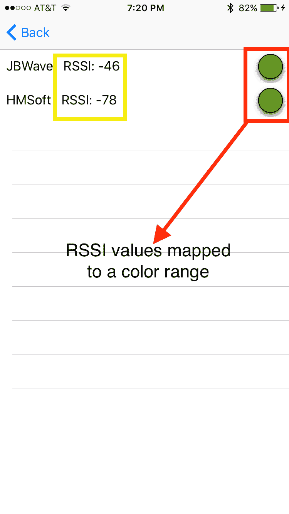

# iOS 串行管理器

> 原文:[https://dev.to/ladvien/ios-serial-manager-24eg](https://dev.to/ladvien/ios-serial-manager-24eg)

# 苹果不喜欢机器人。

这很奇怪，因为他们有一些很棒的硬件和一些优秀的软件。但是，唉，试图让一个机器人连接到任何 iOS 产品就像请史蒂夫·乔布斯来吃饭一样；你会燃起希望，但是，唉，他已经死了。所以，除非有巫术和微风，否则这是不可能的。

但是，我已经找到了让你的 iOS 设备帮助你的机器人的后门，我的朋友，我要把钥匙给你。

那些小 HM-10 蓝牙低能耗印刷电路板，我写了这么久。这些与 iOS 开发者许可证(每年 99 美元)相结合，你可以让你的机器人使用你的 iOS 设备做各种各样的巧妙把戏，以实现更高的功能。

为了赶上你的 HM-10，

*   [使用 HM-1X 从 iOS 到 C](http://ladvien.github.io/robots/connect-an-arduino-to-iphone/)
*   [HM-10](http://ladvien.github.io/robots/HM10/)
*   先进的 HM-10

好的。现在，为了这篇文章的目的。我创造了一些分线板，可以让你用蓝牙连接你的微控制器，这可以让你从你的机器人上访问你的 iOS 设备，但不容易。

CoreBluetooth API 有点抽象和繁琐。我发现自己一遍又一遍地写着同样的代码，试图让我的机器人做一些很酷的动作。我认为我最接近的事情是用我的 iOS 设备(iPhone 4S)作为机器人无线电控制器。嗯，我决定在编程时需要开始使用 [DRY](https://en.wikipedia.org/wiki/Don%27t_repeat_yourself) 方法。这很有趣。我想自从你可以在 Swift 中编译的第一天起，我就一直在用 Swift 写作，但是我一直把我的写作当作[过程编程](https://en.wikipedia.org/wiki/Procedural_programming)。这主要是出于无知，因为我总是按程序编程，当我开始使用本应写成[面向对象](http://searchsoa.techtarget.com/definition/object-oriented-programming) (OO)语言的语言时，我从来没有花时间去了解它们的区别，也不知道我应该如何写。这让我很沮丧。

但是在得到 Bdk6 先生的一些建议后，我花了一些时间去尝试理解 OOP 的目的。真的，我只是看了这个视频:

*   [面向对象编程](https://www.youtube.com/watch?v=lbXsrHGhBAU)

这很有启发性。也许我已经为思想的转变做好了准备(对你们这些 90 后的孩子来说，是“范式的转变”))但是封装和消息传递的概念对于机器人反叛者来说是显而易见的。机器人是一个独立的系统。它有内部和外部行为。它有一些与他人共享的信息；与消息传递相同。但是它的其他部分只为机器人保留。面向对象编程是机器人专家不得不做的事情。

好了，说到这篇文章的主题。

我正在用 Swift 写一个 CoreBluetooth 处理类。这意味着当从 iOS 设备与串行 BLE 设备进行通信时，它将承担许多令人厌烦的责任。发现服务或特征、设置缓冲区、处理断开时的自动连接，或者可能将-20 到 127 RSSI 映射到绿色到红色。简而言之，为了让你的 HM-10/11 与一个 iOS 对话并帮助一个机器人兄弟，你必须做的所有无聊的事情，嗯，我希望这个课程会让它变得简单。需要注意的是，这个类是用 Swit 2.0 编写的，在一台装有 iOS 9.0.2 和 9.1 的 iPhone 6 上进行了测试。

让我们跳进去，

这些项目可以在这里找到:

*   [HMTerminal2](https://github.com/Ladvien/HM10Terminal2)

projects 是一个为 iPhone 设计的应用程序。很简单。它有一个视图是空白的，但有一个“扫描”按钮，将提供范围内所有 ble 设备的列表。

处理程序类在这里，

*   [bleSerialManager](https://github.com/Ladvien/HM10Terminal2/blob/master/HM10Terminal2/bleSerialManager.swift)

下面将是对类 API 的解释。

# **这是一项正在进行中的工作！**

### **初始化 bleSerialManager 类的一个实例**

在对该类进行任何操作之前，必须创建一个实例，

```
//
//  ViewController.swift
//  HM10Terminal2
//
//  Created by Casey Brittain on 8/22/15.
//  Copyright © 2015 Honeysuckle Hardware. All rights reserved.
//

import UIKit
import CoreBluetooth

let hm10serialManager = bleSerialManager()

class ViewController: UIViewController, bleSerialDelegate { 
```

<svg width="20px" height="20px" viewBox="0 0 24 24" class="highlight-action crayons-icon highlight-action--fullscreen-on"><title>Enter fullscreen mode</title></svg> <svg width="20px" height="20px" viewBox="0 0 24 24" class="highlight-action crayons-icon highlight-action--fullscreen-off"><title>Exit fullscreen mode</title></svg>

这里我们创建了一个不可变的 **bleSerialManager** 的实例，我们称之为 **hm10serialManager** 。这将初始化许多处理发现的 BLE 设备所需的属性。它还开始搜索广告 BLE 设备。

另外，请注意，我在初始化任何其他类之前初始化了这个实例。这是故意的。我希望我的 **hm10serialManager** 实例对项目中的所有其他 Swift 文件可见。Swift 设计的一个好处是这样的声明可以做到这一点，使您的实例对所有文件可见。在初始化我的 bleSerialManager 实例*之后，然后*初始化我们的 ViewController 类。注意，任何打算访问实例的类都应该包含 **bleSerialDelegate** 。这要求 ViewController 类符合我们实例的[协议](https://developer.apple.com/library/ios/documentation/Swift/Conceptual/Swift_Programming_Language/Protocols.html)。目前，没有必需的方法，但有几个可选的方法，我将在后面详述，但现在它们被命名为:

```
optional func searchTimerExpired()
optional func deviceStatusChanged()
optional func connectedToDevice() 
```

<svg width="20px" height="20px" viewBox="0 0 24 24" class="highlight-action crayons-icon highlight-action--fullscreen-on"><title>Enter fullscreen mode</title></svg> <svg width="20px" height="20px" viewBox="0 0 24 24" class="highlight-action crayons-icon highlight-action--fullscreen-off"><title>Exit fullscreen mode</title></svg>

它们应该是回调函数。

## **设置你的祝福者**

初始化 bleSerialManager 实例**后，必须在每个将从 CoreBluetooth** 接收数据的类中设置[委托](https://www.andrewcbancroft.com/2015/04/08/how-delegation-works-a-swift-developer-guide/)。这应该在 viewWillAppear，*而不是* viewDidLoad 中完成。这将确保每次视图可见时，都准备好接收来自蓝牙设备的数据。

```
class ViewController: UIViewController, bleSerialDelegate {

    override func viewDidLoad() {
        super.viewDidLoad()
        // Do any additional setup after loading the view, typically from a nib.
    }

    override func viewWillAppear(animated: Bool) {
        hm10serialManager.delegate = self
    } 
```

<svg width="20px" height="20px" viewBox="0 0 24 24" class="highlight-action crayons-icon highlight-action--fullscreen-on"><title>Enter fullscreen mode</title></svg> <svg width="20px" height="20px" viewBox="0 0 24 24" class="highlight-action crayons-icon highlight-action--fullscreen-off"><title>Exit fullscreen mode</title></svg>

## **定义设备行为**

老实说，很多以前做过的事情都被嵌入到 CoreBluetooth API 中，但这是我开始带来附加值的地方。

```
setAutomaticReconnectOnDisconnect(on: Bool, tries: Int, timeBetweenTries: Double) 
```

<svg width="20px" height="20px" viewBox="0 0 24 24" class="highlight-action crayons-icon highlight-action--fullscreen-on"><title>Enter fullscreen mode</title></svg> <svg width="20px" height="20px" viewBox="0 0 24 24" class="highlight-action crayons-icon highlight-action--fullscreen-off"><title>Exit fullscreen mode</title></svg>

这允许您设置是否希望您的 iOS 设备(通常充当主设备/中央设备)自动重新连接到它所连接的最后一个外围设备。它需要三个参数。第一个， **on: Bool** ，设置您是否想要一个重新连接行为。然后， **tries: Int** 告诉实例，在它放弃之前，您想要尝试重新连接到最后一个外设的次数。并且 **timeBetweenTries: Double** 是在你的 iOS 设备尝试重新连接之前你希望等待的时间(以秒为单位)。

```
setRetryConnectAfterFail(on: Bool, tries: Int, timeBetweenTries: Double) 
```

<svg width="20px" height="20px" viewBox="0 0 24 24" class="highlight-action crayons-icon highlight-action--fullscreen-on"><title>Enter fullscreen mode</title></svg> <svg width="20px" height="20px" viewBox="0 0 24 24" class="highlight-action crayons-icon highlight-action--fullscreen-off"><title>Exit fullscreen mode</title></svg>

与上述功能非常相似，该功能定义了如果您的中央设备无法连接到您告诉它连接的设备时将采取的操作。具体来说，如果您告诉您的中央(iOS 设备)连接到外围设备，此功能将会执行，它将开始建立连接的步骤，但在建立稳固连接之前的某个时间会被中断。

```
setMutipleConnections(numberOfDevices: Int) 
```

<svg width="20px" height="20px" viewBox="0 0 24 24" class="highlight-action crayons-icon highlight-action--fullscreen-on"><title>Enter fullscreen mode</title></svg> <svg width="20px" height="20px" viewBox="0 0 24 24" class="highlight-action crayons-icon highlight-action--fullscreen-off"><title>Exit fullscreen mode</title></svg>

在这里，您告诉 iOS 设备限制其连接设备的数量。应该注意的是，这个函数不是看有多少连接是可能的，而是看你想限制你的程序尝试多少连接。

我发现这个功能很有用，因为我尝试连接了几个 HM-10 设备。奇怪的是，当 HM-10 处于外围角色时，它可以连接到已经建立了其他连接的中心角色，但是如果 HM-10 处于中心角色，它只能处理一个连接。无论如何，这是为了防止你的程序浪费时间试图建立一个不需要的连接。

**几个注意事项，**这些行为函数都不需要调用。 **bleSerialManager** 将在没有调用的情况下正常工作；它默认为以下内容，

**默认:**

```
automaticReconnectOnDisconnect(on: true, tries: 3, timeBetweenTries: 1.0)
setRetryConnectAfterFail(on: true, tries: 3, timeBetweenTries: 1.0)
setMutipleConnections(numberOfDevices: 1) 
```

<svg width="20px" height="20px" viewBox="0 0 24 24" class="highlight-action crayons-icon highlight-action--fullscreen-on"><title>Enter fullscreen mode</title></svg> <svg width="20px" height="20px" viewBox="0 0 24 24" class="highlight-action crayons-icon highlight-action--fullscreen-off"><title>Exit fullscreen mode</title></svg>

## **搜索设备**

在我们设置好之后，是时候找一些设备了。

```
// Begin search automatically.
hm10serialManager.search(1.0) 
```

<svg width="20px" height="20px" viewBox="0 0 24 24" class="highlight-action crayons-icon highlight-action--fullscreen-on"><title>Enter fullscreen mode</title></svg> <svg width="20px" height="20px" viewBox="0 0 24 24" class="highlight-action crayons-icon highlight-action--fullscreen-off"><title>Exit fullscreen mode</title></svg>

这将手动启动[中央管理器](https://developer.apple.com/library/prerelease/ios/documentation/CoreBluetooth/Reference/CBCentralManager_Class/index.html)搜索外围设备。如果它发现一个外围设备，它会将其信息(大部分)记录在 Swift [字典](https://developer.apple.com/library/prerelease/ios/documentation/Swift/Conceptual/Swift_Programming_Language/CollectionTypes.html)中。每个字典的值都由为相应设备发现的[nsuid](https://developer.apple.com/library/prerelease/ios/documentation/Foundation/Reference/NSUUID_Class/index.html)来键控。以下是中央管理器收集的数据类型，

```
// Dictionaries for device details on discovered devices.
private var discoveredDeviceList: Dictionary<NSUUID, CBPeripheral>
private var discoveredDeviceListRSSI: Dictionary<NSUUID, NSNumber>
private var discoveredDeviceListUUIDString: Dictionary<NSUUID, String>
private var discoveredDeviceListNameString: Dictionary<NSUUID, String>
private var discoveredDeviceListAdvertisementData: Dictionary<NSUUID, [String : AnyObject]> 
```

<svg width="20px" height="20px" viewBox="0 0 24 24" class="highlight-action crayons-icon highlight-action--fullscreen-on"><title>Enter fullscreen mode</title></svg> <svg width="20px" height="20px" viewBox="0 0 24 24" class="highlight-action crayons-icon highlight-action--fullscreen-off"><title>Exit fullscreen mode</title></svg>

注意，这些[字段](https://en.wikipedia.org/wiki/Field_(computer_science))都是私有的(也就是说，没有一个[被做成属性](http://stackoverflow.com/questions/295104/what-is-the-difference-between-a-field-and-a-property-in-c))。这是有目的的，不一定符合建议的 Swift 设计。我选择遵循严格的 OOP 设计模式，只通过方法公开字段。也就是说，其他实例可以访问的每个属性都将通过一个 [getter 方法来完成。](https://en.wikipedia.org/wiki/Mutator_method)

### **可选回调方法#1**

bleSerialManager 中包含了几个可选的方法，用于在主实例中充当回调函数。当传递给 **search()** 的搜索时间到期时，调用 **searchTimerExpired()** 方法。**注意，**这个方法只有在解包的时候才会被调用，这意味着你必须在你的主类中声明这个方法，它才会被激活。只有包含 **bleSerialDelegate 时，才会附加这些方法。**

举个例子，

```
//  Copyright © 2015 Honeysuckle Hardware. All rights reserved.
//

import UIKit
import CoreBluetooth

class mainViewController: UITableViewController, bleSerialDelegate {

    func searchTimerExpired() {
         // Only called at the end of search
         print("Your search for peripheral devices is over!")
    }

.... 
```

<svg width="20px" height="20px" viewBox="0 0 24 24" class="highlight-action crayons-icon highlight-action--fullscreen-on"><title>Enter fullscreen mode</title></svg> <svg width="20px" height="20px" viewBox="0 0 24 24" class="highlight-action crayons-icon highlight-action--fullscreen-off"><title>Exit fullscreen mode</title></svg>

**再次**，如果 **searchTimerExpired** 方法没有声明，并且您没有通过附加 **bleSerialDelegate** 来符合 **bleSerialManager** 协议，那么这个方法将永远不会触发。

## **获取被发现设备的信息**

让我们回顾一下在我们发现的设备上收集的信息。

```
discoveredDeviceList: Dictionary<NSUUID, CBPeripheral> 
```

<svg width="20px" height="20px" viewBox="0 0 24 24" class="highlight-action crayons-icon highlight-action--fullscreen-on"><title>Enter fullscreen mode</title></svg> <svg width="20px" height="20px" viewBox="0 0 24 24" class="highlight-action crayons-icon highlight-action--fullscreen-off"><title>Exit fullscreen mode</title></svg>

此字段包含发现的每个设备的字典项目。这些项目是一个 [CBPeripheral](https://developer.apple.com/library/prerelease/ios/documentation/CoreBluetooth/Reference/CBPeripheral_Class/index.html) 实例。每个实例都包含您想了解的关于设备的大部分信息。事实上，为了便于处理，下面的字典只是将这些信息分解成单独的字典。

如前所述，您不能直接访问 bleSerialManager 属性。相反，有一个 getter 方法，它将允许您访问存储列表。

```
let myDiscoveredPeripheralDictioanry = hm10serialManager.getdiscoveredDeviceDictionary() 
```

<svg width="20px" height="20px" viewBox="0 0 24 24" class="highlight-action crayons-icon highlight-action--fullscreen-on"><title>Enter fullscreen mode</title></svg> <svg width="20px" height="20px" viewBox="0 0 24 24" class="highlight-action crayons-icon highlight-action--fullscreen-off"><title>Exit fullscreen mode</title></svg>

这将以**字典**的形式检索一个字典。我真的不想经常使用它。事实上，如果你发现自己在使用它，请发邮件给我。这意味着我没有把这门课做得像预期的那样通用和简单。尽管如此，它还是在那里以防万一。

```
discoveredDeviceListRSSI: Dictionary<NSUUID, NSNumber> 
```

<svg width="20px" height="20px" viewBox="0 0 24 24" class="highlight-action crayons-icon highlight-action--fullscreen-on"><title>Enter fullscreen mode</title></svg> <svg width="20px" height="20px" viewBox="0 0 24 24" class="highlight-action crayons-icon highlight-action--fullscreen-off"><title>Exit fullscreen mode</title></svg>

这是我最喜欢的 BLE 属性之一，无线电信号强度指标。它可以用于各种巧妙的把戏，尤其是机器人。例如，让我们说你把一个 HM-10 放在四轴飞行器上，另一个放在控制器上。你有一个通过蓝牙控制的四轴飞行器。但是你开始让它高速飞离你，亚诺，来测试一下。嗯，突然你的 HM-10 由于距离而失去联系，你的四轴飞行器消失了，对吗？没有。作为飞行程序的一部分，你可以让四轴飞行器检查 RSSI，如果 RSSI 太大，那么它会简单地停止现有的飞行，轻轻地降落到地面。很酷，对吧？

当然，您可以在两个不同的时间点访问 RSSI，一个是设备已被发现但未连接，另一个是设备已连接。发现的设备的 RSSI 的当前程度取决于几个因素，但主要是中央设备扫描广告包的频率和外围设备广告的频率。通常在 200 毫秒到 1500 毫秒之间。

这个功能可以让你做这样的事情，

[视频](https://youtu.be/vcrPdhN9MJw)

好的。这是一个很好的特性，我们如何实现它呢？

```
func getDeviceRSSI(deviceOfInterest: NSUUID)->Int() 
```

<svg width="20px" height="20px" viewBox="0 0 24 24" class="highlight-action crayons-icon highlight-action--fullscreen-on"><title>Enter fullscreen mode</title></svg> <svg width="20px" height="20px" viewBox="0 0 24 24" class="highlight-action crayons-icon highlight-action--fullscreen-off"><title>Exit fullscreen mode</title></svg>

该方法将 NSUUID 对象作为一个键，查看发现的设备列表，并以整数形式返回 RSSI 指示器。应该叫做这样的东西，

```
let myDeviceRSSI = hm10serialManager.getDeviceRSSI(myDeviceNSUUID) 
```

<svg width="20px" height="20px" viewBox="0 0 24 24" class="highlight-action crayons-icon highlight-action--fullscreen-on"><title>Enter fullscreen mode</title></svg> <svg width="20px" height="20px" viewBox="0 0 24 24" class="highlight-action crayons-icon highlight-action--fullscreen-off"><title>Exit fullscreen mode</title></svg>

注意，每次调用 search 方法时，RSSI 值都会更新。

另一个有趣的 RSSI 函数是，

```
func getSortedArraysBasedOnRSSI()-> (nsuuids: Array<NSUUID>, rssies: Array<NSNumber>) 
```

<svg width="20px" height="20px" viewBox="0 0 24 24" class="highlight-action crayons-icon highlight-action--fullscreen-on"><title>Enter fullscreen mode</title></svg> <svg width="20px" height="20px" viewBox="0 0 24 24" class="highlight-action crayons-icon highlight-action--fullscreen-off"><title>Exit fullscreen mode</title></svg>

[T2】](https://res.cloudinary.com/practicaldev/image/fetch/s--pqi0SLZm--/c_limit%2Cf_auto%2Cfl_progressive%2Cq_auto%2Cw_880/https://ladvien.cimg/RSSI_Mapping_Table.png)

这个函数不带变量，返回两个对象。一个是按 RSSI 升序排列的已发现的 NSUUIDs 的数组(即，它们越接近 0 索引)。另一个是 NSNumbers 数组，表示 nsuid 数组中相应 nsuid 的 RSSI 值。

这种方法是为了让你做整洁的事情，如图片所示。这里，我使用了一个范围映射函数将 RSSI 值映射到一个简单的颜色方案上(红色= -127，绿色= -20)。

最后，我将编写一个函数来获取 RSSI 并返回一个 UIColor 值。

```
func getDeviceName(deviceOfInterest: NSUUID)-> String 
```

<svg width="20px" height="20px" viewBox="0 0 24 24" class="highlight-action crayons-icon highlight-action--fullscreen-on"><title>Enter fullscreen mode</title></svg> <svg width="20px" height="20px" viewBox="0 0 24 24" class="highlight-action crayons-icon highlight-action--fullscreen-off"><title>Exit fullscreen mode</title></svg>

相当直截了当的电话。它旨在为您提供对特定发现设备名称的快速访问，以字符串形式显示。举个例子，

```
let deviceName = getDeviceName(interestingDeviceNSUUID)
print("The name of my the interesting device is: " + deviceName) 
```

<svg width="20px" height="20px" viewBox="0 0 24 24" class="highlight-action crayons-icon highlight-action--fullscreen-on"><title>Enter fullscreen mode</title></svg> <svg width="20px" height="20px" viewBox="0 0 24 24" class="highlight-action crayons-icon highlight-action--fullscreen-off"><title>Exit fullscreen mode</title></svg>

与此同时，

```
func getDeviceUUIDAsString(deviceOfInterest: NSUUID)->String 
```

<svg width="20px" height="20px" viewBox="0 0 24 24" class="highlight-action crayons-icon highlight-action--fullscreen-on"><title>Enter fullscreen mode</title></svg> <svg width="20px" height="20px" viewBox="0 0 24 24" class="highlight-action crayons-icon highlight-action--fullscreen-off"><title>Exit fullscreen mode</title></svg>

这是一种方便的方法。它的意思是快速获得一个字符串形式的。

## 发现周边广告数据

我仍在试验这一部分——我很快就会完成。

## 接通

搜索之后，是时候连接到一个特定的设备。

```
func connectToDevice(deviceNSUUID: NSUUID) -> Bool 
```

<svg width="20px" height="20px" viewBox="0 0 24 24" class="highlight-action crayons-icon highlight-action--fullscreen-on"><title>Enter fullscreen mode</title></svg> <svg width="20px" height="20px" viewBox="0 0 24 24" class="highlight-action crayons-icon highlight-action--fullscreen-off"><title>Exit fullscreen mode</title></svg>

当调用 **connectoToDevice()** 时，它带有一个参数，即您想要连接的已发现设备的 NSUUID。如果该方法能够连接到所选设备，它将返回 **true** 。如果您已经连接到那个特定的设备，或者如果您已经达到连接设备的最大数量，或者如果没有找到该设备，它将返回 **false** 。

**connectToDevice()示例:**

```
if(hm10serialManager.connectToDevice(myDeviceNSUUID)){
    print("Connected!")
} else {
    print("Was unable to connect")
} 
```

<svg width="20px" height="20px" viewBox="0 0 24 24" class="highlight-action crayons-icon highlight-action--fullscreen-on"><title>Enter fullscreen mode</title></svg> <svg width="20px" height="20px" viewBox="0 0 24 24" class="highlight-action crayons-icon highlight-action--fullscreen-off"><title>Exit fullscreen mode</title></svg>

这将尝试连接到 myDeviceNSUUID 对应的任何设备。连接到您的设备后，bleSerialManager 负责发现设备的服务、特征和特征描述符。然后可以通过下面的方法调用来访问它。

```
Huh, haven't written these methods yet 
```

<svg width="20px" height="20px" viewBox="0 0 24 24" class="highlight-action crayons-icon highlight-action--fullscreen-on"><title>Enter fullscreen mode</title></svg> <svg width="20px" height="20px" viewBox="0 0 24 24" class="highlight-action crayons-icon highlight-action--fullscreen-off"><title>Exit fullscreen mode</title></svg>

**可选回叫方法#2**

```
optional func connectedToDevice() 
```

<svg width="20px" height="20px" viewBox="0 0 24 24" class="highlight-action crayons-icon highlight-action--fullscreen-on"><title>Enter fullscreen mode</title></svg> <svg width="20px" height="20px" viewBox="0 0 24 24" class="highlight-action crayons-icon highlight-action--fullscreen-off"><title>Exit fullscreen mode</title></svg>

**connectedToDevice()** 方法是回调方法，是 **bleSerialManager** 协议的一部分。每当 bleSerialManager 成功连接到设备时都会调用它。**注意，**这个方法只有在解包的时候才会被调用，这意味着你必须在你的主类中声明这个方法。您还必须符合 **bleSerialManager** 协议。此方法旨在用连接状态更新 UI。或者在确认连接后进行任何内部清理。

好的。累了。明天我会再写一些。