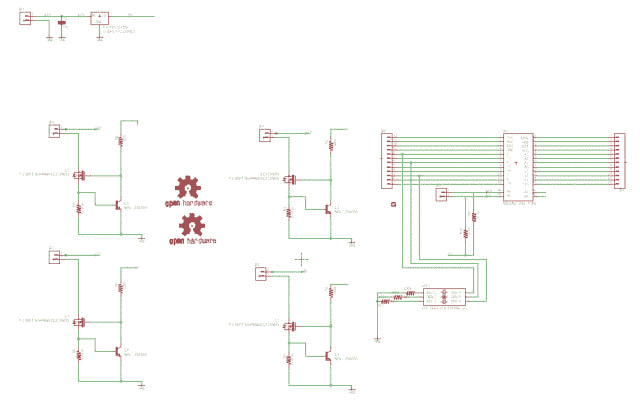

# 实验室控制器 PCB

> 原文:[https://dev.to/ladvien/lab-controller-pcb-4bbm](https://dev.to/ladvien/lab-controller-pcb-4bbm)

[T2】](https://res.cloudinary.com/practicaldev/image/fetch/s--CM4SNDHU--/c_limit%2Cf_auto%2Cfl_progressive%2Cq_auto%2Cw_880/https://ladvien.cimg/Lab_Controller_Board_Top_and_Bottom.png)

我正在做的一个实验室控制器 PCB。它以四个大功率恒流电路为中心，由 Atmega328 的 PWM 驱动。

我讨厌在昏暗的光线下做任何机械的工作；是因为在汽车上工作时，零件掉到了发动机下面。我对我的灯的类型也很挑剔。“冷白”或节能灯真的让我很困扰。我觉得我是一只朝着灭虫器前进的虫子。

我有几个设计目标，

1.  温暖的白色是正确的选择。我正在为四个 1k 流明的暖白色发光二极管在 12v～1A 拍摄。
2.  我有一个 Arduino Pro Mini (APM)插头。当谈到小尺寸和多功能性时，很难与 APM 竞争，哦，还有价格。如果你在易贝买，它们会非常便宜。
3.  我想用我的 HM-10 做一个 BLE 串行接口。这将允许我使用我的 iOS 设备来控制我的 led。几根支柱，
    1.  [使用 HM-1X 从 iOS 到 C](http://ladvien.github.io/robots/connect-an-arduino-to-iphone/)
    2.  [HM-10](http://ladvien.github.io/robots/HM10/)
    3.  先进的 HM-10
4.  A4 和 A5 引脚是打破了，这是为了使董事会链使用 I2C。

电路的核心是一个大功率恒流驱动器。我把电路从这个家伙，有点，很好的职位:

*   [高功率 LED 驱动电路](http://www.instructables.com/id/Circuits-for-using-High-Power-LED-s/step8/a-little-micro-makes-all-the-difference/)

这是我给控制板添加电路的尝试，

[T2】](https://res.cloudinary.com/practicaldev/image/fetch/s--iKDNtHm7--/c_limit%2Cf_auto%2Cfl_progressive%2Cq_auto%2Cw_880/https://ladvien.cimg/Lab_Controller_Schem_image.png)

[PDF](https://github.com/Ladvien/ladvien.github.io/blob/masterhttps://ladvien.cimg/Lab%20Controller%20Board%20v01.pdf)

关于电路是如何工作的....黑魔法。嗯，至少，我是这么理解的。我试图阅读这篇优秀的文章，但最终决定它试图推理出什么是明显的黑魔法。

*   [晶体管- MOSFET 恒流驱动器](http://www.pcbheaven.com/userpages/LED_driving_and_controlling_methods/)

[T2】](https://res.cloudinary.com/practicaldev/image/fetch/s--XGbMu9N5--/c_limit%2Cf_auto%2Cfl_progressive%2Cq_auto%2Cw_880/https://ladvien.cimg/IMG_0133.jpg)

我最初设计了一个最小的 PCB 来容纳电路。我希望一块小小的板子能让我把它贴在任何需要的地方，

[T2】](https://res.cloudinary.com/practicaldev/image/fetch/s--dZtgNOXN--/c_limit%2Cf_auto%2Cfl_progressive%2Cq_auto%2Cw_880/https://ladvien.cimg/5v_regulator_lab_controller_labeled.jpg)

这就是有趣的地方。看到红色鳄鱼夹如此整齐地夹住 5V 稳压器的腿，那么，在观看我们的下一个展览时，请记住这一点。

[T2】](https://res.cloudinary.com/practicaldev/image/fetch/s--nJXLVXoM--/c_limit%2Cf_auto%2Cfl_progressive%2Cq_auto%2Cw_880/https://ladvien.cimg/IMG_0134.jpg)

恶心和注意安全，对不对？这种方式已经持续了大约一年。

好队！

1.  4 x [2N5088](http://http//www.farnell.com/datasheets/46867.pdf)
2.  4 个 [FQP40N06L](http://https//www.fairchildsemi.com/datasheets/FQ/FQP30N06L.pdf)
3.  4 个 0.47 欧姆的电阻或 0.75 欧姆。
4.  4 个[12v 900 毫安](https://www.fasttech.com/products/0/10001245/2119700-10w-3s3p-1000-lumen-6000-6500k-integrated-led)(0.47 欧姆)或[12v 600 毫安](https://www.fasttech.com/products/1822403)0.75 欧姆
5.  1 个 Arduino Pro Mini
6.  1 个大(TBD 尺寸)电解电容器
7.  5 个 [2 针插入式螺丝端子板连接器 5 毫米间距面板印刷电路板支架](http://www.ebay.com/itm/111373399144?_trksid=p2057872.m2749.l2649&ssPageName=STRK%3AMEBIDX%3AIT)
8.  2 个 4.7k 欧姆 0805 电阻器
9.  4 x 10k 欧姆 0805 电阻器
10.  1 个 470 欧姆 0805 电阻器
11.  2 个 330 欧姆 0805 电阻器
12.  1 个 [50-50 SMD RGB LED](http://www.ebay.com/itm/100-pcs-New-RGB-PLCC-6-5050-3-CHIPS-SMT-SMD-LED-Light-NEW-/191674244800?hash=item2ca0acdec0)
13.  1 个 5V 贴片线性稳压器 [MC7805CD2TR4](http://www.ebay.com/itm/400262003608?_trksid=p2057872.m2749.l2649&ssPageName=STRK%3AMEBIDX%3AIT) D2PAK

无论如何，板是在制造商，所以我将报告回来时，我已经填充和测试它们。我已经有了迭代 v2 的想法。