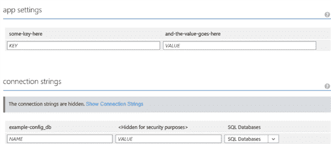

# 将设置复制到 Azure 网站

> 原文：<https://dev.to/funkysi1701/copying-settings-to-an-azure-website-50ec>

我工作的软件即服务(SaaS)网站现在已经卖给了很多客户。这是个好消息。

[T2】](https://res.cloudinary.com/practicaldev/image/fetch/s--F7u8HX_e--/c_limit%2Cf_auto%2Cfl_progressive%2Cq_auto%2Cw_880/https://storageaccountblog9f5d.blob.core.windows.net/blazor/wp-content/uploads/2015/09/2275.app-1.png%3Fw%3D550%26ssl%3D1)

然而，我们有越多的 Azure 网站，越多的网站，我们必须管理，特别是如果像我们一样，你利用交通管理器，需要在不同地区的多个网站的优势。Azure 提供了一些很好的选项来简化这种管理。一项工作是将所有设置添加到 Azure 门户上，到目前为止，我一直是手动添加这些设置，但更快的方法是使用 powershell。

## PowerShell

PowerShell 现在无处不在。您可以使用它来控制服务器、Active Directory 和 Exchange。所以你可以用它来控制 Azure 也就不足为奇了。

打开 powershell 窗口并运行以下命令。

```
Get-AzurePublishSettingsFile 
```

Enter fullscreen mode Exit fullscreen mode

这个命令打开一个 IE 窗口，你可以登录到 Azure 并下载一个包含 Azure 可以使用的设置的文件。保存*。发布 settings 文件并运行以下命令。

```
Import-AzurePublishSettingsFile "C:\MyPublishSettings\mysubscriptions.publishsettings" 
```

Enter fullscreen mode Exit fullscreen mode

这将导入您的 Azure 设置，以便 PowerShell 可以做聪明的事情。

```
Select-AzureSubscription -Default "mysubscription" 
```

Enter fullscreen mode Exit fullscreen mode

这将选择要使用的 Azure 订阅。现在运行以下命令将设置导入 PowerShell。

```
$s = @{"DebugEmailAccount"="test@example.com";"SiteWarningBannerText"=""} 
```

Enter fullscreen mode Exit fullscreen mode

最后运行下面的代码将这些设置导入到你指定的 Azure 网站。

```
Set-AzureWebsite azure-websitename -AppSettings $s 
```

Enter fullscreen mode Exit fullscreen mode

听起来很容易，不是吗？的确如此。最困难的部分是以正确的格式导入设置，但这只是字符串操作。

对于我的项目，我已经有了一个用所有这些设置填充 settings.config 文件的构建脚本，所以我只是复制它来创建一个 settings.config.importtoAzure 文件。下次我要创建网站时，我可以在 Azure 上创建并运行上面的脚本，粘贴到我的构建已经为我生成的设置文件中。

这仅仅触及了你能用 Azure 和 PowerShell 做的事情的表面，希望我将来能做得更多。