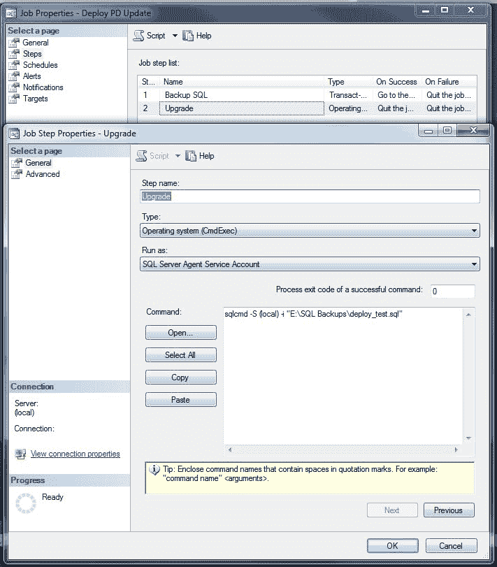

# 非托管数据库部署

> 原文:[https://dev . to/funky si1701/unmanaged-database-deployment-5edl](https://dev.to/funkysi1701/unmanaged-database-deployment-5edl)

在过去的几个月里，我每隔几周左右就会对我公司的数据库进行修改。在不使用数据库的周末，我会备份数据库，加载 visual studio，部署数据库更改，并复制几个前端文件。

自从我儿子詹姆斯的到来，我的周末和晚上对我来说变得更加珍贵了。在合适的时间运行数据库升级，我要么是睡着了，即将入睡，要么是和詹姆斯在一起。

使用 SQL Server 作业，可以将整个部署设置为在我选择的时间运行(不知道为什么我以前从未想过这样做)。我仍然需要在它运行后检查一切是否正常。如果工作遇到任何问题，可以给我发电子邮件，这样我仍然可以确保公司的问题最少，但变化更频繁。

## 非托管数据库部署

好的，那么我需要做些什么来设置它。

[T2】](https://res.cloudinary.com/practicaldev/image/fetch/s--QTNBDlQX--/c_limit%2Cf_auto%2Cfl_progressive%2Cq_auto%2Cw_880/https://storageaccountblog9f5d.blob.core.windows.net/blazor/wp-content/uploads/2015/09/deploy.jpg%3Fresize%3D263%252C300%26ssl%3D1)

1.  测试您的所有代码更改在数据库的备份上是否正常工作，并且一切都被提交到源代码控制。
2.  备份将要更改的所有内容，以便在出现问题时可以回滚。我不依赖于日常备份工作，我自己做。也许我有点偏执，或者也许我只是小心翼翼。

```
BACKUP DATABASE DBName TO DISK='E:\SQL Backups\Filename.bak' 
```

<svg width="20px" height="20px" viewBox="0 0 24 24" class="highlight-action crayons-icon highlight-action--fullscreen-on"><title>Enter fullscreen mode</title></svg> <svg width="20px" height="20px" viewBox="0 0 24 24" class="highlight-action crayons-icon highlight-action--fullscreen-off"><title>Exit fullscreen mode</title></svg>

我将在备份文件名中包含部署的日期和时间，以便以后参考。对于前端文件，这些文件每天都进行备份，并且只在部署期间更改，因此我将依赖每天的备份，而且它们在源代码控制中，因此在最坏的情况下，我可以在那里查看。

1.  在 Visual Studio 中，使用发布选项创建部署脚本，并在数据库服务器上另存为文件。
2.  创建一个 SQL Server 作业，并为其指定一个描述性名称。
3.  在步骤中，创建一个名为 backup 的步骤，并输入上面的 T-SQL 代码。将此设置为失败时停止，成功时继续。
4.  用下面的代码创建第二个步骤，称为类型操作系统的升级。

```
sqlcmd -S (local) -i "E:\SQL Backups\deploy_test.sql" 
```

<svg width="20px" height="20px" viewBox="0 0 24 24" class="highlight-action crayons-icon highlight-action--fullscreen-on"><title>Enter fullscreen mode</title></svg> <svg width="20px" height="20px" viewBox="0 0 24 24" class="highlight-action crayons-icon highlight-action--fullscreen-off"><title>Exit fullscreen mode</title></svg>

-S 参数是您的 SQL Server 实例的名称，而-i 参数是您从上面的 Visual Studio 中生成的 SQL 脚本的路径。将此作业设置为不报告成功或失败。

1.  在计划创建您希望作业运行的日期时间中，确保这是一次性作业，因为您不希望它再次尝试运行而可能导致问题。
2.  在我已设置为完成时发送电子邮件的通知中，您可以将其设置为仅在失败时发送电子邮件。不管怎样，我更想知道工作的结果。
3.  使用 SQL Server 作业通过网络复制文件是可能的，但对于设置来说并不简单，因此我将使用 windows 任务计划程序来完成此任务。
4.  在任务计划程序中创建一个作业，以复制所有已更改的 ADP 或 ade。如果 SQL 作业失败，您将需要复制回这些的旧版本，但这很容易做到。

这个过程可以扩展到检查源代码控制之外的代码，甚至进行更多的自动化部署，但目前这对于我的目的来说已经足够好了。