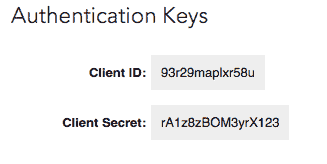

# 使用 OAuth 2.0 的 LinkedIn Rest API

> 原文：<https://dev.to/shanalikhan/linkedin-rest-api-with-oauth-2-0-14f6>

一旦知道如何授权用户，连接 LinkedIn Rest API 就很容易了。以下是可以在中执行的步骤。NET / Java 使用 HttpClients 或简单地从 JQuery / Javascript。

*   **[注册你的应用](https://developer.linkedin.com/)** 注册后你需要设置你的应用的作用域，作用域的意思是定义你的应用要使用 LinkedIn 的哪个特性。对于高级 API 级别，您可能需要联系 Linked 以获得许可。保存配置后，您的应用程序将被分配一个唯一的“客户端 ID”(也称为消费者密钥或 API 密钥)和“客户端机密”值。
*   **获取授权码**

> [https://www.linkedin.com/uas/oauth2/authorization?response \ _ type = CODE&client \ _ id = YOUR \ _ APP \ _ CODE&redirect \ _ uri = YOUR \ _ WEBSITE \ _ ENCODED \ _ URL&state = 987654321](https://www.linkedin.com/uas/oauth2/authorization?response%5C_type=code&client%5C_id=YOUR%5C_APP%5C_CODE&redirect%5C_uri=YOUR%5C_WEBSITE%5C_ENCODED%5C_URL&state=987654321)

| Parameter | Description | Required |
| response _ type |该字段的值应始终为:code | Yes |
| client_id |注册应用程序时生成的“API 密钥”值。|是|
| redirect_uri |

授权后您的用户将被发送回的 URI。

例如[https://www.example.com/auth/linkedin](https://www.example.com/auth/linkedin)

|
|是|状态|状态

您选择的难以猜测的唯一字符串值。用来防止 [CSRF](http://en.wikipedia.org/wiki/Cross-site_request_forgery) 。

例如 state=DCEeFWf45A53sdfKef424

|是|
|范围|

应用程序代表用户请求的成员权限的 URL 编码、空格分隔列表。如果您在调用中没有指定作用域，我们将回退到使用您在[应用程序配置](https://www.linkedin.com/secure/developer)中定义的默认成员权限。

例如，scope = r _ full profile % 20r _ email address % 20w _ share

|可选|

*   **当申请被批准时**当申请被批准时，LinkedIN 将通过两个查询字符串参数将一些信息重定向到您的 URL。
    *   代码- OAuth 2 授权代码
    *   state —用于测试可能的 CSRF 攻击的值。
    *   error_description -如果发现错误(如果用户成功通过授权，则不会出现在 URL 中)
*   **用授权码交换请求令牌**现在，在最后一步中，您必须发送 POST 请求，以便获得该用户的请求令牌。该令牌的默认生命周期为 60 天。

> [https://www.linkedin.com/uas/oauth2/accessToken](https://www.linkedin.com/uas/oauth2/accessToken)

结果将出现在 JSON 中，为该用户提供 access_token 和 exprire_in。该令牌可以保存在您的数据库中，如果您的应用程序仍然可以访问该用户的信息，则可以在接下来的 60 天内轻松地使用该令牌查看该用户的数据。

*   **获取用户信息**您可以访问此[链接](https://developer.linkedin.com/docs/rest-api)以获取用户信息。

> 如果你发现任何问题，请在评论中发表任何问题。