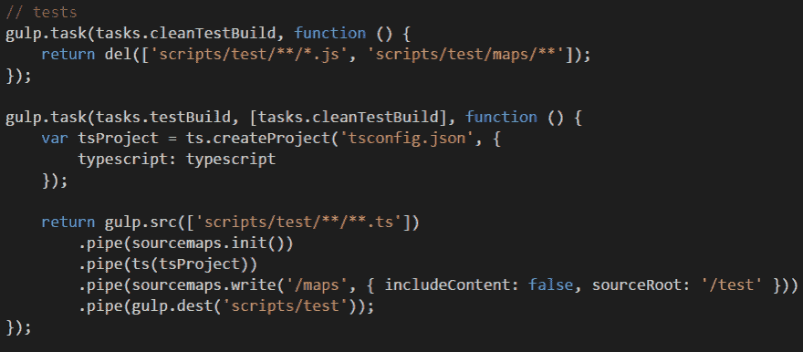
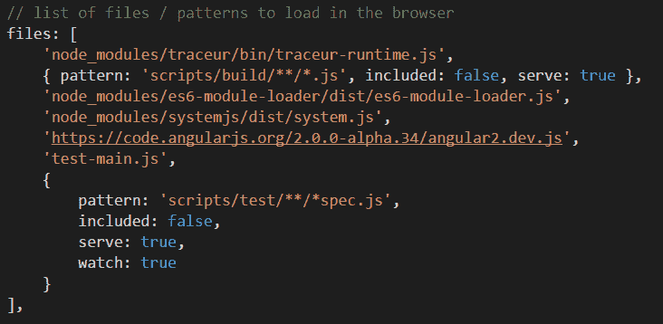
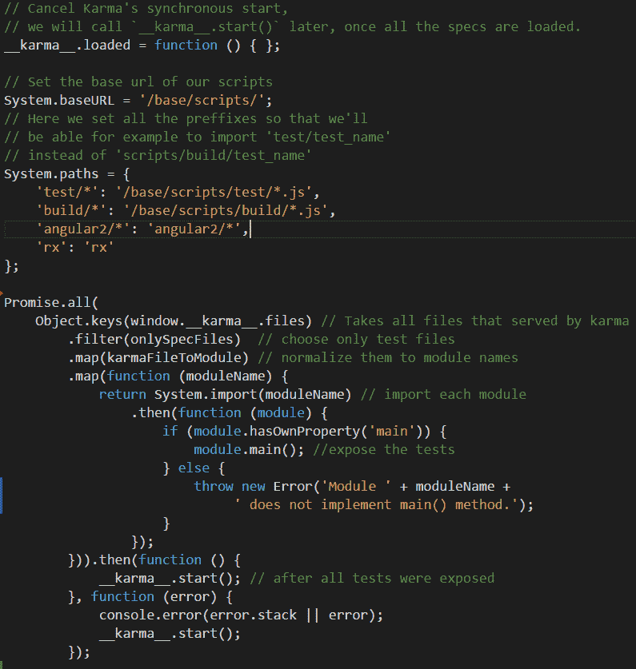
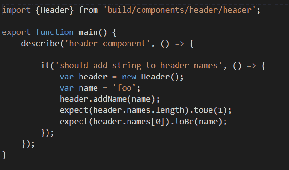

# 立即测试 Angular2 或如何设置 Angular2 单元测试

> 原文：<https://dev.to/forforeach/test-angular2-now-or-how-to-set-up-angular2-unit-tests-1ek8>

[T2】](https://res.cloudinary.com/practicaldev/image/fetch/s--ZJ_Xb8MS--/c_limit%2Cf_auto%2Cfl_progressive%2Cq_auto%2Cw_880/https://dev-to-uploads.s3.amazonaws.com/i/455xvwgo96tczpkvvn8l.png)

目前，我正在做一个项目，我决定用 Angular2 来构建它。这是一个勇敢的决定。当你试图用新技术的 alpha 版本来构建一些东西时，它真的不像看起来那么简单。大量的变化，其中一部分正在打破，缺乏文档的困难。然而，看到 Angular 是如何成长的，观察团队的合作，并感受到这一有趣过程的一部分，这是令人难以置信的兴奋。

对我来说，其中一项重要的任务是为我的项目建立单元测试。这就是我决定描述这个过程的原因。让我们开始吧:

#### **打字稿**

正如[微软在近半年前发布的](http://blogs.msdn.com/b/typescript/archive/2015/03/05/angular-2-0-built-on-typescript.aspx)一样，Angular2 是用 TypeScript 编写的。一开始，这对我来说是一个令人震惊的消息。但后来，我明白了这一步。我检查了一个新版本的 TypeScript，惊讶地发现它非常接近 ES6，呃… JavaScript 2015？！..嗯……没关系，最新的 JavaScript 版本:-)它还带来了额外的特性，比如可选类型、注释等等。这些事实足以说服我尝试用 TypeScript 编写我的项目。我认为很清楚，如果代码是用 TypeScript 编写的，测试也应该用 TypeScript 编写。如果测试是用 TypeScript 编写的，我应该把它们转换成 ES5。于是我做了两个任务[大口](http://gulpjs.com/):

[T2】](https://res.cloudinary.com/practicaldev/image/fetch/s--CqTSFbGS--/c_limit%2Cf_auto%2Cfl_progressive%2Cq_auto%2Cw_880/https://dev-to-uploads.s3.amazonaws.com/i/1pp9cynj62feytfmd5ut.png)

源代码这里是[这里是](https://github.com/forforeach/Angular2-Unit-Tests/blob/master/gulpfile.js)。

#### **因缘**

[Karma](http://karma-runner.github.io/0.13/index.html) 是 Angular 团队在 [Angular.js](https://angularjs.org/) 开发过程中开发的一款测试跑者。它的主要特性之一是能够在真正的浏览器上快速运行测试。此外，它对测试框架是不可知的，因此您可以使用您喜欢的任何框架。我选择了一款[茉莉](http://jasmine.github.io/)，但是你可以很容易地换成另一款。所以我在我的环境中安装了 Karma 和 Jasmine，并开始设置我的第一个测试。以下是文件中有趣的部分:

[T2】](https://res.cloudinary.com/practicaldev/image/fetch/s--ij17_HLJ--/c_limit%2Cf_auto%2Cfl_progressive%2Cq_auto%2Cw_880/https://dev-to-uploads.s3.amazonaws.com/i/9kjzok25l2li6i2673fp.png)

源代码这里是[这里是](https://github.com/forforeach/Angular2-Unit-Tests/blob/master/karma.conf.js)。

首先，我们需要添加 traceur-runtime.js。这些基本上是允许我们在浏览器中使用 ES6 功能的 polyfills，尽管它们尚未实现。

然后我们添加源文件。这些文件应该已经被编译成了 ES5 代码，并且应该只由 Karma 提供服务，而不是包含在脚本标签中。这是因为我们将使用 [System.js](https://github.com/systemjs/systemjs) 将它们导入到测试中。

这里是 es6 模块加载器和 system.js 文件。System.js 是一个通用的动态模块加载器，它在浏览器和 NodeJS 中加载 ES6 模块、AMD、CommonJS 和全局脚本。稍后，我们将看到如何配置 System.js 来正确地使用我们的测试。

我们肯定应该添加一个 angular2 文件:-)，然后是我们的测试文件。他们也应该被服务，而不是被包含。

当然，你注意到了这个我包含但没有解释的 **test-main.js** 文件。这个文件是这个帖子的亮点！所以，女士们先生们，请欢迎:

#### system . js 钩子

正如我之前所说的，为了支持模块的导入，我们使用 System.js。目前，Karma 不支持这个特性，所以我们需要实现一些变通方法，以便能够导入所有需要的模块，然后才能运行我们的测试。我们需要做的是:

[T2】](https://res.cloudinary.com/practicaldev/image/fetch/s--x-UNSyAm--/c_limit%2Cf_auto%2Cfl_progressive%2Cq_auto%2Cw_880/https://dev-to-uploads.s3.amazonaws.com/i/rvzl3du85q9yg3jgpl05.png)

首先，你要阻止业力的执行。这是由
制作的

```
\_\_karma\_\_.loaded = function () { }; 
```

接下来，我们应该通过设置系统全局对象的 baseUrl 和 paths 属性，用适当的文件配置 system.js。

```
System.baseURL = ‘/base/scripts/’;
System.paths = {
 ‘test/\*’: ‘/base/scripts/test/\*.js’,
 ‘build/\*’: ‘/base/scripts/build/\*.js’,
 ‘angular2/\*’: ‘angular2/\*’,
 ‘rx’: ‘rx’
}; 
```

然后，我们获取 Karma 提供的所有文件，只过滤测试文件，将文件名规范化为模块名，并使用 System.import 方法逐个导入它们。

**需要注意的一件重要事情**:每个测试文件都必须导出 main 函数，该函数包含与模块相关的所有测试。当模块被导入时，我们运行它的 main 方法来公开测试。下面是一个测试模块的示例:

[T2】](https://res.cloudinary.com/practicaldev/image/fetch/s--MBcFb-CX--/c_limit%2Cf_auto%2Cfl_progressive%2Cq_auto%2Cw_880/https://dev-to-uploads.s3.amazonaws.com/i/zyk8z9gt0oqjl6m2gbi8.png)

最后，当整个测试被导入并公开时，我们运行 karma 引擎:

```
\_\_karma\_\_.start(); // after all tests were exposed 
```

瞧，我们的 Angular2 测试环境已经准备就绪！

你可以在 Github 上找到[的源代码。要设置环境，只需克隆存储库并运行:](https://github.com/forforeach/Angular2-Unit-Tests) 

```
$ npm start 
```

另外，欢迎你来看看我和我的大学 Elad 开发的[角启动器](https://github.com/EladRK/angular-starter)。它非常简单，使用 gulp 构建工作流。

我将我的测试环境建立在角度测试环境的基础上。你可以在这里找到他们的 tests-main . js。

还有一件事，如果你喜欢这个帖子，请分享。有任何问题，可以在 Twitter 上找[@我](https://twitter.com/forforeach)

* * *