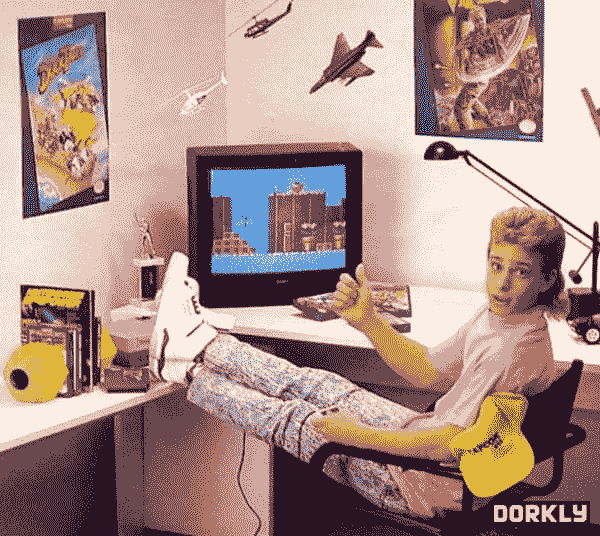
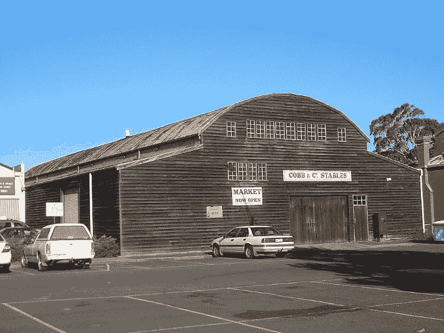
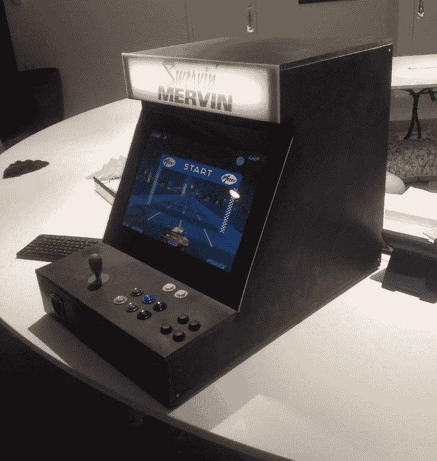

# 构建 DIY 街机，第 0 部分:动机

> 原文:[https://dev . to/buntine/building-a-DIY-arcade-machine-part-0-motivation](https://dev.to/buntine/building-a-diy-arcade-machine-part-0-motivation)

我一直是复古电子游戏的粉丝。这让我回想起我的童年时光，那时我和哥哥、姐姐会挤在电视机前的地板上，在我们的世嘉主控系统控制台上玩游戏。这是《奇迹世界》中内置亚历克斯·基德的特别版之一。我特别记得那场比赛，因为它既非常困难，也没有任何“拯救游戏”的概念。因此，很自然地，我们会暂停游戏，让游戏机一次运行几个星期。

[T2】](https://res.cloudinary.com/practicaldev/image/fetch/s--1fe_bRhY--/c_limit%2Cf_auto%2Cfl_progressive%2Cq_auto%2Cw_880/http://i.imgur.com/dCBECJ0.jpg)

> 我童年的艺术家印象。

在 90 年代初的某个时候，当我们的父亲给了我们一个全新的超级任天堂时，我们得到了升级。我对打败像[大金刚 II](https://en.wikipedia.org/wiki/Donkey_Kong_Country_2:_Diddy%27s_Kong_Quest) 和[超级男人 X](https://en.wikipedia.org/wiki/Mega_Man_X_(video_game)) 这样的游戏有着美好的回忆。每个周末，我和哥哥都会从当地的音像店租来一套 SNES 游戏、施瓦辛格电影和世界野生动物基金会摔跤录像带。在 WWW 出现之前，衡量一款游戏是否优秀的唯一标准就是寻找“强烈推荐！”封面上有标签。

偶尔，我和我的兄弟姐妹也会在我们当地的拱廊上输掉一两美元(一百美元),有趣的是，它是由一个旧马厩改建而成的。我们尤其擅长 4 人游戏《x 战警》(Beat 'em up 游戏的经典之作)和一款相对不知名的日本平台游戏《托奇》。我的一个好朋友在玩托奇的时候尿裤子了，因为他的分数很高，而且不相信我能在 30 秒内接手。那天，妈妈羞愧地开车送我们回家...

[T2】](https://res.cloudinary.com/practicaldev/image/fetch/s--QqRYKcTW--/c_limit%2Cf_auto%2Cfl_progressive%2Cq_auto%2Cw_880/http://i.imgur.com/OOf8GVE.jpg)

> 亚当尿裤子的地方。

快进 20 年。我正和我的女朋友坐在餐桌旁谈论我想做的一个视频游戏的想法。这将是一个赛车游戏，就像我过去在街机上玩的游戏一样: [Out Run](https://www.youtube.com/watch?v=WiWiTXq4yYY) 。我知道为了获得完整的效果，游戏需要在真实的街机上运行。我最初的想法是，也许我可以买一台现有的街机，并更换一些内部硬件。事实证明，这种*是*的可能性，因为 80 年代中期以后制造的大多数街机都是由 [JAMMA](https://en.wikipedia.org/wiki/Japan_Amusement_Machinery_Manufacturers_Association#Connector_standards) 标准化的，这意味着你可以用现代主板替换旧电路板，并用 JAMMA-2-USB 连接器连接两者。

但是，唉，找到一台完好无损的原版街机相对来说比较困难。这可能与这样一个事实有关，即这些可怜的机器通常在最初的二十年里被每个玩它们的人打得屁滚尿流，然后由于暴露在一些老家伙的棚子里而腐烂。除此之外，活跃的收藏家市场也推动了价格稳步上涨...

我只有一个选择:自己造这该死的东西！

在这个博客系列中，我将详细描述我安德鲁·邦汀在建造我自己的街机时所面临的考验和磨难，他在家具或电子产品方面没有任何经验。为了证明我真的建造了它并且它确实存在，我想给你一个成品的预览:

[T2】](https://res.cloudinary.com/practicaldev/image/fetch/s--THCUkgb6--/c_limit%2Cf_auto%2Cfl_progressive%2Cq_auto%2Cw_880/http://i.imgur.com/JC4TikH.jpg)

> 圆角很硬。

敬请期待下一部分。与此同时，也许你可以尝试在 NES 模拟器上击败有史以来最难的视频游戏[battle toad](https://en.wikipedia.org/wiki/Battletoads_(video_game))？祝你好运！！