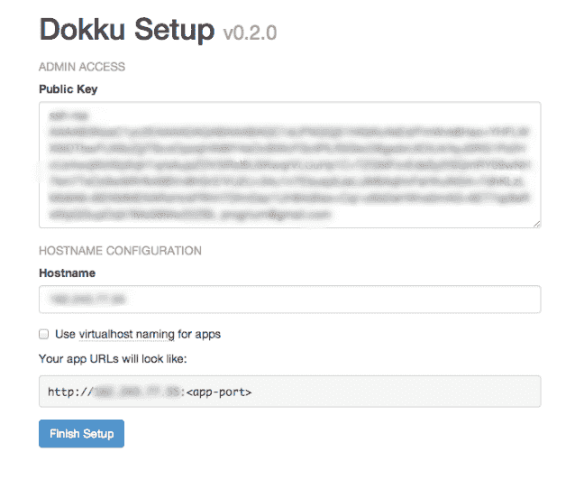

# 多库，为空的人准备部署！多库，为空的人准备部署！多库，为空的人准备部署！多库，为空的人准备部署！多库，为空的人准备部署！多库，为空的人准备部署！(导言)

> 原文:# t0]https://dev . to/adrianantombu/doku-le-deputy-para-los-null-introduction-1197

# doku，部署为空！(导言)

> 国家警察；FTP 博士一直以来 git push dokku master 是未来！

## 部署前

在不那么遥远的过去， ( *周五晚上*投入生产，至今仍是整个技术团队胆战心惊的时刻。

他把文件放入 FTP 软件后，屁股被拧紧，等待 3000 个文件上线。一般来说，由于的传输错误，需要多次重复。有时，由于 PHP 版本与某些最近使用的功能不兼容，或者由于未安装扩展，这可能会导致出现问题。

总之，一个**真正的噩梦**，浪费了大量的时间。

## 今天的部署

忘了这些‘t0’可怕的时刻’你一定经历过(“T2”我晚上还在梦寐以求的‘T3’)，因为现在部署真的变成了‘T4’对 null’:

```
git push dokku master 
```

Enter fullscreen mode Exit fullscreen mode

你想学习**魔法食谱**来达到这个结果吗？跟着向导走！

[T2】](https://res.cloudinary.com/practicaldev/image/fetch/s--phub3_yb--/c_limit%2Cf_auto%2Cfl_progressive%2Cq_66%2Cw_880/https://blog.otso.img/2015-08-07-dokku-le-deploiement-pour-les-nuls-introduction/bob-eponge-arc-en-ciel.gif)

## 什么是独木桥？

如其[github](https://github.com/progrium/dokku)仓库所示，dokku 是著名的 [Heroku](https://www.heroku.com/) 的复制品，是 Paas 型平台([平台即服务](https://en.wikipedia.org/wiki/Platform_as_a_service)。

使用 Heroku 进行部署时，您只需处理应用程序开发部分:服务器管理、缺少的模块、更新等方面的更多问题。我的梦！

除了价格会很快上涨。有一个免费的实例，但它在 1:30 后自动关闭，没有访客。下一个报价为 7\$ /月/应用程序。

dokku 就是这样出现的，他做了同样的事情，但是在**开源**！

## 完美部署的处方

### 1。在服务器上安装 dokku

几个月来，我一直使用[数字海洋](https://www.digitalocean.com/?refcode=8f4dbd7cf40b)(赞助链接)作为**VPS**的主持人。除其他功能外，它还提供点击式应用程序安装。确实有一个[doku 快捷批处理](https://www.digitalocean.com/features/one-click-apps/dokku/)，但在本教程中，我将使用其增强版[doku-alt](https://github.com/dokku-alt/dokku-alt)，它提供了许多预安装的插件。

因此，您可以选择简单的 Ubuntu 14.04 发行版，每月 5 美元。

要安装 doku-alt，**在新安装的服务器上登录 SSH** ，然后运行以下命令:

```
sudo bash -c "$(curl -fsSL https://raw.githubusercontent.com/dokku-alt/dokku-alt/master/bootstrap.sh)" 
```

Enter fullscreen mode Exit fullscreen mode

安装完成后，系统会提示您连接到以下 URL:

```
http://<ip-du-serveur>:2000/ 
```

Enter fullscreen mode Exit fullscreen mode

您可以添加自己的 SSH 密钥 ( *数字海洋*上自动填充的字段，并输入一个**域名**以代替服务器的 IP 地址。

[T2】](https://res.cloudinary.com/practicaldev/image/fetch/s--Ju9FpU6d--/c_limit%2Cf_auto%2Cfl_progressive%2Cq_auto%2Cw_880/https://blog.otso.img/2015-08-07-dokku-le-deploiement-pour-les-nuls-introduction/dokku-setup.png)

为了本文的目的，我们假定服务器可通过 URL**doku . me**访问

### 2。部署应用程序

作为一个优秀的开发人员，您将在 Git 下对您的项目进行版本控制。如果你不知道这种必不可少的工具，我建议你从今天起把[放在那里](https://git-scm.com/documentation)！

首先，**启动终端**，并定位在应用程序文件夹中。然后添加一个**远程弹出装置**，指向安装 dokku 的服务器。

```
git remote add dokku [email protected]:my-app 
```

Enter fullscreen mode Exit fullscreen mode

最后，你终于可以拿出你的魔杖，召唤著名的**神奇推演**！

```
git push dokku master 
```

Enter fullscreen mode Exit fullscreen mode

dokku 将自动处理整个部分**您的应用程序部署**。它会自动检测您使用的语言，并相应地在“[容器坞站”T7 中执行相应的“**”操作(“T4”在 PHP 中安装 composer 依赖项，构建其 Jekyll 应用程序，……t5”)。**](https://www.docker.com/)

完成后，您可以访问新部署的应用程序，网址为:

```
http://my-app.dokku.me 
```

Enter fullscreen mode Exit fullscreen mode

这就是简便的部署方式！

## 总有一天到来

今天，我为你们奠定了使用独木桥的基础很好，但我们可以做得更好！在接下来的一篇文章中，我将向大家解释用这个工具可以做的很多事情**:**

 ***   创建数据库
*   为部署的应用程式使用自订网域名称
*   安装扩展、选择 PHP 版本等。
*   在部署之间建立永久卷
*   添加环境变量

环境问题

[T2】](https://res.cloudinary.com/practicaldev/image/fetch/s--fnW8nZRT--/c_limit%2Cf_auto%2Cfl_progressive%2Cq_66%2Cw_880/https://blog.otso.img/2015-08-07-dokku-le-deploiement-pour-les-nuls-introduction/sheldon-content.gif)**