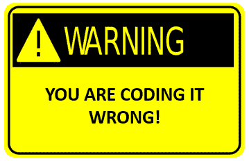

# 7 个警告信号表明你是一个糟糕的程序员

> 原文:[https://dev . to/funky si1701/7-warning-signs-that-you-a-bad-programmer-4150](https://dev.to/funkysi1701/7-warning-signs-that-youre-a-bad-programmer-4150)

[T2】](https://res.cloudinary.com/practicaldev/image/fetch/s--LvVWPTj4--/c_limit%2Cf_auto%2Cfl_progressive%2Cq_auto%2Cw_880/https://storageaccountblog9f5d.blob.core.windows.net/blazor/wp-content/uploads/2015/07/you_are_coding_it_wrong.png%3Fw%3D359%26ssl%3D1)

我是一个好的程序员还是一个坏的程序员？

这里有 7 个迹象，可能意味着你更倾向于坏的一端。

1.  在开始编码之前，你没有计划好

我对此感到非常内疚，我喜欢在思考之前跳入代码。但是我慢慢开始看到在我写任何代码之前画出一些草图的好处。

我最近的大部分编码都是基于 SQL 的，我开始喜欢画出表格设计草图。

1.  您未能使用版本控制

我在过去的博客中提到过使用版本控制，但它确实是一项非常有用的技术。它不仅跟踪您的解决方案中的每个文件并存储其整个历史，而且您可以将不同的版本分成不同的分支，并查看谁在何时更改了什么(以及提交消息是否足够详细，为什么)。

1.  您使用了错误的变量名

variable1 和 variable2 作为变量名有什么问题？变量应该根据它们做什么或者包含什么来命名，但是开始复制和粘贴它们是非常容易的，在你知道之前，你已经有了变量 1 和变量 2 的情况。请记住，Visual Studio 有一些强大的重构工具，所以让它们恢复正常相对容易。

1.  你重复你的代码

我一直在读《实用程序员》,他们的第一条建议是“干——不要重复自己”。他们走极端，在你的代码中没有任何地方重复，但我认为你不需要走得太远，你可以是合理的。如果相同的代码重复了四次，那么为这段代码创建一个函数将会极大地改善您的代码。

1.  你努力理解你自己的代码

我为什么这样做？我觉得我总是试图记住我选择以前编码方式的原因。造成这种情况的部分原因是，目前我正在不断地学习，但在未来，我可以做更多的事情来帮助自己理解。

1.  你很自私，不分享

我不自私，如果我学到了很酷的东西，我会告诉别人。我喜欢在这里写东西与世界分享。我在想培训员工的新方法。

1.  你从事多个项目

是的，罪名成立。我在工作中有多个项目，我也有一些我想做的个人项目。我不完全同意多个项目等于糟糕的程序员。