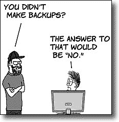

# 使用数据库前需要了解的事项

> 原文:[https://dev . to/funky si1701/things-to-know-before-working-on-your-database-1aa 3](https://dev.to/funkysi1701/things-to-know-before-working-on-your-database-1aa3)

我最近看到了 [Brent Ozar](http://www.brentozar.com/team/brent-ozar/) 的博客[帖子](http://www.brentozar.com/archive/2015/07/questions-to-ask-before-you-touch-a-database-server/)，我想我可以讨论一下。

Brent 列出了在开始使用数据库之前要问的 13 个问题。我将仔细阅读这 13 个问题，并根据我的经验对它们进行扩展。

1.  这个数据库现在投入生产了吗？

我认为不言而喻的是，您首先应该弄清楚您的数据库是否在生产中。如果不是在生产中，你可以做你喜欢的，没有人会注意到。我知道哪些数据库在生产中，哪些不在我工作的地方，所以我可以回答这个问题。

1.  如果这样下去，会有哪些应用程序跟着完蛋？

什么应用程序运行在什么数据库上是一个很好的第二个问题。我至少有一个数据库，其中有多个前端应用程序。乍一看，你会认为这两个应用程序没有联系，但它们是联系在一起的，我需要小心这两个应用程序，以确保它们不会相互破坏。我知道什么应用程序运行在什么数据库上。

1.  当这些应用程序停止运行时，是否会有潜在的生命或金钱损失？

这是一个困难的问题，所以我将把它分成两部分。生命损失，我的数据库不控制生命维持机或核武器，所以我的第一直觉会说不。然而，这并不简单，如果你的应用程序允许承包商知道他们工作的财产内的危险位置会怎么样。一旦你的应用出现故障，他们可能会因为缺乏信息而发生事故。赔钱，这个比较直白。在商业世界中，时间就是金钱，所以任何时候你的应用程序宕机，你的员工无法工作，都是金钱的损失。如果你的数据库链接到一个电子商务网站，金钱的损失可能会非常高。我知道停机会对我的用户和业务产生什么影响。

1.  **这些应用对暂时的减速有多敏感？**

与上一个问题类似，对于某些应用程序来说，速度变慢可能会导致停机。幸运的是，我的大多数应用程序都是内部的，所以不会受到缓慢的严重影响。

1.  **上次成功备份是什么时候？**

我管理所有数据库的备份计划，因此我确切知道每个数据库上次备份的时间。每当我对生产数据库做任何事情时，我都会运行一个备份，以便在出现问题时可以回滚。作为开发变更的一部分，我在数据备份上运行我的变更。我可以编写所有更改的脚本，并针对备份反复运行它们，直到我确信不会出现问题。

[T2】](https://res.cloudinary.com/practicaldev/image/fetch/s--5B2hsgj6--/c_limit%2Cf_auto%2Cfl_progressive%2Cq_auto%2Cw_880/https://storageaccountblog9f5d.blob.core.windows.net/blazor/wp-content/uploads/2015/07/uf010206.jpg)

1.  **上一次成功的恢复测试是什么时候？**

比备份更重要的是测试恢复您的数据库。如果你不能恢复数据，那么你的备份是无用的。我尝试至少每周测试恢复我的备份，这样我知道我可以依赖我的备份。

1.  **每个人都可以将数据恢复到上次成功备份的状态吗？**

如果发生灾难，您可能会丢失从现在到上次备份之间的所有数据。但并非全部丢失事务性备份可以安排在全天进行，在我的案例中，我们最多可以丢失 15 分钟的数据。这可以根据您的数据配置得更频繁或更不频繁。但是请记住上一个问题，确保您测试的是事务性备份的恢复，如果您无法从事务性备份中恢复，您将被迫从上次成功的备份中恢复。

1.  **上一次成功的廉洁测试是什么时候？**

如果不迅速发现腐败，它可能成为一个杀手。如果您需要恢复到损坏发生前的最后一次备份，这可能会导致大量数据丢失。为了检查腐败，你需要定期运行 DBCC。

1.  我们是否有一个开发或试运行环境，让我可以先测试我的变更？

如果答案是否定的，那么你的下一个工作就是建立一个开发或准备区域。拥有一个开发环境使开发变得容易得多，如果没有开发环境，我不认为我能完成最近所做的所有改变。

1.  有文档说明为什么服务器要这样配置吗？

我真的希望我们有更多的关于配置的文档，因为这将有助于找出为什么事情是这样设置的。所以很不幸，这个问题的答案是否定的。

1.  我不能做什么改变？

取决于你的应用程序做什么，托管在哪里，改变需要多快，以及许多其他因素都将限制你可以做出什么样的改变。数据库的历史决策也会影响可以做出的更改，如果数据库已经以某种方式构建，那么以更有效的方式重新构建它可能会非常困难。

1.  谁能证明我的更改解决了问题？

这是一个有趣的问题，从经验来看，关于数据库的问题，最好的交谈对象是用户。如果他们能告诉你如何重现一个问题，你应该能够解决这个问题，之后你可以让他们验证这个问题是否已经解决。

1.  谁能测试这些应用程序是否仍能按设计运行，我的改动是否有意想不到的副作用？

这是上一个问题的延伸。你的应用程序的主要用户应该是你的第一个访问端口，以了解应用程序是否如预期那样工作。然而，探索副作用和不受欢迎的功能是我在开发过程中要测试的一部分。这花了一段时间，但我已经建立了一个详细的检查表，可以用于测试，所以我知道大多数错误可以在发布前发现。