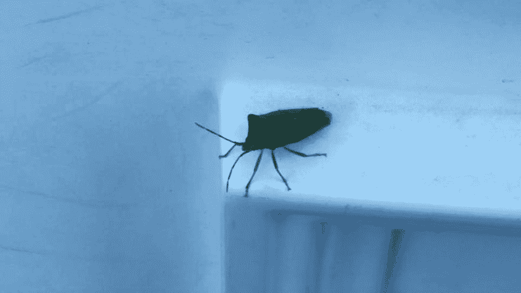
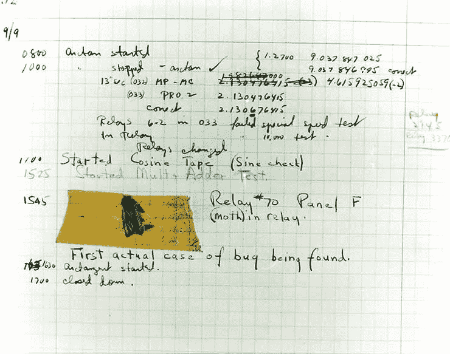

# 为什么我们称它们为虫子？

> 原文:[https://dev.to/funkysi1701/why-do-we-call-them-bugs-3h8](https://dev.to/funkysi1701/why-do-we-call-them-bugs-3h8)

[T2】](https://res.cloudinary.com/practicaldev/image/fetch/s--QRxouJf8--/c_limit%2Cf_auto%2Cfl_progressive%2Cq_auto%2Cw_880/https://storageaccountblog9f5d.blob.core.windows.net/blazor/wp-content/uploads/2015/07/11666093_10153470803062792_4914668365512645054_n.jpg%3Fw%3D960%26ssl%3D1)

在我从办公室回家的路上，我发现了这个小家伙。在我的专家看来，这是一个“错误”。

这个特殊的“错误”是无害的，但是你有没有想过为什么计算机问题经常以这个小家伙(和他的朋友)的名字命名？

[T2】](https://res.cloudinary.com/practicaldev/image/fetch/s--AzLQByQ0--/c_limit%2Cf_auto%2Cfl_progressive%2Cq_auto%2Cw_880/https://storageaccountblog9f5d.blob.core.windows.net/blazor/wp-content/uploads/2015/07/H96566k.jpg%3Fresize%3D300%252C236%26ssl%3D1)

第一次有记录的错误报告是在 1947 年，当时格蕾丝·赫柏在哈佛马克 2 号的继电器之间发现了一只蛾子，这只蛾子被记录在日志中作为证据。

从那时起，消除错误的过程就被称为“调试”。然而，在此之前，电气设备中已经存在缺陷。

在早期的电报时代，有两种类型的键控器。老式的“手动”键盘，要求操作者对点和破折号进行编码。还有更新的半自动键盘，可以自动发送一串点。这些半自动键盘被称为“臭虫”。这些按键中最常见的品牌之一是 Vibroplex，它使用了一个甲虫图形。

幸运的是，我处理的虫子没有腿或翅膀，只是计算机代码中的错误。当我调试代码时，我需要查看代码的内部工作情况，寻找问题，通常是打字错误或逻辑不匹配。但是电脑虫子和活着的虫子之间的关系仍然存在，虫子追踪软件 bugzilla 用一只卡通虫子作为它的标志。