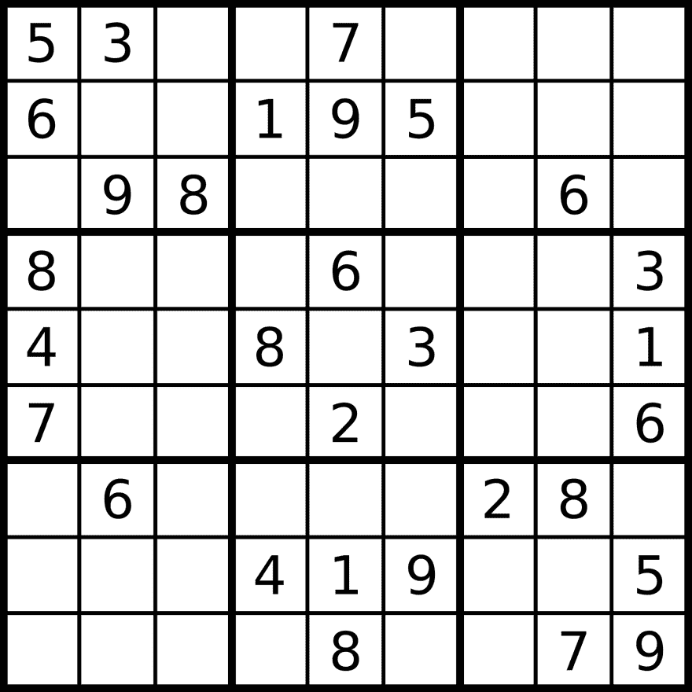

# 数独挑战

> 原文:[https://dev.to/funkysi1701/sudoku-challenge-1gdd](https://dev.to/funkysi1701/sudoku-challenge-1gdd)

昨晚我去了 Leeds Sharp 的一个代码道场(我已经开始去那个编码用户组了)。Code Dojo 是一项编程挑战，人们通常成对工作。

我们面临的挑战是编码解谜游戏数独的解决方案。我们使用的代码可以在 github 上找到。

[T2】](https://res.cloudinary.com/practicaldev/image/fetch/s--8XPCyhoG--/c_limit%2Cf_auto%2Cfl_progressive%2Cq_auto%2Cw_880/https://storageaccountblog9f5d.blob.core.windows.net/blazor/wp-content/uploads/2015/06/2000px-Sudoku-by-L2G-20050714.svg_.png%3Fresize%3D660%252C660%26ssl%3D1)

我不太了解数独，但游戏是这样的。你从一个 9×9 的格子开始，想法是把所有缺失的数字都填上。

每行只能使用 1 到 9 中的每个数字一次，每列只能使用 1 到 9 中的每个数字一次，每个子网格(3×3)只能使用每个数字一次。

我和 Richard 一起工作，他是 Leeds Sharp 的组织者之一，我们开始尝试遍历每个空单元格并插入值进行暴力攻击，但这种方法并没有让我们走得很远(实际上是因为应用程序崩溃了！)

我们需要使用的方法是循环计算可能的值。

只有当我在这个道场坐下来的时候，我才意识到我还有很多东西要学，但是在和 Richard 谈论不同的方法和不同的编码结构的时候，我开始学习了。