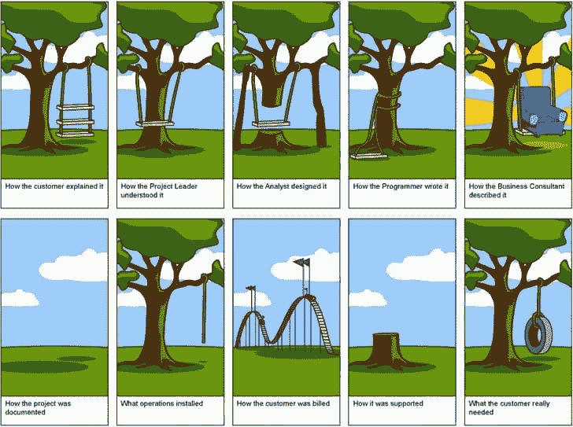

# 需求收集

> 原文：<https://dev.to/funkysi1701/requirement-gathering-1eml>

在设计系统变更时，为什么很难找出到底需要什么？

[T2】](https://res.cloudinary.com/practicaldev/image/fetch/s--4E0H3KgM--/c_limit%2Cf_auto%2Cfl_progressive%2Cq_auto%2Cw_880/https://storageaccountblog9f5d.blob.core.windows.net/blazor/wp-content/uploads/2015/06/Requirements-Gathering-User-Experience-UX-Project-Cartoon.jpg)

当向数据库添加功能时，我总是喜欢一头扎进去，开始添加额外的列和新的表。但在某些时候，你需要找出什么是需要的。

我所遵循的收集需求的过程是这样的。

我的老板告诉我，我们需要一个系统来解决 x 问题。这是对所需内容的大致概述。

接下来，我需要具体了解该系统是如何使用的，以及需要添加哪些内容。和我的老板讨论细节经常会导致高度的混乱。我总是试着和每天都会使用这个系统的用户交流。如果我创造了一些不喜欢的东西，人们会避免使用它，这也不能解决原来的问题，所以我一直认为与日常用户交流是非常重要的。

在我有了需要什么的想法后，我会建造一些东西。一旦我有了这样的东西，我会试着向用户演示，收集反馈。这种反馈是非常宝贵的，因为它通常会揭示我是否走在正确的方向上，并揭示需要合并到最终解决方案中的缺失需求。

我通常会将最后一个阶段重复几次，尤其是在需要进行重大变革的情况下，一旦我感到满意，我会在部署解决方案之前向我的老板展示。

部署之后，在我认为项目完成之前，通常会有一段时间来修复问题和收集反馈。

这整个过程非常耗时，因为有一段时间的变化是根据反馈来来回回调整的。更好的方法是收集详细的需求说明，并努力实现。