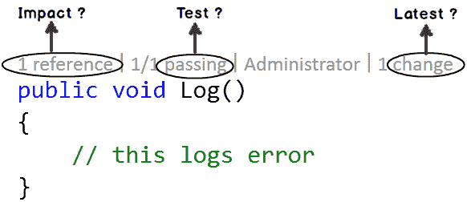

# 可视化工作室

> 原文：<https://dev.to/funkysi1701/visual-studio-307p>

我最近用 Visual Studio 2015 RC 替换了我安装的 Visual Studio 2013。

我喜欢新版本，我不是 Visual Studio 专家，所以可能需要一段时间才能找到所有的好东西，但这里有一些初步的想法。

由于我的 MSDN 订阅仍然有效，我已经安装了专业版，以利用其额外的功能，如 CodeLens。

我发现的第一件事是与 Azure 的集成已经得到了改进。在上一个版本中，很难用正确的凭证登录 Azure，尤其是如果你有不止一个 Azure 帐户。现在，您可以添加多个帐户和套餐。

[T2】](https://res.cloudinary.com/practicaldev/image/fetch/s--_c8S9ZNL--/c_limit%2Cf_auto%2Cfl_progressive%2Cq_auto%2Cw_880/https://storageaccountblog9f5d.blob.core.windows.net/blazor/wp-content/uploads/2015/05/i1.png)

CodeLens 是自 2013 年以来一直存在于 Visual Studio 中的一项功能，但在 2015 年，它在专业领域可用，这意味着更多人可以访问它。

CodeLens 为编码人员提供了一目了然的有用信息。在每个类/方法上面列出了有多少引用。如果您单击引用的数量，您可以看到该类或方法在代码的其余部分中被引用。能够看到哪些方法或类没有被使用是很有用的。

Next CodeLens 显示了谁(根据 git)最后一次更改了类或方法，以及是多少天前。点击它会显示一个很酷的图表，上面显示了何时发生了变化以及谁做了这些变化。

接下来，您可以看到已经做出的更改的数量，基本上是一个源代码控制历史，但是不需要加载您的 git 客户端。

对于不包含类或方法(如 T_SQL)的代码，您可以在代码窗口的底部看到最后两个 CodeLens 信息，以帮助您跟踪最近发生了什么变化。

我注意到的最后一个新特性是在我的代码中不断出现的灯泡。我认为灯泡可能被称为快速行动，但不管它们被称为什么，它们都是关于如何改进代码的建议。到目前为止，他们建议去掉不使用的引用，简化完全限定名，去掉不需要的关键字。我敢肯定，随着我做更多的编码，会弹出更多。

我喜欢 Visual Studio 的这些改进，我相信还有很多我没有注意到的。我期待对 vNext 的支持。net 框架也在那里的某个地方，希望我可以很快玩一玩。