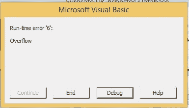

# 泛滥

> 原文：<https://dev.to/funkysi1701/overflow-24f8>

今天我遇到了一个新的错误。

[T2】](https://res.cloudinary.com/practicaldev/image/fetch/s--g80xMgmF--/c_limit%2Cf_auto%2Cfl_progressive%2Cq_auto%2Cw_880/https://storageaccountblog9f5d.blob.core.windows.net/blazor/wp-content/uploads/2015/05/error.jpg%3Fw%3D385%26ssl%3D1)

运行时错误“6”:溢出并没有告诉我太多。错误发生在我们主数据库的 Access ADP 前端。它只发生在一个特别的身份证号码上，这让我很困惑。

我尝试的第一件事是删除我最近做的更改，这没有什么不同。现在是时候看看错误发生前运行的 VBA 代码了。

```
Dim iPropertyId As Integer
iPropertyId = DLookup(“PropertyId”, “Survey”, “[ProjectNo]=” & Me.ProjectNo) 
```

Enter fullscreen mode Exit fullscreen mode

一切看起来都很好，甚至在 SQL Management Studio 中运行 Dlookup 查询也没有抛出任何错误。

```
SELECT PropertyId FROM dbo.Survey WHERE ProjectNo = 
```

Enter fullscreen mode Exit fullscreen mode

接下来，我尝试将 iPropertyId 显式设置为有问题的 Id，仍然是同样的错误。

这让我再次查看错误消息。Overflow 表示某物太大了，但它会是什么呢？

整数的大小限制为 32，767，而我试图传递到 iProperty 的值是 32779。这就是导致问题的原因，我的数据库已经增长到一个整数太小的程度，我需要把它改成一个长整数。Long 的大小为 2，147，483，647，所以我的数据库应该还能工作一段时间。

著名的编程帮助网站[堆栈溢出](https://stackoverflow.com/)就是以这样一个错误命名的。这个错误显示了决定使用哪种变量类型是多么困难，因为您不知道数据库增长的速度有多快。