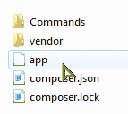

# 在 PHP 中创建自己的工匠

> 原文:[https://dev . to/sarfraznawaz 2005/creating-your-own-artisan-in-PHP-2267](https://dev.to/sarfraznawaz2005/creating-your-own-artisan-in-php-2267)

这篇文章是关于如何创建你自己的命令行工具的基础教程。我会试着一步一步解释，这样事情就容易理解了。

当我第一次看到 Laravel framework 时，我真的很喜欢它的 Artisan 控制台工具，它似乎像魔法一样为我们提供了一堆我们可以用它做的事情，例如创建 MVC 三元组、运行迁移等等。虽然类似的概念已经存在于 CakePHP 这样的框架中，但 Laravel 做得很好，让我们意识到控制台应用程序是多么有用，我们可以在基本的 CRUD 操作之外使用它。

要创建一个控制台应用程序，我们可以使用 Symfony 的控制台组件，事实上 Laravel 也使用了相同的组件。我们也可以使用[光环。但是在这篇文章中，我们将坚持使用 Symfony 提供的。](https://github.com/auraphp/Aura.Cli)

## 安装 Symfony 控制台组件

最简单的安装方法是通过 composer。在你的文档根目录下创建一个名为 **consoleApp** 的新文件夹，并在其中创建一个 **composer.json** 文件，内容如下:

```
{
    "require" :{
        "symfony/console": "2.6.7"
    }
} 
```

然后从您的 cli 应用程序运行新创建的文件夹中的`composer install`命令。过了一段时间，你应该已经创建了**供应商**目录。

## 创建我们的第一个命令

命令是执行特定任务的东西。例如，在 Laravel 的 artisan 工具中，您可以键入以下内容:

```
> php artisan app:name yourAppName 
```

这里的`app:name`是一个命令，可以改变你的 Laravel 应用程序的名称空间。以下也是上述行的明细:

*   `php` - php 可执行文件(php.exe)。这假设您已经在系统的`PATH`环境变量中添加了 php.exe
*   `artisan` -控制台应用程序的名称
*   `app:name` -将要运行的命令的名称
*   `yourAppName`是`app:name`命令的一个参数

在应用程序的根目录下创建一个**命令**文件夹，这将包含我们将要创建的控制台应用程序的所有命令。还可以创建一个名为 **app** (不带扩展名)的空文件，方法是使用您选择的编辑器，或者通过您的 cli 在 app 根文件夹`touch app`中运行该命令。文件夹结构现在应该如下所示:

[T2】](https://res.cloudinary.com/practicaldev/image/fetch/s--dBBECVqT--/c_limit%2Cf_auto%2Cfl_progressive%2Cq_auto%2Cw_880/https://codeinphp.github.img/1431513018555327ba67b95.png)

在您选择的编辑器中打开 app `app`文件，并将这一行粘贴到其中:

```
#!/usr/bin/env php 
```

这告诉系统这是一个 php env 文件，应该由 php 可执行文件运行。如果您在 Linux 上，您可能需要对这个文件应用 *execute* 权限。

接下来，让我们通过 composer 的 autoload 特性来包含我们的依赖项，所以添加这一行:

```
require __DIR__. '/vendor/autoload.php'; 
```

这将自动包括我们的依赖，在这种情况下是 Symfony 控制台组件。

现在`app`文件应该有这些内容:

```
#!/usr/bin/env php
<?php
require __DIR__. '/vendor/autoload.php'; 
```

在我们进一步编辑这个文件之前，让我们首先创建我们的命令，它基本上将是一个`Greet`命令。我们的命令本质上是类文件，因此在我们之前创建的命令目录中，创建一个名为`GreetCommand.php`的文件。

Symfony 控制台组件要求我们应该扩展它，并提供至少两个名为`configure()`和`execute()`的方法。顾名思义，`configure()`方法可以用来配置我们的命令，比如将调用什么命令，它将接受什么参数和选项，以及`execute()`命令将实际执行我们的命令。

在`GreetCommand.php`文件中，粘贴这些内容:

```
<?php
use Symfony\Component\Console\Command\Command;
use Symfony\Component\Console\Input\InputArgument;
use Symfony\Component\Console\Input\InputInterface;
use Symfony\Component\Console\Input\InputOption;
use Symfony\Component\Console\Output\OutputInterface;

class GreetCommand extends Command
{
    protected $commandName = 'app:greet';
    protected $commandDescription = "Greets Someone";

    protected $commandArgumentName = "name";
    protected $commandArgumentDescription = "Who do you want to greet?";

    protected $commandOptionName = "cap"; // should be specified like "app:greet John --cap"
    protected $commandOptionDescription = 'If set, it will greet in uppercase letters';    

    protected function configure()
    {
        $this
            ->setName($this->commandName)
            ->setDescription($this->commandDescription)
            ->addArgument(
                $this->commandArgumentName,
                InputArgument::OPTIONAL,
                $this->commandArgumentDescription
            )
            ->addOption(
               $this->commandOptionName,
               null,
               InputOption::VALUE_NONE,
               $this->commandOptionDescription
            )
        ;
    }

    protected function execute(InputInterface $input, OutputInterface $output)
    {
        $name = $input->getArgument($this->commandArgumentName);

        if ($name) {
            $text = 'Hello '.$name;
        } else {
            $text = 'Hello';
        }

        if ($input->getOption($this->commandOptionName)) {
            $text = strtoupper($text);
        }

        $output->writeln($text);
    }
} 
```

代码非常简单明了:

*   是我们司令部的名字
*   `$commandDescription`是我们命令的描述/帮助文本
*   `$commandArgumentName`是我们命令的参数名
*   `$commandOptionName`是我们命令的选项名。参数和选项的区别在于选项是可选的，不像参数，可以用`--optionName`指定。
*   在`configure()`方法内部，我们可以很容易地理解我们如何设置命令名、参数和选项。
*   在`execute()`方法中，我们获取参数并检查它是否被设置。如果设置了，我们说`Hello Name`，否则我们简单地说`Hello`。然后，我们检查是否提供了选项，如果是，我们大写它，最后输出结果。

最后，让我们告诉 Symfony 控制台组件使用我们刚刚创建的命令。修改`app`文件，使其看起来像这样:

```
#!/usr/bin/env php
<?php
require __DIR__. '/vendor/autoload.php';

use Symfony\Component\Console\Application;

$application = new Application();

# add our commands
$application->add(new GreetCommand());

$application->run(); 
```

让我们测试一下我们的命令。打开您的 cli 应用程序，将其指向我们的应用程序根目录，并运行以下命令:

```
> php app app:greet John 
```

这将导致错误，即没有找到`GreetCommand.php`文件。让我们告诉 composer 自动包含来自**命令**文件夹的命令。编辑 composer.json 文件，如下所示:

```
{
  "require": {
    "symfony/console": "2.6.7"
  },
  "autoload": {
    "classmap": ["Commands"]
  }
} 
```

然后在您的 cli 应用程序中键入`composer dump -o`。现在再次运行我们的命令:

```
> php app app:greet John 
```

你应该看看`Hello John`。类型:

```
> php app app:greet John --cap 
```

你应该看看`HELLO JOHN`。

这里我们将控制台文件命名为`app`，但是如果你将其重命名为`artisan`，然后运行上面的命令，将`app`替换为`artisan`，你将拥有自己的 artisan 工具，非常有趣:)

当然，您现在可以向新的控制台应用程序添加任何您想要的命令。您甚至可以通过新的控制台应用程序运行 composer 或 git 命令，或者可能是一些部署/构建脚本，甚至是系统命令。如果你正在使用一些 MVC 框架，你可以使用这个工具来创建你自己的方法，比如创建控制器，实体类，运行你的定制迁移，从你的控制器调用方法等等。

如果你想知道 Laravel 是如何做到这一切的，你可以看看这个文件夹，看看这些命令是如何创建的:

`vendor/laravel/framework/src/Illuminate/Foundation/Console`

我目前正在从事一个由 CodeIgniter 驱动的项目(正如你所知，它没有内置的控制台应用程序)，我创建了一些命令，这些命令确实帮助我加快了开发时间，我可以通过我的控制台应用程序做许多不同的事情。

尽情使用您的 artisan 工具:)

[T2】](https://res.cloudinary.com/practicaldev/image/fetch/s--QpciR4Jo--/c_limit%2Cf_auto%2Cfl_progressive%2Cq_auto%2Cw_880/http://feeds.feedburner.com/%257Er/codeinphpfeed/%257E4/9mUxSBZQ5BY)