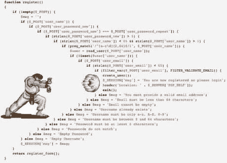

# 用保护类替换嵌套条件

> 原文:[https://dev . to/sarfraznawaz 2005/replace-nested-conditions-with-guard-clauses-24 F4](https://dev.to/sarfraznawaz2005/replace-nested-conditions-with-guard-clauses-24f4)

有时，当我们需要将条件放入条件(嵌套条件)中时，我们必须编写代码，一旦所有这些都为真，我们就执行一些操作。下面是我的意思的虚拟例子:

```
function isAuthorized($userId, $age)
{
    if (isLoggedIn($userId))
    {        
        if (isAdmin($userId) && $age >= 18)
        {            
            if (hasAcess($userId, $resourceId))
            {
                return true;
            }
        }
    }

    return false;
} 
```

虽然上面的代码在功能上没有问题，但是以某种方式避免嵌套条件(也是嵌套循环)是一个好的实践。这是一个简单的例子，用肉眼看起来很容易理解，但事实并非总是如此。显然，我们可以重构上面的代码，避免像这样的嵌套条件:

```
function isAuthorized($userId, $age)
{
    if (isLoggedIn($userId) && isAdmin($userId) && $age >= 18 && hasAcess($userId, $resourceId))
    {        
        return true;
    }

    return false;
} 
```

我们已经缩短了代码，但它看起来仍然不太好，可读性也受到了影响。根据您正在使用的代码编辑器/IDE 和字体，或者如果您有更多的嵌套条件，这似乎不是一个好的解决方案或一个容易理解的方案。

解决办法是一种叫做**保护条款**的东西，它本质上意味着你把你的条件以一种与你原来的条件相反的方式提出来。与原始条件相比，保护条款应该返回相反的值。下面是我们如何使用上述例子中的守卫条件:

```
function isAuthorized($userId, $age)
{
    if (! isLoggedIn($userId)) { return false; }
    if (! isAdmin($userId) || $age < 18) { return false; }
    if (! hasAcess($userId, $resourceId)) { return false; }

    return true;
} 
```

可以看出，我们已经通过在函数上放置反向条件来消除嵌套条件。当其中任何一个为`false`时，我们不再继续。如果 none 为 false，则最后返回`true`作为默认值。

这样做的好处是代码看起来容易理解，一眼就能看出它在做什么。相当简单但有效的东西。

# 避此；-)

[T2】](https://res.cloudinary.com/practicaldev/image/fetch/s--bVU1Dscb--/c_limit%2Cf_auto%2Cfl_progressive%2Cq_auto%2Cw_880/https://codeinphp.github.img/14316395635555160b05859.png)

[T2】](https://res.cloudinary.com/practicaldev/image/fetch/s--ZsrQPtgW--/c_limit%2Cf_auto%2Cfl_progressive%2Cq_auto%2Cw_880/http://feeds.feedburner.com/%257Er/codeinphpfeed/%257E4/ZGHE7TQtk4U)