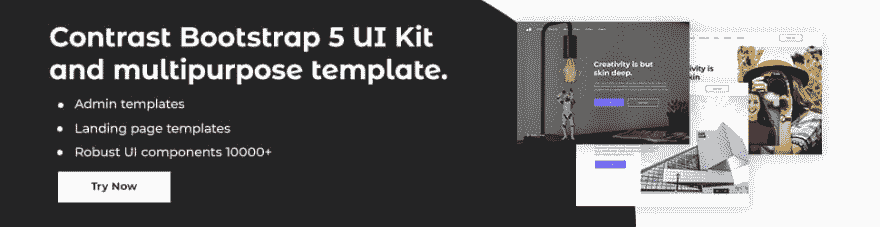
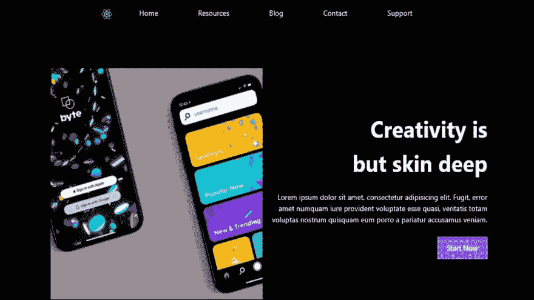
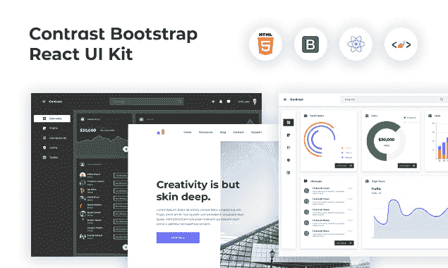

# 如何在 React 中使用引导使用 React 库

> 原文：<https://dev.to/devwares/how-to-use-bootstrap-in-react-using-a-react-library-4a5c>

React 是最流行的 javascript 前端框架之一，它的流行并不令人惊讶，因为它使用起来非常灵活。另一方面，Bootstrap 是一个开源的 CSS 框架，为用户界面组件(如卡片和模态)提供了许多模板。

[T2】](https://res.cloudinary.com/practicaldev/image/fetch/s--c1kDWjYV--/c_limit%2Cf_auto%2Cfl_progressive%2Cq_auto%2Cw_880/https://dev-to-uploads.s3.amazonaws.com/uploads/articles/41meil9ho9yx2ulb535m.png)

在本文中，我们将利用这两个框架和一个 react 库来创建一个简单的登录页面。我们将使用的库是 CDBReact，它是一个优雅的 UI 工具包，具有可重用的组件，用于构建移动优先、响应迅速的网站和 web 应用程序。

**先决条件**

登录页面将由 React、Bootstrap 和 CDBReact 构建。你不需要有任何关于 CDBReact 的知识。基本反应知识基本引导知识 NPM 安装

这是我们将要构建的登录页面的图像。

[T2】](https://res.cloudinary.com/practicaldev/image/fetch/s--56XcmYi9--/c_limit%2Cf_auto%2Cfl_progressive%2Cq_auto%2Cw_880/https://dev-to-uploads.s3.amazonaws.com/uploads/articles/msdafgchigfqv4x0ga71.png)

**设置**

首先检查您是否安装了节点。为此，运行以下代码

```
node -v 
```

Enter fullscreen mode Exit fullscreen mode

如果你没有安装 nodejs，请在这里下载它

安装节点也会在您的 PC 上安装 npm，但是您仍然可以使用
进行确认

```
npm -v. 
```

Enter fullscreen mode Exit fullscreen mode

现在我们已经安装了节点，我们可以通过转到我们选择的目录并运行
来启动 React 项目

```
npx create-react-app landing-page 
```

Enter fullscreen mode Exit fullscreen mode

我选择了登陆页面作为我的项目名称，但是你可以使用任何你想要的名称。

**安装 CDB rect**

现在，我们必须在我们的项目
中安装 cdbreact

```
npm install --save cdbreact 
```

Enter fullscreen mode Exit fullscreen mode

或者使用纱线

```
yarn add cdbreact 
```

Enter fullscreen mode Exit fullscreen mode

请注意，我们不需要安装 bootstrap 或将其添加到项目中的任何位置，因为 CDBReact 会在安装时为我们完成这些工作。

还要安装 React router，因为我们将要创建的 Navbar 需要它。

```
npm install react-router-dom 
```

Enter fullscreen mode Exit fullscreen mode

现在运行`npm start`以确保一切顺利运行

### 导航条

现在让我们继续为我们的登录页面创建一个导航栏。

创建名为 Navbar 的文件

从 cdbreact
导入 Navbar 和我们将使用的其他组件

```
import React, { useState } from 'react';

import {

  CDBBtn,

  CDBNavbar,

  CDBNavBrand,

  CDBNavbarNav,

  CDBNavToggle,

  CDBNavItem,

  CDBNavLink,

  CDBCollapse,

} from 'cdbreact'; 
```

Enter fullscreen mode Exit fullscreen mode

之后，为导航栏添加以下代码。

```
const Navbar = () => {

  const [collapse, setCollapse] = useState(false);

  return (

    <header

      className="page-header"

      style={{ width: '60%', margin: '0 auto', 'max-width': '1320px' }}

    >

      <CDBNavbar

        className="navigation bg-transparent p-0"

        expand="md"

        dark

        scrolling

      >

        <CDBNavBrand href="/">

          

        </CDBNavBrand> 
        <CDBNavToggle

          onClick={() => {

            setCollapse(!collapse);

          }}

        /> 
        <CDBCollapse id="navbarCollapse1" delay="0" isOpen={collapse} navbar>

          <CDBNavbarNav>

            <CDBNavItem active>

              <CDBBtn flat className="p-2 border-0 bg-transparent">

                <CDBNavLink to="#">Home</CDBNavLink> 
              </CDBBtn> 
            </CDBNavItem> 
            <CDBNavItem>

              <CDBBtn flat className="p-2 border-0 bg-transparent">

                <CDBNavLink to="#">Resources</CDBNavLink> 
              </CDBBtn> 
            </CDBNavItem> 
            <CDBNavItem>

              <CDBBtn flat className="p-2 border-0 bg-transparent">

                <CDBNavLink to="#">Blog</CDBNavLink> 
              </CDBBtn> 
            </CDBNavItem> 
            <CDBNavItem>

              <CDBBtn flat className="p-2 border-0 bg-transparent">

                <CDBNavLink to="#">Contact</CDBNavLink> 
              </CDBBtn> 
            </CDBNavItem> 
            <CDBNavItem>

              <CDBBtn flat className="p-2 border-0 bg-transparent">

                <CDBNavLink to="#">Support</CDBNavLink> 
              </CDBBtn> 
            </CDBNavItem> 
          </CDBNavbarNav> 
        </CDBCollapse> 
      </CDBNavbar> 
    </header> 
  );

};

export default Navbar; 
```

Enter fullscreen mode Exit fullscreen mode

从上面这段代码中，我们从 cdbreact 导入了必要的组件，然后我们还创建了一个折叠状态，navbar 将使用它来知道它何时打开。我们可以注意到一些引导类，比如“p-2”和“border-0”被用在了 navbar 的样式中。

让我们将 Navbar 导入到 App.js 中，并包含 react-router-dom 中的路由器。

```
import './App.css';

import Navbar from './Navbar';

import { BrowserRouter as Router } from 'react-router-dom';

function App() {

  return (
    <Router>

      <div className="App">

        <Navbar />

      </div> 
    </Router> 
  );

}

export default App; 
```

Enter fullscreen mode Exit fullscreen mode

现在让我们编辑我们的 App.css 文件，给我们的页面一个黑色的背景颜色

```
.App {
  background-color: black;
} 
```

Enter fullscreen mode Exit fullscreen mode

在这之后，你的导航条应该如下图所示。

[T2】](https://res.cloudinary.com/practicaldev/image/fetch/s--56XcmYi9--/c_limit%2Cf_auto%2Cfl_progressive%2Cq_auto%2Cw_880/https://dev-to-uploads.s3.amazonaws.com/uploads/articles/msdafgchigfqv4x0ga71.png)

现在让我们继续创建页面的其余部分。

### 落地组件

创建一个名为 landing.js 的新文件，并在其中创建一个名为 landing 的组件，还要创建一个用于样式化的 landing.css 文件。

在你的 Landing.js 中，添加下面的代码

```
import React from 'react';

import './landing.css';

import { CDBBtn } from 'cdbreact';

const Landing = () => {

  return (

    <section className="page-head d-flex align-items-center text-right text-white">

      

      <div className="page-info">

        <p className="page-title font-weight-bold ml-auto">

          Creativity is but skin deep

        </p> 
        <p className="my-4">

          Lorem ipsum dolor sit amet, consectetur adipisicing elit. Fugit, error

          amet numquam iure provident voluptate esse quasi, veritatis totam

          voluptas nostrum quisquam eum porro a pariatur accusamus veniam.

        </p> 
        <CDBBtn

          flat

          style={{ background: '#8080ff', border: '2px #8080ff solid' }}

        >

          Start Now

        </CDBBtn> 
      </div> 
    </section> 
  );

};

export default Landing; 
```

Enter fullscreen mode Exit fullscreen mode

在这里，我们导入 landing.css 文件，我们还从 CDBReact 导入 CDBBtn 组件，然后使用许多引导类(如 d-flex、align-items-center 和 my-4)进行样式化。还要注意，我们可以像上面对 CDBBtn 所做的那样，将自定义样式传递给 CDBReact 组件。

另外，将以下内容添加到 landing.css 文件中。

```
.page-head {
  margin: 5rem auto 0 auto;
  width: 80%;
}

.page-head .image {
  width: 50%;
  max-width: 550px;
}

.page-info {
  width: 50%;
  text-align: right;
}

.page-title {
  font-size: 3em;
  max-width: 350px;
}

.page-info .btn {
  max-width: 200px;
} 
```

Enter fullscreen mode Exit fullscreen mode

然后将登陆组件导入到您的 App.js 文件中，使其看起来像这样:

```
 import './App.css';

import Navbar from './Navbar';

import { BrowserRouter as Router } from 'react-router-dom';

import Landing from './landing';

function App() {

  return (

    <Router>
      <div className="App">
        <Navbar />
        <Landing />
      </div>
    </Router> 
  );

}

export default App; 
```

Enter fullscreen mode Exit fullscreen mode

现在你的登陆页面应该准备好了，看起来像下面的图片。

[T2】](https://res.cloudinary.com/practicaldev/image/fetch/s--56XcmYi9--/c_limit%2Cf_auto%2Cfl_progressive%2Cq_auto%2Cw_880/https://dev-to-uploads.s3.amazonaws.com/uploads/articles/msdafgchigfqv4x0ga71.png)

恭喜您，您已经使用 react、bootstrap 和 CDBReact 成功构建了一个登录页面。很容易不是吗？搭配这些工具可以帮助你立刻创建漂亮的网页。

**资源**

[CDB 合同文件](https://www.devwares.com/docs/contrast/react/index)

[引导文档](https://getbootstrap.com/docs/4.0/getting-started/introduction/)

[链接到 github 上的代码](https://github.com/Chimdiya1/article-landing-page)

### 创建令人惊叹的网站和网络应用

在 react 中为您的 web 应用程序或网站构建不同的自定义组件可能会非常有压力。这就是为什么我们决定建立对比。我们已经整合了一个 UI 套件，包含 10000 多个组件、5 个管理仪表板和 23 个额外的不同页面模板，用于将几乎任何类型的 web 应用程序或网页构建到一个名为 Contrast Pro 的产品中。[试试 contrast pro！](https://www.devwares.com/product/contrast-pro)

[T2】](https://res.cloudinary.com/practicaldev/image/fetch/s--HmPIBlKY--/c_limit%2Cf_auto%2Cfl_progressive%2Cq_auto%2Cw_880/https://dev-to-uploads.s3.amazonaws.com/uploads/articles/ulsutxnzjpbpaauhvbew.png)

Contrast React Bootstrap PRO 是一个多用途的 PRO 模板、UI 工具包，可以用一个干净、文档完整、制作精良的模板和 UI 组件来构建您的下一个登录、管理、SAAS、预启动等项目。[了解关于 Contrast Pro 的更多信息](https://www.devwares.com/product/contrast-pro)

## 资源

*   [获取对比度 PRO](https://www.devwares.com/product/bootstrap-contrast-pro)

*   [如何在 HTML 中使用 tailwind CSS](https://www.devwares.com/blog/how-to-use-tailwind-css-in-HTML)

*   [为什么顺风 CSS 好](https://www.devwares.com/blog/why-tailwind-css-is-good)

*   [如何在 Nextjs 中使用 Tailwind CSS](https://www.devwares.com/blog/tailwind-css-in-nextjs)

*   [如何为你的网站创建顺风 CSS 组件](https://www.devwares.com/blog/how-to-create-tailwind-css-components-for-your-website)

*   [如何创建顺风 CSS 动画](https://www.devwares.com/blog/create-animation-with-tailwind-css/)

*   如何在你的项目中使用顺风 CSS 网格模板

*   [如何使用 Tailwind CSS 创建一个漂亮的响应导航条](https://www.devwares.com/blog/how-to-create-a-beautiful-responsive-navbar-using-tailwind-css/)

*   如何使用 Tailwind CSS 创建和设计一个响应表单

*   [顺风 CSS Flex:如何使用顺风 CSS Flex](https://www.devwares.com/blog/how-to-use-tailwind-css-flex/)

*   [如何在你的项目中使用 tailwind CSS 填充、边距和边框](https://www.devwares.com/blog/how-to-use-tailwind-css-padding-margin-and-border-in-your-project/)

*   [顺风 CSS CDN——如何使用顺风 CSS JIT CDN](https://www.devwares.com/blog/how-to-use-the-tailwind-css-JIT-CDN/)

*   [如何建立你的第一个顺风 CSS 项目](https://www.devwares.com/blog/setting-up-your-first-project-using-tailwind-css/)

*   [如何在 HTML 中使用 Tailwind CSS](https://www.devwares.com/blog/how-to-use-tailwind-css-in-HTML/)

*   [顺风 CSS 表——如何创建顺风 CSS 表](https://www.devwares.com/blog/how-to-create-tailwind-css-tables/)

*   [如何建立你的第一个顺风 CSS 项目](https://www.devwares.com/blog/setting-up-your-first-project-using-tailwind-css/)

*   [为什么 tailwind CSS 比其他 CSS 框架好](https://www.devwares.com/blog/why-tailwind-css-is-good/)

*   [10 个顺风 CSS 模板和主题](https://www.devwares.com/blog/tailwind-css-10-templates-and-themes/)

*   [如何给你的项目添加顺风 CSS 颜色和字体](https://www.devwares.com/blog/how-to-add-tailwind-css-colors-and-fonts-to-your-project/)

*   [顺风 CSS 和 SASS 的区别](https://www.devwares.com/blog/differences-between-tailwind-css-and-sass/)

*   [顺风 CSS 和自举之间的差异](https://www.devwares.com/blog/diffrences-between-tailwind-css-and-bootstrap/)

*   [用顺风 CSS 打造的 10 个牛逼项目](https://www.devwares.com/blog/awesome-10-projects-built-with-tailwind/)。

*   [如何在 Vue.js 中安装 Tailwind CSS](https://www.devwares.com/blog/how-to-install-tailwind-css-in-vuejs/)。

*   [如何在 React 中使用 Tailwind CSS](https://www.devwares.com/blog/how-to-use-tailwind-css-in-react/)

*   [如何用 Laravel 安装顺风 CSS](https://www.devwares.com/blog/how-to-install-tailwind-css-in-laravel/)

*   [如何创建反应日期选择器](https://www.devwares.com/blog/create-datepicker-with-contrast/)

*   [React bootstrap 5 表单——如何创建 React 表单](https://www.devwares.com/blog/how-to-create-and-style-a-responsive-form-using-tailwindcss/)。

*   [如何创建漂亮的 React 多选](https://www.devwares.com/blog/create-multiselect-with-contrast/)。

*   [如何创建一个漂亮的 React 引导进度条](https://www.devwares.com/blog/create-progress-with-contrast/)。

*   [如何用图标创建漂亮的 React 引导选择](https://www.devwares.com/blog/create-select-with-contrast/)。

*   [如何创建一个漂亮的自举 5 步进器](https://www.devwares.com/blog/create-stepper-with-contrast/)

*   [如何创建漂亮的 React 引导表](https://www.devwares.com/blog/create-tables-with-contrast/)

*   [如何创建漂亮的 React 引导标签](https://www.devwares.com/blog/create-tabs-with-contrast/)

*   [如何使用 Tailwind CSS 创建一个漂亮的响应导航条](https://www.devwares.com/blog/how-to-create-a-beautiful-responsive-navbar-using-tailwind-css/)

*   如何使用顺风 CSS 创建一个反应模型。

*   [如何创建 Bootstrap 5 模态？](https://www.devwares.com/blog/how-to-create-a-bootstrap5-modal/)

*   [如何用图标创建漂亮的引导数据表](https://www.devwares.com/blog/create-datatable-with-contrast/)

*   如何创建一个 React 日期选择器。

*   [React bootstrap 5 表单-如何创建 React 表单](https://www.devwares.com/blog/create-forms-with-contrast/)

*   [入门](https://www.devwares.com/docs/contrast/react/index/)

*   [手风琴](https://www.devwares.com/docs/contrast/react/components/accordion/)

*   [自动完成](https://www.devwares.com/docs/contrast/react/components/autocomplete/)

*   [警报](https://www.devwares.com/docs/contrast/react/components/alert/)

*   [徽章](https://www.devwares.com/docs/contrast/react/components/badge/)

*   [动画](https://www.devwares.com/docs/contrast/react/components/animations/)

*   [框](https://www.devwares.com/docs/contrast/react/components/box/)

*   [ButtonToolbar](https://www.devwares.com/docs/contrast/react/components/buttonToolbar/)

*   [面包屑](https://www.devwares.com/docs/contrast/react/components/breadcrumb/)

*   [按钮组](https://www.devwares.com/docs/contrast/react/components/buttonGroup/)

*   [复选框](https://www.devwares.com/docs/contrast/react/components/checkbox/)

*   [按钮](https://www.devwares.com/docs/contrast/react/components/buttons/)

*   [崩溃](https://www.devwares.com/docs/contrast/react/components/collapse/)

*   [传送带](https://www.devwares.com/docs/contrast/react/components/carousel/)

*   [Iframe](https://www.devwares.com/docs/contrast/react/components/iframe/)

*   [卡](https://www.devwares.com/docs/contrast/react/components/card/)

*   [下拉菜单](https://www.devwares.com/docs/contrast/react/components/dropdown/)

*   [页脚](https://www.devwares.com/docs/contrast/react/components/footer/)

*   [输入](https://www.devwares.com/docs/contrast/react/components/input/)

*   [列表组](https://www.devwares.com/docs/contrast/react/components/listgroup/)

*   [输入组](https://www.devwares.com/docs/contrast/react/components/inputgroup/)

*   [图标](https://www.devwares.com/docs/contrast/react/components/icon/)

*   [多选](https://www.devwares.com/docs/contrast/react/components/multiselect/)

*   [通知](https://www.devwares.com/docs/contrast/react/components/notification/)

*   [屏蔽](https://www.devwares.com/docs/contrast/react/components/mask/)

*   [进度](https://www.devwares.com/docs/contrast/react/components/progress/)

*   [评级](https://www.devwares.com/docs/contrast/react/components/rating/)

*   [收音机](https://www.devwares.com/docs/contrast/react/components/radio/)

*   [选择](https://www.devwares.com/docs/contrast/react/components/select/)

*   [模态](https://www.devwares.com/docs/contrast/react/components/modal/)

*   [先生](https://www.devwares.com/docs/contrast/react/components/pane/)

*   [面板](https://www.devwares.com/docs/contrast/react/components/panels/)

*   [滑块](https://www.devwares.com/docs/contrast/react/components/slider/)

*   [旋转器](https://www.devwares.com/docs/contrast/react/components/spinner/)

*   [选择 2 个](https://www.devwares.com/docs/contrast/react/components/select2/)

*   [光滑滚动](https://www.devwares.com/docs/contrast/react/components/smoothscroll/)

*   [开关](https://www.devwares.com/docs/contrast/react/components/switch/)

*   [步进器](https://www.devwares.com/docs/contrast/react/components/stepper/)

*   [图表](https://www.devwares.com/docs/contrast/react/chart/)

*   [导航条](https://www.devwares.com/docs/contrast/react/navigation/navbar/)

*   [选项卡](https://www.devwares.com/docs/contrast/react/navigation/tabs/)

*   [侧边栏](https://www.devwares.com/docs/contrast/react/navigation/sidebar/)

*   [分页](https://www.devwares.com/docs/contrast/react/navigation/pagination/)

*   [日期选择器](https://www.devwares.com/docs/contrast/react/sections/datepicker/)

*   [文件上传者](https://www.devwares.com/docs/contrast/react/sections/fileuploader/)

*   时间拾取器

*   [可编辑表格](https://www.devwares.com/docs/contrast/react/table/editabletable/)

*   [表](https://www.devwares.com/docs/contrast/react/table/table/)

*   [数据表](https://www.devwares.com/docs/contrast/react/table/datatables/)

*   [Widgets](https://www.devwares.com/docs/contrast/react/widgets/)

*   [表格](https://www.devwares.com/docs/contrast/react/forms/)