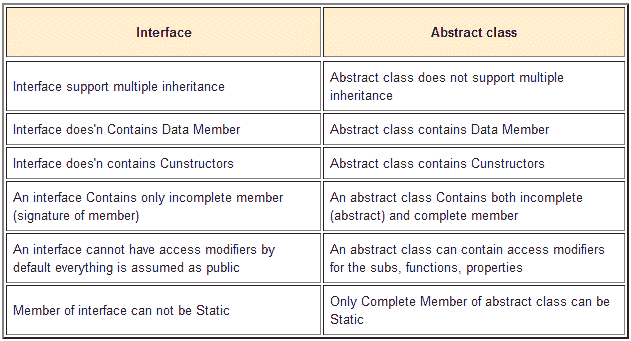

# 抽象类 vs 接口

> 原文:[https://dev . to/sarfraznawaz 2005/abstract-class-vs-interface-245 l](https://dev.to/sarfraznawaz2005/abstract-class-vs-interface-245l)

我发现这张图片说明了`abstract class`和`interface`的区别:

[T2】](https://res.cloudinary.com/practicaldev/image/fetch/s--9qHJrj7C--/c_limit%2Cf_auto%2Cfl_progressive%2Cq_auto%2Cw_880/https://codeinphp.github.img/142937584655328b66dcedc.png)

* * *

让我们实际地看看每一个比较，这样我们就知道它意味着什么。

```
Interface support multiple inheritance | Abstract class does not support multiple inheritance 
```

这意味着你可以用一个或多个(因此是*多重继承*)接口来扩展一个`interface`，比如:

```
interface Interface_A { }
interface Interface_B { }
interface Interface_C { }

interface MyInterface extends Interface_A, Interface_B, Interface_C { } 
```

可以看到，我们用另外三个接口`Interface_A`、`Interface_A`和`Interface_C`扩展了`MyInterface`。

现在让我们尝试扩展一个`abstract class` :

```
class Class_A { }

abstract class MyAbstractClass extends Class_A { } 
```

这没有问题，你可以用一个类来扩展一个抽象类，但是如果你试图再添加一个的话:

```
class Class_A { }
class Class_B { }

abstract class MyAbstractClass extends Class_A, Class_B { } 
```

这一次 PHP 会给你一个奇怪的错误，而不告诉你你做错了什么:

`Parse error: syntax error, unexpected ',', expecting '{'`

我希望 PHP 能给出类似这样的消息(希望 PHP 在未来版本中给出更智能的错误消息):

`Fatal Error: You cannot extend an abstract class with more than one classes`

* * *

```
Interface does'n Contains Data Member | Abstract class contains Data Member 
```

对于数据成员，它意味着类属性或变量。所以不能给接口添加数据成员:

```
interface MyInterface {
    public $foo = null;
} 
```

所以在一个接口中，只能提供方法存根。

你可以给抽象类添加数据成员，当然这是有效的代码:

```
abstract class MyAbstractClass {
    public $foo = null;
} 
```

* * *

```
Interface does'n contains Constructors | Abstract class contains Constructors 
```

听起来这一点可能适用于其他语言，但是在 PHP 中，一个接口可以有一个空的构造器外壳:

```
interface MyInterface {
    public function __construct();
} 
```

像其他语言一样，PHP 不应该允许在接口中有构造函数。但无论如何，它在这里没有多大意义，无论如何都应该避免。

另一方面，抽象类可以包含构造函数方法:

```
abstract class MyAbstractClass {
    abstract public function __construct();
} 
```

这里的构造函数被称为`abstract`，因此扩展了子类来补充它。然而，你也可以在一个抽象类的构造函数中有公共的初始化代码，在这种情况下，你需要删除`abstract`关键字并为它提供主体:

```
abstract class MyAbstractClass {
    public function __construct() {
         // initialization code
    };
} 
```

* * *

```
An interface Contains only incomplete member (signature of member) | An abstract class Contains both incomplete (abstract) and complete member 
```

这仅仅意味着一个接口只能包含方法存根而不是它们的实现。这与上图中的第二点非常相似。这就是为什么在一个接口的方法中，它们没有标有`{ }`括号的主体。所以一个接口完全是一个空壳，执行一些子类必须实现的规则，就是这样。

抽象类可以两者兼得；空的方法定义和完整的方法实现。一般来说，空的方法存根以`abstract`关键字为前缀，因此子类必须提供它们的实现细节。但是抽象类内部也可以包含完整的方法实现，这些方法实现通常用于每个子类可能需要的公共功能。比如:

```
abstract class Animal {
    // child classes must implement this
    abstract function prey();

    public function run() {
        echo 'I am running!';
    }
}

class Dog extends Animal {
    public function prey() {
        echo 'I killed the cat !';
    }
}

class Cat extends Animal {
    public function prey() {
        echo 'I killed the rat !';
    }
}

$dog = new Dog();
$cat = new Cat();

$dog->prey(); // I killed the cat !
$cat->prey(); // I killed the rat !

$dog->run(); // I am running!
$cat->run(); // I am running! 
```

在上面的代码中，我们可以看到`Animal`类有一个名为`prey`的`abstract`方法，因为每个子类(动物)都有自己寻找猎物的方式，还有一个名为`run`的完整实现方法，因为所有动物都可以跑，这不需要在每个子类中定义。所以这里的`run`方法是完全实现的，它代表了需要在子类间共享的公共数据。

请注意，除了抽象类中常见的完全实现的方法之外，您还可以拥有公共的数据成员，例如需要在子类之间共享的变量。

* * *

```
An interface cannot have access modifiers by default everything is assumed as public | An abstract class can contain access modifiers for the subs, functions, properties 
```

对于访问修饰符，我们指的是通过使用关键字 [`public`、`private`和`protected`](http://stackoverflow.com/questions/4361553/php-public-private-protected) 来改变范围的能力。我们不能将它们用于接口，但是我们可以将它们用于抽象类中的任何东西。

* * *

```
Members of interface can not be Static | Only Complete Member of abstract class can be Static 
```

与其他语言不同，这在 PHP 中也是可能的(从 PHP 5.4 开始)，所以你可以:

```
interface MyInterface {
    static function foo();
} 
```

注意添加了关键字`static`来将其标记为静态方法。

对于抽象类，你可以拥有静态成员以及那些在抽象类中实现的方法:

```
abstract class MyAbstractClass {
    public static $foo = null;

    public static function foo() {}
} 
```

但是你不能让一个方法同时是`static`和`abstract`，所以你不能这样做，这在各种语言中都很常见:

```
abstract class MyAbstractClass {
    public static $foo = null;

    abstract static function foo() {} // error
} 
```

* * *

总之，接口类和抽象类是完全不同的，你不能互换它们或者用一个替代另一个。接口完全是空壳，期望子类为它们实现一切。另一方面，抽象类不仅可以通过在它们内部实现来包含*条公共信息*,还可以期望子类来填补剩余的空白。

[T2】](https://res.cloudinary.com/practicaldev/image/fetch/s--1CbVc7Qn--/c_limit%2Cf_auto%2Cfl_progressive%2Cq_auto%2Cw_880/http://feeds.feedburner.com/%257Er/codeinphpfeed/%257E4/BXVBGV9K0CE)