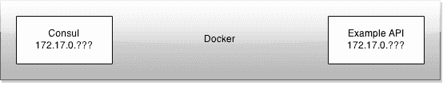
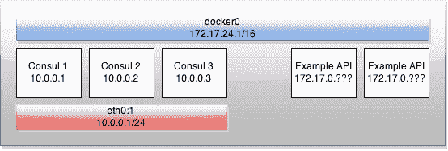

# 发现服务发现服务

> 原文：<https://dev.to/adamkdean/discovering-service-discovery-services-10cd>

服务发现的问题在于，为了使用它来发现服务，服务必须首先发现服务发现服务。

Docker 动态地为容器分配 IP 地址，所以你不能保证知道一个服务的确切位置。你也不想将 docker 套接字传递给容器，因为那是一件不好的事情。

[T2】](https://res.cloudinary.com/practicaldev/image/fetch/s--CAbDObUU--/c_limit%2Cf_auto%2Cfl_progressive%2Cq_auto%2Cw_880/https://i.imgur.com/z0XLS6Q.png)

所以问题是，你从哪里开始？你必须从某个地方开始，你必须有某种定位点，你可以从那里收集其余的信息。我使用 Consul 进行服务发现，并在一个容器中运行它，所以这是我想开始的地方。我希望服务能够与 Consul 对话并发现其他服务，但起点必须是 Consul。

我想到了某种 DNS，这样我就可以解决`consul.local`，但是问题只转移到 DNS 服务器上。我想到了一个 docker 查找服务，在那里我可以请求一个名称，它给我容器`172.17.0.???` IP，但同样，这只是将责任转移到 docker 查找应用程序，这是另一个可能损坏的移动部分。

## 解

解决方案是创建一个单独的虚拟网络接口，只有咨询服务可以使用。然后，我可以在节点启动时为其静态分配一个 IP，网络上的任何服务都可以访问这些 IP。

[T2】](https://res.cloudinary.com/practicaldev/image/fetch/s--WuebPqEx--/c_limit%2Cf_auto%2Cfl_progressive%2Cq_auto%2Cw_880/https://i.imgur.com/HIjUVQw.png)

为了测试这一点，我创建了接口(参见下面的永久解决方案):

```
sudo ifconfig eth0:1 10.0.0.1 netmask 255.255.255.0 up 
```

Enter fullscreen mode Exit fullscreen mode

然后，我运行了一个与该 IP 绑定的`hello-world`应用程序:

```
docker run --rm -t -i -p 10.0.0.1:80:80 tutum/hello-world 
```

Enter fullscreen mode Exit fullscreen mode

然后我导航到`http://10.0.0.1/`，看到了 hello world 页面。这很好，说明`eth0:1`起作用了。我无法创建一个没有问题的`docker0:1`界面。到目前为止，我还不确定为什么。

下一步是启动绑定到 IP consult，然后让其他服务连接到 consult，因为 IP 是已知的。对于 Node.js，我使用的是 [node-consul](https://www.npmjs.com/package/consul) 。一旦它知道了 Consul 服务器的位置，它应该能够获得所有相关的服务。

要开始咨询:

```
# This is only an example snipped from a larger file

readonly NAME="consul-node1"
readonly HOSTNAME="node1"
readonly NETADDR="10.0.0.1"

docker run -d -h $HOSTNAME \
    --name $NAME \
    -p $NETADDR:8400:8400 \
    -p $NETADDR:8500:8500 \
    -p $NETADDR:8600:53/udp \
    progrium/consul -server -bootstrap -ui-dir /ui 
```

Enter fullscreen mode Exit fullscreen mode

现在你可以连接到 10.0.0.1 知道领事在那里。

## 一个更永久的网络接口

对于更持久的网络界面，编辑`/etc/network/interfaces`并在底部添加以下内容:

```
# Private network for Consul services
auto eth0:1
iface eth0:1 inet static
    address 10.0.0.1
    netmask 255.255.255.0
    gateway 10.0.0.1 
```

Enter fullscreen mode Exit fullscreen mode

然后调出界面:

```
$ sudo ifup eth0:1 
```

Enter fullscreen mode Exit fullscreen mode

总是检查接口是否正常，因为 ifconfig/ifup/ifdown 是非常奇怪的存在，他们在他们想做的时候做他们想做的事情，通常是以你不想要的方式。

# 免责声明

这与其说是一篇结构化的文章，不如说是一篇随笔式的文章。请不要按照这些说明去做，好像它们会为你建立一个系统。他们不会。但是他们可能做的是给你一个想法，告诉你如何做某些事情。最重要的是，它们将成为未来我的巨大资源。