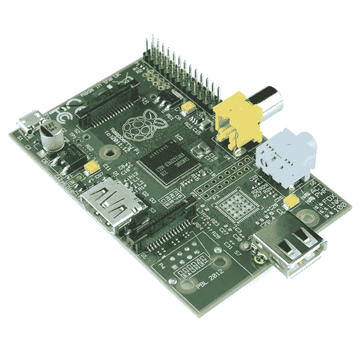

# 用树莓皮做东西

> 原文:[https://dev . to/funky si1701/building-something with a-a-raspberry-pi-328j](https://dev.to/funkysi1701/building-something-with-a-raspberry-pi-328j)

很多年前，我花了很多时间学习电子学。这非常有趣，我不记得我具体做了什么，但学习电阻和电容的功能非常有趣。

我真的没有想过这个问题，因为我的兴趣一直集中在计算机和编程上，但最近我的兴趣又达到了顶峰。

[T2】](https://res.cloudinary.com/practicaldev/image/fetch/s--71rGOHdZ--/c_limit%2Cf_auto%2Cfl_progressive%2Cq_auto%2Cw_880/https://storageaccountblog9f5d.blob.core.windows.net/blazor/wp-content/uploads/2015/04/Raspberry_Pi_-_Model_A.jpg)

CodeNewbie 和 Hanselminutes 播客已经运行了一个月，内容是关于制作东西和用名为 T4 的硬件做聪明的事情，这让我开始再次思考这些东西。

昨天，我的一个朋友向我展示了他用树莓皮和 Arduino 做的东西。你可以用这些微小的技术做的事情是惊人的，我印象深刻。

现在我在想我可以玩什么样的迷你项目，我应该把它建立在什么样的硬件上。我还不太了解这两个平台，但我发现了一篇介绍这两个平台的博客文章。我目前的想法是从 Raspberry Pi 开始，它是一项英国技术，使用 linux 操作系统(我对此有所了解)。

作为一名 windows 开发人员，我的大部分编程知识都是用 C#和 Visual Studio。为了利用我现有的知识，我可以安装和使用 MONO，这意味着我可以使用 C#对 Raspberry Pi 进行编程(参见[此处](http://logicalgenetics.com/raspberry-pi-and-mono-hello-world/)了解更多关于 Raspberry Pi 上 MONO 的细节)。

但是决定使用哪种语言并不能帮助我选择项目。我甚至还没有给自己买一个树莓派，所以我可能会在玩了一次之后决定买更多。到目前为止，我的想法包括让 wi-fi 在树莓派上工作，或者添加一个摄像头，把它放在某个地方并拍照，甚至可能为自己制作一个婴儿监视器(如果与婴儿有关，可能会得到妻子的同意)