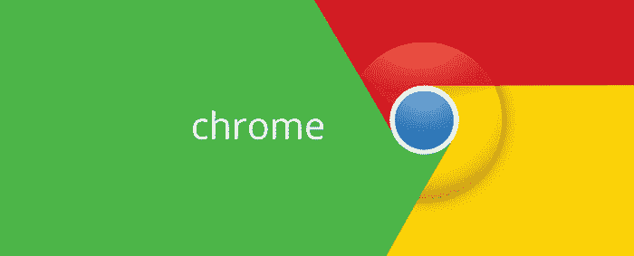
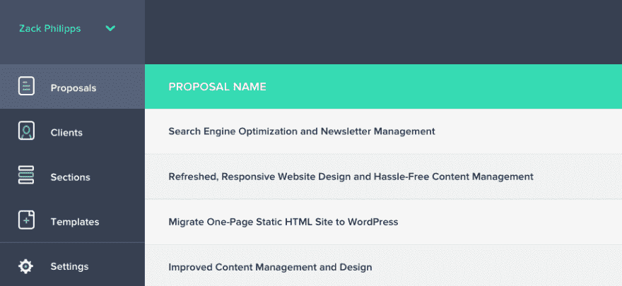
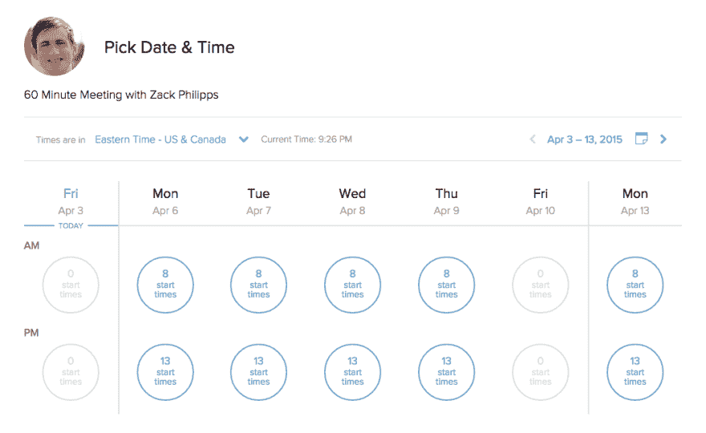
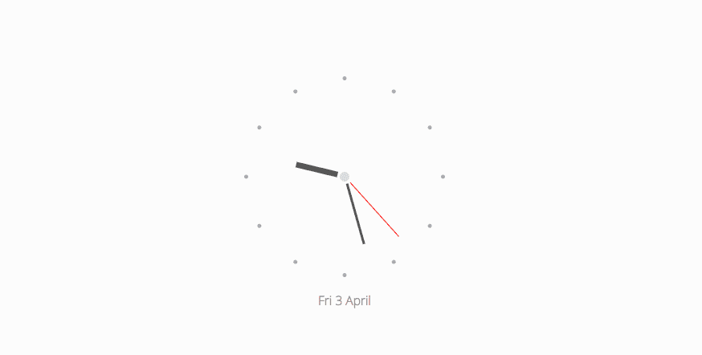

# 我如何使用 Chrome 来经营网页设计业务

> 原文:[https://dev . to/zackphilipps/how-I-use-chrome-to-run-a-web-design-business](https://dev.to/zackphilipps/how-i-use-chrome-to-run-a-web-design-business)

[T2】](https://res.cloudinary.com/practicaldev/image/fetch/s--FnSA00wV--/c_limit%2Cf_auto%2Cfl_progressive%2Cq_auto%2Cw_880/http://zackphilipps.com/conteimg/2015/04/google-chrome-2.jpg)

正如之前在[一个前端开发者的日常应用栈](http://zackphilipps.com/a-front-end-developers-daily-app-stack/)中提到的，我使用 Chrome Beta，尽管我也想在 Yosemite 上使用 Safari，因为我非常喜欢 Chrome 的 DevTools。我认为写一些我使用的网络应用和我的 Chrome 扩展会很有趣。

* * *

## 网络应用

注意:大多数都是免费增值，也就是说你不用花一分钱就可以享受大部分的功能。

### 体式

在[部落井](http://tribeswell.com)，我们使用 [Asana](http://asana.com) 进行**项目管理。**它很好地阻止了我们的方式，让我们不用通过电子邮件进行内部交流。(嗯，Slack 也有帮助。)

我真正喜欢体式的是分配任务和给出截止日期的快捷键。它还允许您选择对您最有意义的任务和项目视图。我发现自己经常使用的另一个功能是用电子邮件给体式发任务。Asana 将自动提取电子邮件的所有内容，包括附件，并从中创建一个任务。

### Toggl

我们使用 [Toggl](http://toggl.com) 进行**时间跟踪。**绝对是我见过最简单最好看的时间追踪器。实际上，我们用它来记录员工的工作时间，并为客户跟踪计费时间。Toggl 漂亮的报告系统使查看自定义日期范围内的时间变得轻松甚至有趣。

另外，一旦你安装了 [Toggl 按钮浏览器扩展](https://chrome.google.com/webstore/detail/toggl-button/oejgccbfbmkkpaidnkphaiaecficdnfn?hl=en)，你就会得到这些整洁的小 Toggl 按钮。在 Asana 中的一个任务，在 GitHub 中的一个问题，一个 Google 文档或表单，我可以简单地点击“开始计时”来开始跟踪我的时间。

**注意:** Asana 和 Toggl 是我一直固定的三个[标签中的两个](http://www.techrepublic.com/blog/tech-sanity-check/how-to-use-pin-tab-to-organize-your-work-in-google-chrome/)。

### Nusii

[T2】](https://res.cloudinary.com/practicaldev/image/fetch/s--xKRusrgm--/c_limit%2Cf_auto%2Cfl_progressive%2Cq_auto%2Cw_880/http://zackphilipps.com/conteimg/2015/04/Screen-Shot-2015-04-03-at-21-23-53.png)

我用 [Nusii](http://nusii.com/#_l_1c) 来表示**的提议。**它允许我使用模板，并且通过允许我创建和保存可重复使用的部分，变得更加模块化。这些部分可以是基于文本的，也可以是基于价格的。Nusii 的设计使我可以为我的客户提供分级定价选择。我可以包括固定价格或每小时、每天或每月的价格。他们最近还增加了一个非常棒的数字签名功能。

当我写完一份提案时——多亏了 Nusii，现在花的时间更少了——我可以直接从应用程序发送给客户，每当客户查看它时，我都会收到一封通知邮件。然后，客户可以在浏览器中选择定价选项并接受提案。别担心，如果客户需要，可以选择下载并打印 PDF 版本。哦，PDF 和网络版都非常棒。

其他功能包括定制品牌和配色方案，以及一个定制的网址，您所有的建议都可以访问(我们的是**proposals.tribeswell.com**)。

### Kashoo

我们用 [Kashoo](http://kashoo.com) 来表示**云会计。**它处理我们从创建、发送到结算的所有发票。它还具有一个非常强大的报告系统，所以我们可以使用自定义的日期范围来比较利润&损失。我们经常做的另一件事是查看我们所有的过期应收账款，看看哪些客户的发票还没有收到，以及它们已经过期多久了。

### Calendly

[T2】](https://res.cloudinary.com/practicaldev/image/fetch/s--9iWK4rVy--/c_limit%2Cf_auto%2Cfl_progressive%2Cq_auto%2Cw_880/http://zackphilipps.com/conteimg/2015/04/Screen-Shot-2015-04-03-at-21-26-07.png)

我使用[日历](http://calendly.com)(对[喊出来)来安排**的约会。想和我见面的人可以使用我的个人链接，自己安排约会。这样就省去了来回十封电子邮件和十个电话，试图找出一天的工作时间。**](http://www.marcusblankenship.com/)

### 缓冲区

Tribeswell 目前并不太热衷于社交媒体游戏，但当我们热衷于社交媒体游戏时， [Buffer](https://buffer.com/) 很不错，因为它允许从一个中心位置管理我们的脸书、LinkedIn 和 Twitter 账户。它还负责平均调度职位和自动...记录...他们对我们和我们的追随者来说是伟大的。

### 严格开发

我将在另一篇文章中更深入地讨论这些[，但是现在:](http://zackphilipps.com/a-wordpress-development-workflow-for-small-teams-in-2015/)

*   开源代码库
*   Bitbucket
*   数字海洋
*   代码船
*   堆栈溢出
*   新遗迹

### 等。

因为每个人都应该使用这些，这里有一些不值得拥有自己的部分，但却值得提及:

*   所有谷歌的东西
*   我选择的社交媒体入口:Tumblr、Twitter

* * *

## 分机

### 船镜

Shipscope 是 [CodeShip 的浏览器扩展](https://chrome.google.com/webstore/detail/shipscope/jdedmgopefelimgjceagffkeeiknclhh?hl=en),它向我显示了我的所有项目及其构建状态的列表。对于我的构建，我选择不使用电子邮件或 Slack 通知，而是决定使用它。

### 字体脸忍者

字体忍者让我不用打开 DevTools 就能窥探网页的排版。此外，它看起来很漂亮，使用起来也很有趣。谁不希望浏览器窗口的右上角总是出现一个小小的忍者图标呢？

**免责声明:**此扩展会在极少数情况下破坏站点。

### Adblock Plus

如果你没有这个，你怎么了？现在就去拿吧！

### GhostText

我的同事最近提醒我这种宝石的存在。它允许我按下`cmd+shift+K`来立即开始使用[崇高的文本](https://dev.to/zackphilipps/a-front-end-developers-sublime-text-setup-temp-slug-48528)，而不是我目前用来编码的任何低劣的`textarea`(阅读:WordPress)。你只需要安装好[扩展](https://chrome.google.com/webstore/detail/ghosttext-for-chrome/godiecgffnchndlihlpaajjcplehddca?hl=en)和[包](https://github.com/Cacodaimon/GhostText-for-SublimeText)。

### 最小新标签时钟

[T2】](https://res.cloudinary.com/practicaldev/image/fetch/s--B4mPSmtX--/c_limit%2Cf_auto%2Cfl_progressive%2Cq_auto%2Cw_880/http://zackphilipps.com/conteimg/2015/04/Screen-Shot-2015-04-03-at-21-27-02.png)

有大量的[“新标签”扩展](https://chrome.google.com/webstore/search/new%20tab?hl=en&_category=extensions)。我选择了[这个](https://chrome.google.com/webstore/detail/minimal-new-tab-clock/impmanfocmgfodfbnhbmkkonnpcogfak?hl=en)，因为模拟的、最小的外观实际上让我平静下来。

**更新:**我现在用的是 [Embark](https://chrome.google.com/webstore/detail/embark-new-tab-page/aeajehgeohhgjbhhbicilpenjfcbfnpg?hl=en) 。

**更新#2:** 我终于赶了上来，开始使用[动量](https://chrome.google.com/webstore/detail/momentum/laookkfknpbbblfpciffpaejjkokdgca?hl=en)...这是惊人的和完美的，所有其他新的标签扩展相比之下吸...希望你开心！

### 服务条款；没看

我只是觉得这很有趣。

* * *

#### 相关岗位

*   [一个前端开发者的日常应用栈](http://zackphilipps.com/a-front-end-developers-daily-app-stack/)
*   [一个前端开发者的崇高文本设置](https://dev.to/zackphilipps/a-front-end-developers-sublime-text-setup-temp-slug-48528)
*   [2015 年面向小团队的 WordPress 开发工作流程](http://zackphilipps.com/a-wordpress-development-workflow-for-small-teams-in-2015/)