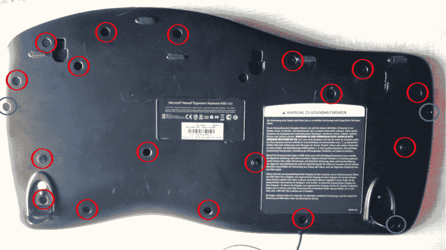
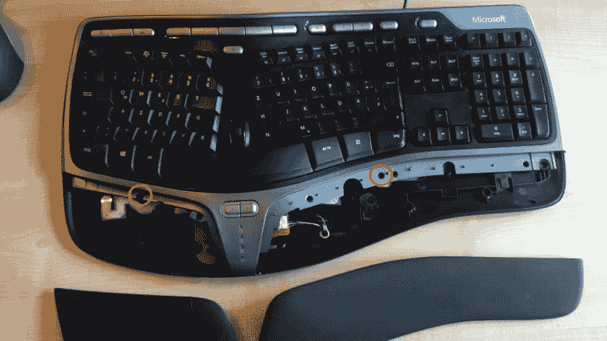
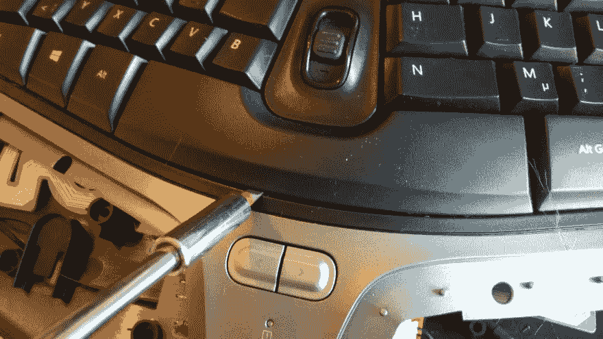
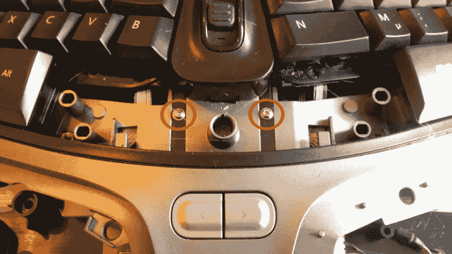
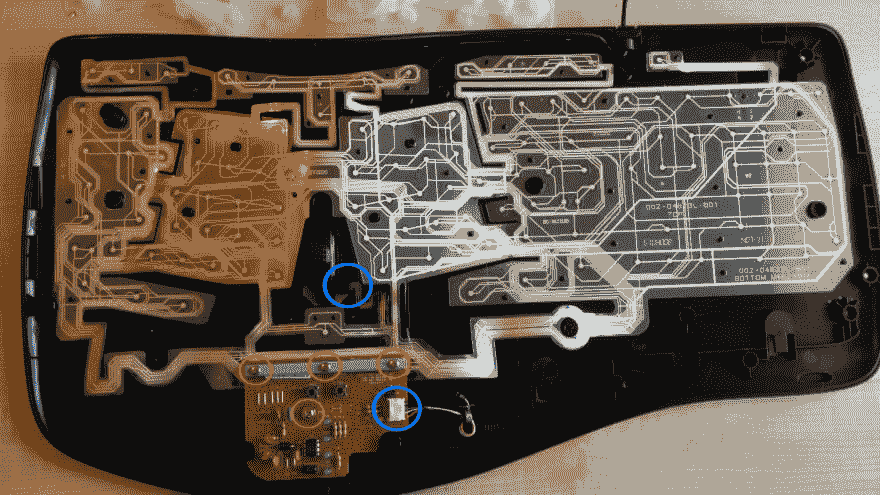
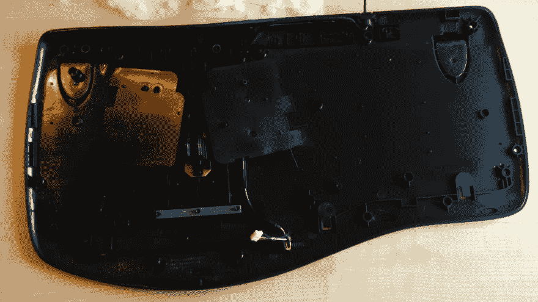
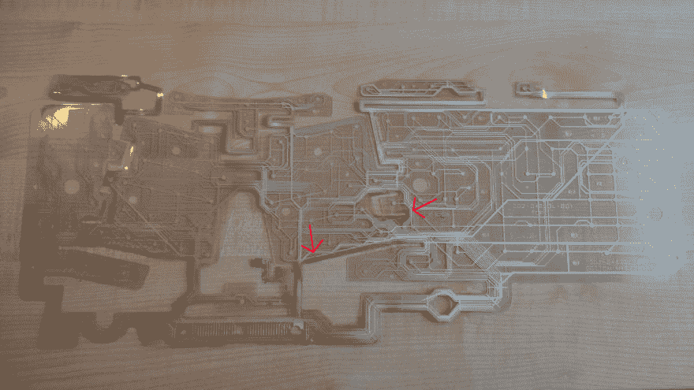
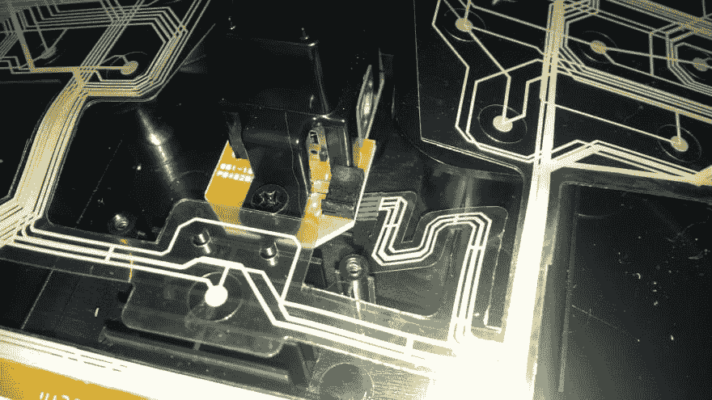

# 修复 Microsoft 人体工程学键盘

> 原文:[https://dev . to/rnd MH 3 ro/repair-a-Microsoft-ergonomic-keyboard-2 pel](https://dev.to/rndmh3ro/repairing-a-microsoft-ergonomic-keyboard-2pel)

我不小心把茶洒在了我的微软 natural 人体工程学键盘上(参考链接)。在清理了明显的混乱后，我继续正常使用键盘，因为一切都还正常。但是第二天键盘就不工作了。灯还在闪，但是我按的键没有显示在屏幕上。

似乎是一个很好的机会，看看里面是什么样子，所以是时候撬开它了！

要看到键盘的内部，你首先要去掉 21(！)螺丝。其中 3 个比其他的长，这些用蓝色标出。[T2】](https://res.cloudinary.com/practicaldev/image/fetch/s--tXWuAsv2--/c_limit%2Cf_auto%2Cfl_progressive%2Cq_auto%2Cw_880/https://www.zufallsheld.img/keyboard/01_keyboard_back.jpg)

将键盘转回来，卸下人造革掌托。取下螺丝后应该很容易取下。在支架下面还有两个螺丝需要拧松。

[T2】](https://res.cloudinary.com/practicaldev/image/fetch/s--sBUYbiO---/c_limit%2Cf_auto%2Cfl_progressive%2Cq_auto%2Cw_880/https://www.zufallsheld.img/keyboard/02_keyboard_front.jpg)

然后你必须去掉空格键，因为在它下面有更多的螺丝！将螺丝刀压在钥匙中间，轻轻转动螺丝刀。空格键应该会弹出。你可能需要用点力。

[T2】](https://res.cloudinary.com/practicaldev/image/fetch/s--S2NERzq4--/c_limit%2Cf_auto%2Cfl_progressive%2Cq_auto%2Cw_880/https://www.zufallsheld.img/keyboard/03_keyboard_space.jpg)

拆下两颗露出的银色螺丝。

[T2】](https://res.cloudinary.com/practicaldev/image/fetch/s--pmO5yJRU--/c_limit%2Cf_auto%2Cfl_progressive%2Cq_auto%2Cw_880/https://www.zufallsheld.img/keyboard/04_keyboard_space_off.jpg)

现在你可以取下键盘的上半部分了。在它下面，你会发现白色的橡胶片可以让按键上下跳动。把这些也脱了。在那下面，你可以看到检测按键的硅胶接触层，也称为按键矩阵。

[T2】](https://res.cloudinary.com/practicaldev/image/fetch/s--a3vNUkMh--/c_limit%2Cf_auto%2Cfl_progressive%2Cq_auto%2Cw_880/https://www.zufallsheld.img/keyboard/06_keyboard_white_stuff_off.jpg)

按键矩阵南边的棕色部分是微处理器。这是连接到电源线的部分。拔下电路板右侧的白色插头(蓝色圆圈)。

你还必须拧下电路顶部的四个小螺钉，并取下被螺钉压住的金属棒。

键盘两部分之间的上下键通过插头与键矩阵的其余部分相连。拔出来。现在你可以完全移除键矩阵，键盘完全拆卸。

[T2】](https://res.cloudinary.com/practicaldev/image/fetch/s--roeyJkiX--/c_limit%2Cf_auto%2Cfl_progressive%2Cq_auto%2Cw_880/https://www.zufallsheld.img/keyboard/07_keyboard_empty.jpg)

在下面的照片中，你可以看到茶叶造成的损害。看看这些棕色的痕迹。

[T2】](https://res.cloudinary.com/practicaldev/image/fetch/s--jKzr6tfc--/c_limit%2Cf_auto%2Cfl_progressive%2Cq_auto%2Cw_880/https://www.zufallsheld.img/keyboard/08_keyboard_in.jpg)

我试着用水轻轻地去除这些痕迹。可悲的是，我的键盘清洗后仍然无法正常工作。

幸运的是，我还有一个旧的微软人体工程学键盘，它有另一个问题。所以我把这个键盘拆开，把键矩阵放在我新的键盘里，然后再装回去。现在又能用了！

要重新组装键盘，只需按照相反的顺序！；-)如果您在重新连接上下键和按键矩阵的插头时遇到问题，请卸下紧固插头的两个螺钉，插入插头并重新连接按键！

[T2】](https://res.cloudinary.com/practicaldev/image/fetch/s--vO-GSQ6x--/c_limit%2Cf_auto%2Cfl_progressive%2Cq_auto%2Cw_880/https://www.zufallsheld.img/keyboard/09_keyboard_plug.jpg)

此外，如果您想了解更多关于键盘内部工作原理的信息，请查看以下链接:

*   [电脑键盘如何工作](http://computer.howstuffworks.com/keyboard2.htm)
*   [电脑键盘](http://www.explainthatstuff.com/computerkeyboards.html)