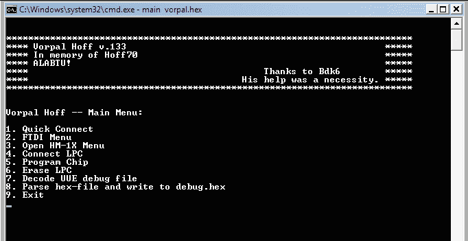

# C 中的命令行菜单

> 原文：<https://dev.to/ladvien/command-line-menu-in-c-3bl8>

**怀旧**

我想发布这个只是因为它给我带来了一种干涩的怀旧的快乐。当我 8-9 岁的时候，我的父母得到了一台旧电脑。我只记得它的屏幕是橙色和黑色的；拥有一个[大力士显卡](http://en.wikipedia.org/wiki/Hercules_Graphics_Card)。我很快就学会了从命令提示符下绕过。但我总是很兴奋地跑进菜单驱动程序。这就像去一家抽象的高级餐厅。无论如何，当我想让我的代码慢一点，并根据用户输入分支方向时，命令菜单是一个自然的选择。

**LPC 1114 上传程序的中断**

我想我应该花些时间远离编码我的 [LPC1114 上传器](http://letsmakerobots.com/lpc1114-usb-serial-solution-rerolling-boot-uploader)并且口头处理一些我学到的东西。像往常一样，请随意批评它；它最终只会让我的代码更加健壮。

这篇文章是一系列的文章，是我写上传者的大文章的前奏。所有职位将依赖于 GCC 编译器。

[](https://res.cloudinary.com/practicaldev/image/fetch/s--MbcXKRbE--/c_limit%2Cf_auto%2Cfl_progressive%2Cq_auto%2Cw_880/https://ladvien.cimg/GCCLogo.png) 设置 GCC 编译器

我尽可能地设置了一个 C 环境。也许有更简单的方法，但是我想用 GCC 来编译。

要设置环境:

1.  我下载并设置了 [MinGW32](http://www.mingw.org/wiki/HOWTO_Install_the_MinGW_GCC_Compiler_Suite) 。

2.  我添加了这些 **includes** 来使代码运行。

```
#include <stdio.h> #include <stdarg.h> #include <stdlib.h> #include <windows.h> #include <windef.h> #include <winnt.h> #include <winbase.h> #include <string.h> #include <math.h> #include <stdbool.h> #include <stdint.h> #include <sys/time.h> 
```

Enter fullscreen mode Exit fullscreen mode

我用这一行来建造它:

**$ gcc -o main main.c**

至于剪辑，我真的越来越喜欢崇高的文本 2。

如果你有* *的问题，确保包含你的文件的目录在你的 PATH 环境变量* *(我在这篇[文章](http://letsmakerobots.com/content/lpc1114-setup-bare-metal-arm)中讲述了如何将目录添加到你的环境变量中)。

[T2】](https://res.cloudinary.com/practicaldev/image/fetch/s--8p_ZrxG6--/c_limit%2Cf_auto%2Cfl_progressive%2Cq_auto%2Cw_880/https://ladvien.cimg/Command_line_menu.png)

**如何编写命令行菜单**

这里没有太多的代码。基本上，它打印出你想让你的用户知道的选项。然后，它开始一个 do-while 循环，直到用户选择一个合适的数字。

嗯。没什么大不了的，不确定它是否配得上自己的职位。但是管它呢。

```
void main_menu()
{
    char char_choice[3];
    int int_choice = 0;

    do
    {
        system("cls");
        startScreen();
        printf("\n");
        printf("Vorpal Hoff -- Main Menu: \n\n");
        printf("1\. Quick Connect\n");
        printf("2\. FTDI Menu\n");
        printf("3\. Open HM-1X Menu\n");
        printf("4\. Connect LPC\n");
        printf("5\. Program Chip\n");
        printf("6\. Erase LPC\n");
        printf("7\. Decode UUE debug file\n");
        printf("8\. Parse hex-file and write to debug.hex\n");
        printf("9\. Exit\n");

        scanf("%s", char_choice);
        int_choice = atoi(char_choice);

        switch (int_choice)
        {
            case 1:
                quick_connect();
                break;
            case 2:
                ftdi_menu();
                break;
            case 3:
                                HM_1X_main_menu();
                break;
            case 4:
                // Not yet used.
                break;
            case 5:
                program_chip(file_name);
                    break;
            case 6:
                // Not yet used.
                   break;
            case 8:
                debug_hex_file(file_name);
                    break;
            case 9:
                shut_down();
                    break;
            default:printf("Wrong choice. Enter Again");
                    break;
        }
    }while(int_choice !=99);
} 
```

Enter fullscreen mode Exit fullscreen mode

6 和 54:这是 [do-while 循环](http://en.wikipedia.org/wiki/Do_while_loop)的开始和结束。基本上，do-while 是一个奇特的循环，它反复执行括号中的所有操作，直到遇到布尔变量(第 54 行)。

do-while 循环相当于下面的代码，

```
while (true) {
   do_work();
   if (!condition) break;
} 
```

Enter fullscreen mode Exit fullscreen mode

*   8:清除屏幕。这将删除命令提示符；给我们的菜单一张白纸。
*   9:我放了一个函数来绘制我的菜单标题。这允许我很容易地改变一个菜单的标题。这也使得菜单代码更容易阅读。
*   12-20:我们为用户打印菜单选项。
*   22: [scanf](http://www.cplusplus.com/reference/cstdio/scanf/) 是一个棘手的命令。它暂停并等待用户输入，然后输入“n”。它接受一个与您想从用户那里获得的数据类型相对应的变量。这里，我们希望用户输入一两个数字。这些被放入提供的字符串中。
*   23:我们使用 [atoi](http://www.cplusplus.com/reference/cstdlib/atoi/) 函数将一个字符串转换成一个整数。这个值我们存储在整数 **int_choice** 中。
*   25:为我们做实际工作的[开关语句](http://www.tutorialspoint.com/cprogramming/switch_statement_in_c.htm)的开始。它根据预定义的值(这里是 1-9)测试 int_choice 值。如果其中一个值相等，它将在从 switch 语句中断之前执行在那里找到的代码。
*   51:如果输入了 1-9 之外的数字，默认值将为真。让我们抱怨用户选择了一个错误的号码。

仅此而已。您只需将希望被调用的函数放在 switch-statement 的适当值中。由于 do-while 循环，一旦做出选择并执行，菜单将再次显示。

您也可以通过如下操作将选择限制为显示，

```
bool connected_flag = false;
    do
    {
        system("cls");
        printf("FTDI Menu: ");
        printf("1\. Quick Connect\n");
        printf("2\. Device List\n");
        if (got_list == true) // Only display option if devices list.
        {
        printf("3\. Connect Device\n");
        }

        printf("9\. Main Menu\n");

        // Get user choice.
        scanf("%s", char_choice);

        // Convert string to int for switch statement.
        int_choice = atoi(char_choice);

        switch (int_choice)
        {
            case 1:
                quick_connect();
                baud_rate = 115200;
                connected_flag = true;
            case 2:
                got_list = get_device_list();
                break;
            case 3:
                if (got_list == true) // Only display option if devices listed.
                {
                    connected_flag = connect_device(&baud_rate);
                }
                break;
            case 9:
                main_menu();
                break;
            default:printf("""Bad choice. Hot glue!""");
                break;
        }
    }while(int_choice !=99);
} 
```

Enter fullscreen mode Exit fullscreen mode

这里，选项“3。连接设备”直到选项“2”才显示。设备列表”正在运行。在第 34 行，如果函数成功，connect_device()函数将 connected_flag 变量设置为 true。然后，在点击 break 并重新绘制菜单后，选择“3。将显示“连接设备”。此外，“3”将成为有效的用户选择。

**子菜单**

最后一点。如果你想创建一个子菜单，你只需要使用和上面一样的代码，只需要去掉 do-while 循环。这表示您只希望子菜单运行一次，即返回主菜单。