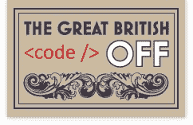

# 伟大的英国代码关闭

> 原文:[https://dev.to/funkysi1701/great-british-code-off-2peb](https://dev.to/funkysi1701/great-british-code-off-2peb)

[T2】](https://res.cloudinary.com/practicaldev/image/fetch/s--Cvtw0Kih--/c_limit%2Cf_auto%2Cfl_progressive%2Cq_auto%2Cw_880/https://storageaccountblog9f5d.blob.core.windows.net/blazor/wp-content/uploads/2015/02/logo.jpg)

英国烘焙大赛和英国缝纫大赛是非常受欢迎的电视节目。每周参赛者都要参加烘焙或缝纫挑战，评委选出最好的和最差的，最差的不得不离开。这是非常有趣的，因为你看到选手之间的戏剧和评委告诉他们他们是垃圾时的反应。

这种简单的格式能应用于计算机编程吗？我认为可以。

尽管是朋友，但我所知道的唯一的开发人员会争论解决不同问题的最佳方式。我假设这是典型的行为，并不是他们独有的。所以在这个电视节目中，我们将把选手分成两人一组，这样我们就能看到他们合作得多好。

我还没有决定是让两人每周呆在一起，一人离开，还是让两人随机组合，一人离开。第二种选择是每隔一周有一个三人小组，不确定这对这个小组是有利还是不利。

我的一些经验丰富的程序员朋友已经同意担任评委，他们都有招聘和解雇员工的经验，知道在好的代码中应该寻找什么，并且从不同意，所以应该足够有趣。

在烘烤比赛中，直到裁判切蛋糕并咬一口，参赛者才真正知道他们做得有多好。对于代码关闭，我们不能编译代码，直到法官运行它，会使编码额外的困难，如果参赛者像我一样，我每五分钟运行我的代码，看看有什么影响的变化。

那么我们能提出什么样的挑战呢？

*   网页设计周
*   存储过程周
*   移动应用周
*   环
*   逻辑问题
*   虫子周
*   性能问题

我想我们会赢的。其他人是怎么想的？