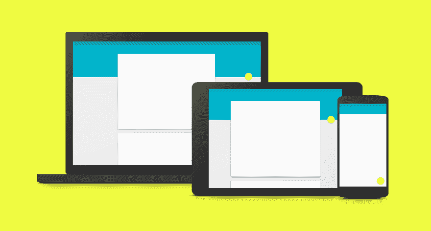
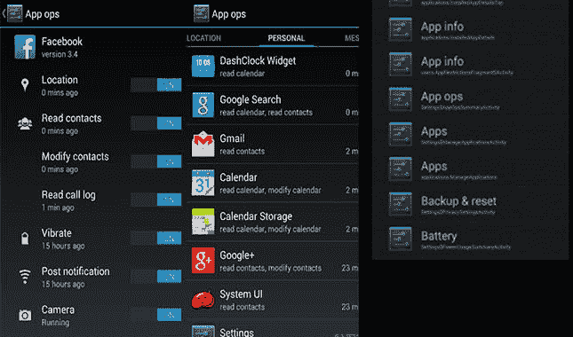
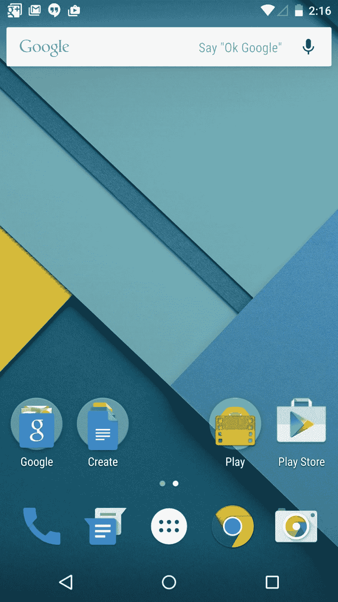

# 安卓棒棒糖——他们没有修复真正坏掉的东西

> 原文：<https://dev.to/diskdrive/android-lollipop-they-didnt-fix-what-was-really-broken-2mo4>

Android Lollipop 5.0 被吹捧为 Android 操作系统迄今为止最大的变化。摆弄了几个月，不得不说有点‘咩’。变化是有的，但与他们应该关注的事情相比，这些变化是相当微小的 Android 的真正缺陷。

### **棒棒糖主要特色简介**

[T2】](https://material-design.storage.googleapis.com/publish/v_1/social.png)

材料设计可能是你会注意到的第一件事，在很大程度上，是的，这是一个视觉上的改进——配色方案在某些地方有点难看，但我确实喜欢添加的动画和其他东西。然而，这真的只是一个视觉上的东西——我对功能上的变化更感兴趣。

实际上，我发现唯一有用的新功能是显示在锁定屏幕上的通知窗格。其他一切都没那么令人印象深刻。

_ **电池寿命改善** _-我的 Nexus 7 没有发现任何改善，至于电池节省模式，几乎每个 OEM 皮肤都有类似的东西。

_ **智能锁** _ -除非你有智能手表，否则这是一个只能工作一半时间的半解决方案。它并不比苹果的触控 ID 更安全也更方便。

_ **屏幕锁定和访客模式** -_ 很高兴知道它的存在，但我不认为这是一个杀手级功能——我敢打赌大多数人甚至不会使用它，甚至不知道它的存在..

共享菜单上的 ***【安卓梁】***——这其实是一个进步。旧的机器人光束是如此笨重，完全不被发现。把它放在分享菜单上就简单多了。与此同时，我真的不认为很多人会仅仅因为一个简单的事实而使用它，即 NFC 已经出现了那么久，但仍然没有流行起来。

所以我并不是说新功能不是一种改进，我只是对谷歌没有专注于 Android 中真正需要解决的问题感到失望，我将在下面概述这些问题。

### **仍然没有权限/隐私控制**

在这个时间点上，你系统中安装的每个 Android 应用程序都可以访问你手机上的所有数据。是的，我知道在安装的时候，你应该通读一组权限并接受它们，但是说实话，谁会去做呢？

仅仅在安装时显示一堆权限来保护用户数据显然是不够的。大多数用户不知道一个应用程序在你的设备上的整个生命周期需要哪些权限——谷歌要求用户在安装之前决定是否授予这些权限。

如果你在手机上安装了什么东西，它可以整天跟踪你。它可以查看你的联系人名单和照片等。也许那个应用程序是 Google Now 或脸书，你很高兴它这么做，因为它给了你想要的功能，但你安装的任何随机应用程序都可以做到这一点。*任何 app 都可以窥探你*。你可能信任甚至希望谷歌拥有你的数据，但是看看你的手机——看看你拥有的所有随机的小应用程序——你信任所有这些拥有你数据的开发者吗？

Android 4.3 引入了 App Ops——这是一个隐藏的功能，允许用户精确地打开和关闭每个应用的权限。这是一个实验性的功能，虽然它可能会导致应用程序在没有警告的情况下失败，但它真的非常棒。不幸的是，谷歌决定将其从 Android 4.4 Kit Kat 中撤出，此后就再也没有出现过。

|  |
|适用于 Android 4.3 的 App Ops 允许按应用权限定制|

我很失望，一个更完善的 App Ops 版本没有出现在 Lollipop 上。事实上，我很失望他们完全没有改变 Android 破碎的安全和许可模式。尽管 Android 有定制的能力，但在定制谁可以在什么时候访问你的数据的能力方面，iOS 仍然占主导地位。

例如，对于某些权限，如访问位置数据，iOS 可以选择在需要权限时询问用户。这为用户提供了比安装时询问更多的上下文。我知道 Android 应用程序是建立在假设他们被授予的权限存在的基础上的，但 Lollipop 是一个重大的修订——如果开发人员可以重新设计他们的整个应用程序以进行材料设计——如果他们不能访问用户位置，他们肯定可以让他们的应用程序优雅地失败。尤其是因为用户位置并不总是可用的(例如，用户处于飞行模式)。

此外，已经有第三方解决方案允许你拒绝或伪造权限([权限被拒绝](https://play.google.com/store/apps/details?id=com.stericson.permissions.donate&hl=en)， [CyanogenMod 的 PrivacyGuard](https://plus.google.com/+CyanogenMod/posts/86LLXrDpVWY) )。不幸的是，由于谷歌的限制，他们都需要一个自定义的 ROM 或根访问。因此，解决方案可能很困难，但并非不可能。谷歌没有在这方面做出一点努力，这真的很遗憾，尤其是因为用户隐私最近已经成为一个如此大的问题。

### 令人困惑的后退按钮行为

[T2】](http://upload.wikimedia.org/wikipedia/commons/5/52/Android_5.0_%22Lollipop%22_homescreen.jpg)

我对 Android 上的后退按钮是又爱又恨。一方面，这也是我更喜欢 Android 而不是 iOS 的原因之一(嘿，聊胜于无)。另一方面，这太让人生气了。我要说 80%的时候，它会做我想做的事情——另外 20%会把我扔到主屏幕或某个意想不到的地方，我必须再次找到回到那个屏幕的方法。

问题在于后退按钮可以做很多不同的事情——它可以带你回到你之前所在的应用程序，带你上一层你当前所在的应用程序，或者让你退出到主页。这是完全不一致的，也不可能仅仅通过看屏幕来判断，因为它的行为取决于每个应用程序开发人员。

现在我不是 UX 专家，所以我不知道解决方案是什么。我认为有一些现有的[提议](https://plus.google.com/+ChrisLacy/posts/cRhDALMzGXg?pid=6062295069641901458&oid=104649936579980037256)很有趣。我只知道在目前的状态下，它不是直观的，它可以更好，修复它将是棒棒糖的杀手级功能。

### 可以改进的非棒棒糖特性

我想，如果我已经走了这么远来写这篇文章，我也可以把我对 Android 的其他抱怨一吐为快...

#### Google Now 键盘默认不显示

[T2】](https://c1.staticflickr.com/9/8355/8290171341_07cc49e187_b.jpg)

我喜欢在 home 键上向上滑动，直接进入 Google Now 的感觉。我讨厌在进入 Google Now 屏幕后点击搜索框来弹出键盘。如果我用这个手势进入 Google Now，键盘会自动显示出来。

是的，这是一件小事——这是额外的一小步。但在我看来，这是一件大事——因为经常使用的功能上的微小额外摩擦会累积起来。这就是为什么棒棒糖的锁屏通知有用的原因。它消除了许多必须解锁手机等的摩擦。并使通知更有用。

在访问功能方面，苹果的 Spotlight Search 实现得更好，只需向下滑动，你就可以立即获得键盘和搜索。

#### 谷歌地图慢得吓人。

 
曾经有一段时间，谷歌地图相当圆滑。然后是第 9 版，我不知道他们做了什么，我听说他们在 WebGL 或其他地方重写了它。不管他们做了什么，都让它变得很慢。

我的 HTC One M8 甚至需要 5 秒钟才能启动，速度很慢。如果你已经完全习惯了它的臃肿和迟缓，下载 waze，看看它与谷歌地图相比有多光滑。这就是 9 版之前地图的工作方式。

如果你对 Android 有什么想看的，或者你不同意我提到的建议，请在下面的评论中提出。