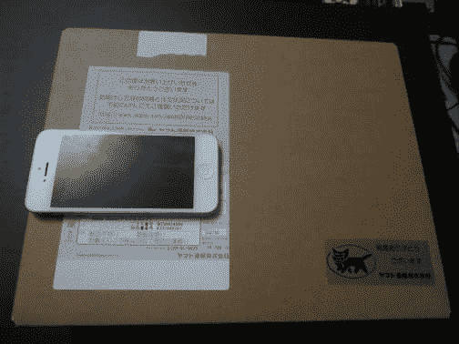

# 更“又轻又快变薄”的 iPad。 苹果 ipad air2sim 免费 64GB 金牌评论

> 原文：<https://dev.to/takimura/ipad-apple-ipad-air-2-sim-64gb---345l>

[T2】](http://livedoor.blogimg.jp/cv_k/imgs/2/4/2400e812.jpg)

轻得惊人，速度也快得多的 iPad

成为了时隔约 4 个月的博客报道。 这 4 个月对管理员来说是经历了各种各样的事情的 4 个月，也是久违地在家以外的活动时间超过了在家的时间的一个月。 关于这 4 个月，我想在今年的年末报道中详细总结。

那么，购买了从 10 月 24 日开始销售的 iPad 系列的最新机型“iPad Air 2”的 64GB 金牌 SIM 免费机型，所以先进行开封和比较的评论。 日本通信的 Platinum DATA SIM 也预约了，一到就想介绍一下。

接下来请继续。

[接下来的阅读](http://connect.coron.tech/archives/51871703.html)