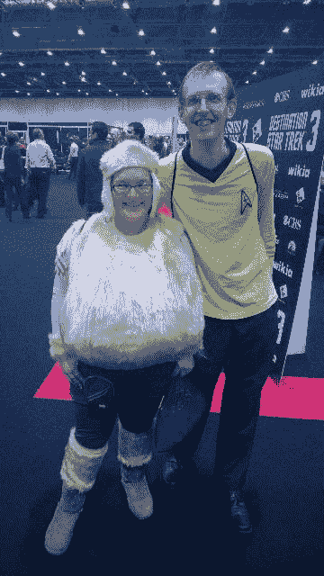

# 目的地星际旅行

> 原文:[https://dev.to/funkysi1701/destination-star-trek-38ei](https://dev.to/funkysi1701/destination-star-trek-38ei)

作为对我通常话题的一个突破，我将谈谈我在周末做了什么。

[T2】](https://res.cloudinary.com/practicaldev/image/fetch/s--Af25v5wC--/c_limit%2Cf_auto%2Cfl_progressive%2Cq_auto%2Cw_880/https://storageaccountblog9f5d.blob.core.windows.net/blazor/wp-content/uploads/2014/10/10670061_10152884492389155_77781042960777157_n.jpg)

我是一个超级星际迷航迷，所以我和我的妻子劳拉去了目的地星际迷航，在伦敦举行的会议。这是一张我们穿着戏服的照片，我的妻子设计了一套特里布尔戏服(特里布尔是一个由一团毛组成的外星种族),我穿着一套原版的队长制服。我们玩得很开心。

有几件事让这次旅行变得特别。

*   朋友:在上次会议之后，我记得我在想，如果有一群朋友参加，会议会好得多。不久之后，我开始听 trekmate 播客，最终这让我帮助他们的网站，并通过 twitter 与许多主持人交朋友。这个周末是我第一次和他们见面，把脸和名字(或者推特上的名字)放在一起感觉很棒
*   **编剧和导演**:星际迷航很有哲理。在未来，人类将把他们的分歧放在一边，一起探索银河系，这就是为什么《星际迷航》在近 50 年后仍然如此受欢迎的一个原因。这一理念是由作家和其他创作人员多年来创造的。我最喜欢的《星际迷航》电影是尼古拉斯·梅耶导演的《可汗之怒》,这个周末我拿到了他签名的 DVD，并告诉他在这部电影制作 30 多年后，我仍然很喜欢它。他说他真的很感激我这么说。后来听了他的演讲，听到他对制作我最喜欢的电影的见解很有意思。是编剧和导演塑造了我们最喜欢的角色，演员自己是不允许即兴发挥的，他们所做的只是用一点情感或一种矫揉造作来充实他们，是编剧创造了我们记忆中最喜欢的台词或场景。
*   九分之七:在我十几岁的时候，我的墙上有很多七分的海报。九分之七是穿着紧身连衣裤在船上走来走去的前博格人，但她也非常聪明，并继续探索人类是什么。能和她合影实在是太棒了，尽管因为很多人想和她合影而显得有些仓促。
*   琐事:在大会的周五，劳拉参加了初学者琐事挑战赛，她赢了。周六我参加了中级琐事挑战，我做得很差，只答对了 3 题，周日我参加了队长级挑战，我赢了。我真的没想到，在我前一天表现如此糟糕之后。感谢 Marc Stamper 和 Destination Star Trek 的组织，这非常有趣，也很高兴认识了我通过 twitter 与之竞争的其他星际迷。
*   **聚会！**:周六晚上我们去了一个派对，我们喝了罗慕伦啤酒，我们让一些演员表演了歌曲(詹姆斯·达伦唱得特别好)，一些演员和粉丝们混在一起，看到演员们放松真是太好了，如果你幸运的话，你可以和他们聊天，我问沃恩·阿姆斯壮他觉得音乐怎么样，他喜欢音乐。

这只是我所做的一个尝试，还有更多，比如看外星人的服装，听演讲，坐在桥的模型上。只有一个方法来结束这篇文章，**长命百岁，繁荣昌盛！**