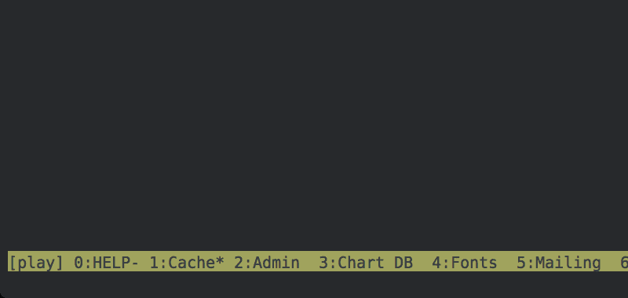

# 更友好的 tmux 状态栏的配置

> 原文:[https://dev . to/mjswensen/configuration s-for-a-friendlier-tmux-status-bar-32n 3](https://dev.to/mjswensen/configurations-for-a-friendlier-tmux-status-bar-32n3)

在工作中，工程团队使用 [tmux](https://tmux.github.io/) 来管理我们运行的服务的几个实例，以在本地开发 Lucid suite。这是一个非凡的终端管理系统，最好的部分是它高度可配置。如果您喜欢使用命令行，并且还没有体验过，那么您需要体验一下！

这是打开几个窗口后默认状态栏的样子:

[T2】](https://res.cloudinary.com/practicaldev/image/fetch/s--RFssaJLx--/c_limit%2Cf_auto%2Cfl_progressive%2Cq_auto%2Cw_880/https://mjswensen.com/blimg/tmux-status-bar-before.png)

我在我的`~/.tmux.conf`文件中添加了一些配置选项，使状态栏更容易阅读: