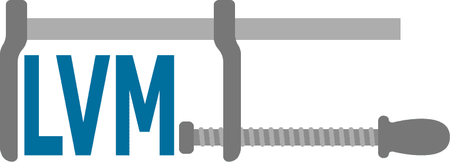

# 缩小 Linux 上的(LVM)日志分区

> 原文:[https://dev . to/rndmh 3 ro/shrinking-the-LVM-log-partition-on-Linux-2kl 6](https://dev.to/rndmh3ro/shrinking-the-lvm-log-partition-on-linux-2kl6)

在 linux 机器上扩大 LVM 分区是微不足道的。您只需要一个命令就可以做到这一点，甚至可以在挂载分区时完成。

```
lvresize -r -L +20G /vg1/lvm1 
```

该命令将 LVM *lvm1* 放大到 20GB。假设你在 LVM 层使用 ext、ReiserFS 或 [XFS](https://en.wikipedia.org/wiki/XFS) 文件系统，它也会被放大(使用*-r*-开关)。

但是，如果您需要收缩现有的分区，这可能会变得很难看。可以在线收缩 LVM，但是不能在挂载文件系统时缩小它的大小。

[T2】](https://res.cloudinary.com/practicaldev/image/fetch/s--Sm2kMHvs--/c_limit%2Cf_auto%2Cfl_progressive%2Cq_auto%2Cw_880/https://www.zufallsheld.img/shrink_lvm.png)

所以最近我不得不重新配置 linux 主机上的分区，因为没有单独的分区用于 */tmp* 或 */opt* 。我可以选择收缩根文件系统或者日志目录( */var/log* )所在的文件系统。为了避免不必要的停机时间和复杂的调整大小动作，我选择缩小后者。

出现的问题是有许多程序在这个目录中写入日志文件。至少我是这样认为的…

实际上，大多数程序并不直接写入这个目录，大多数使用[syslog](https://en.wikipedia.org/wiki/Syslog)-守护进程来处理日志写入。

现在，您所要做的就是停止 syslog 守护进程和其他不使用 syslog 但仍然写入 */var/log* 的应用程序。要找出哪些应用程序做到了这一点，你可以使用 *lsof* :

```
lsof /var/log 
```

这显示了当前写入目录的所有应用程序。现在，您所要做的就是停止这些应用程序和系统日志，并使用上述命令调整 LVM 的大小。然后再次启动 syslog 就大功告成了！