# 在 Objective-C 中使用 HM-1X 从 iOS 到 C

> 原文：<https://dev.to/ladvien/ios-to-uc-using-hm-1x-in-objective-c-17nh>

(这个节点可能会浮动一点，有很多工作要做。我很抱歉。)

我一直想在 Arduino 和 iOS 之间建立一座桥梁。不打算说谎，不是一个 iOS 设备的超级粉丝，但自从我的妻子赢得了一个 iPad Mini，我就不情愿地接受了它们满足了一个需求。尽管如此，我的黑客行为已经绕过了机器人，任何我无法连接到机器人的设备都会让我感到沮丧。嗯，一年前我意识到一个 [iPad Mini 会连接到一个 HM-10](https://www.youtube.com/watch?v=1a9xLfBH-hc) 上，因此，也就是机器人。

可悲的是，用于连接 HM-10 的应用程序是[浅蓝色](https://itunes.apple.com/us/app/lightblue-bluetooth-low-energy/id557428110?mt=8)，一个几乎没有多功能性的应用程序。然而，它让我能够确认连接 iPad Mini 和机器人的一切都已就绪。当然，我不愿意花几百美元去开发一个应用程序。这个想法被归档在“国家科学基金会”名下

但是，两个月前，Carduino 公司的首席执行官西蒙·莱利联系了我。他问我为什么没有开发一个 iOS 应用程序来连接 HM-10 BLE 系列模块。我的回答很简短:缺乏资金。我解释说要在 iOS 中开发(合法的，因此不会感到疲劳和担心)你需要一个 iOS 开发者许可*和*一台 Mac 来开发；我没钱买这两样东西。西蒙第二天回应道，“也许我们能帮上忙。”

长话短说，Carduino 捐了钱，我用我的机器人津贴(你们这些已婚男人明白)买了剩下的。那么，我得到了什么？

Mid 2009 年年中

[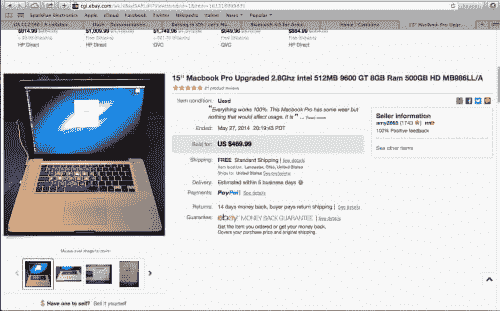T2】](https://res.cloudinary.com/practicaldev/image/fetch/s--r-acxLb3--/c_limit%2Cf_auto%2Cfl_progressive%2Cq_auto%2Cw_880/https://ladvien.cimg/Mac_Pro.png)

价格最终为 469.99 美元。我花了比我应该的多一点的钱，但是自从 Carduino 加入了 kitty 之后，我担心会得到一些我不能运行 Xcode 的东西。因此，我多花了一点钱，希望得到一台能让我高效编写代码的机器。

[T2】](https://res.cloudinary.com/practicaldev/image/fetch/s--C6Al78TM--/c_limit%2Cf_auto%2Cfl_progressive%2Cq_auto%2Cw_880/https://ladvien.cimg/Amys_Mac.png)

我得花点时间提醒人们，我戴着一顶白帽子。亲爱的 [Amy2865](http://www.ebay.com/usr/amy2865) ，在您出售笔记本电脑之前，请务必注销您的易贝账户。另外，[贾里德·库施马](https://www.amherst.edu/athletics/archives/2011-12/golf-m/roster/bios/kusma)，我喜欢你的笔记本电脑，但是我在使用它之前彻底清洁了键盘。以及屏幕上的斑点。

好了，玩笑开够了。继续前进。

我处理临床[妄想](http://en.wikipedia.org/wiki/Delusional_disorder)。但是，我正在学习强迫他们为我服务。我意识到我永远不会像在幻觉的痛苦中感觉的那样好。然而，我让这些话来指引我，

相信我能做任何事，可能不是真的。但是相信它能让我做任何事。

嗯，当我接受卡杜诺的资金帮助开发一个应用程序时，我可能是在妄想。我没有告诉任何人我以前从未使用过苹果电脑，更不用说写下 Objective-C 了。但有一点我相信，如果我下定决心要做某件事，我会去做。当然，我的时间表是我自己的，产品可能看起来很粗糙，但它*会*完成。

不管怎样，我承认我不知道我在做什么，所以我决定边走边记。

这让我想到了我的免责声明:

**我是*而不是*一名职业程序员。我没有假装。因此，请随时指出我的错误、低效或无效代码。我发布这样的文章的部分原因是为了同行评议。但不要指望我会为我没抓到的东西道歉。在非技术领域做全职工作，有一个读研的妻子，抚养一个四岁的孩子，嗯，这些事情让我几乎没有时间编程，*几乎没有时间进行代码审查。***

我不认为我的代码中有错误，我知道有错误。好了，先不说自嘲，我们开始吧。

## 设置环境

[T2】](https://res.cloudinary.com/practicaldev/image/fetch/s--HmETa2KJ--/c_limit%2Cf_auto%2Cfl_progressive%2Cq_auto%2Cw_880/https://ladvien.cimg/apple_mini_mac.jpg)

首先，你需要一台 Mac 和一个开发者许可证。Mac 确实需要至少 2008 或更高版本才能有效地为当前的 iOS 编码(编写时为 7.1，8.0 处于测试阶段)。

在查看了易贝的许多“交易”后，我决定买一台 Mac Book Pro 2009。它似乎足够大的人没有不健康的附件。2009 年以后，就好像人们在出售他们漂亮的女儿。

我选择了 Mac Book 而不是 Mac Mini。Mac Book 附带了显示器和外围设备。Maxhirez 警告我，一些 Mac Mini 有专有视频，这将迫使我购买一个显示器。

我非常担心易贝·麦克会失踪。当它终于进来，我放心地看到它启动。但是，不到一个小时，它就过热崩溃了。担心死我了。然后，我意识到这台笔记本电脑有两个视频卡和显示设置是全爆炸。我调低了视频设置，温度似乎保持不变。还是有点担心。当我为 Carduino 编写应用程序时，我可能会把它拆开，清洁散热片并重新涂上导热膏。

因此，苹果电脑的价格: **$469.99**

[T2】](https://res.cloudinary.com/practicaldev/image/fetch/s--Jj366xEP--/c_limit%2Cf_auto%2Cfl_progressive%2Cq_auto%2Cw_880/https://ladvien.cimg/Dev_Web2.png)

我有苹果电脑，现在呢？

我开始研究 iOS 开发者许可证的成本。一年 99 美元。

这应该允许你全年写和*发布*io。我硬着头皮点了。

**购买发布者许可证:**

*   [iOS 开发者许可证购买](https://developer.apple.com/programs/ios/)

**下载 Xcode**

一旦你有了 Mac 和开发者许可证，就该设置 Xcode 了。

*   [Xcode 5](https://itunes.apple.com/us/app/xcode/id497799835?mt=12#)

[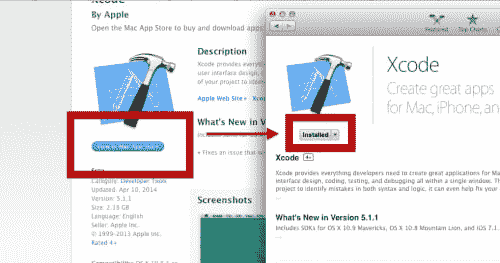T2】](https://res.cloudinary.com/practicaldev/image/fetch/s--MGf-Up6j--/c_limit%2Cf_auto%2Cfl_progressive%2Cq_auto%2Cw_880/https://ladvien.cimg/Screenshot_2014-07-14_22_41_42.png)

如果您尝试编译您的应用程序，并且* *收到关于证书的错误，* *并且没有自动解决，您可以手动下载证书。

**下载开发者证书**

1.  登录 [iOS 开发中心](https://developer.apple.com/devcenter/ios/index.action)并下载您的开发者证书

[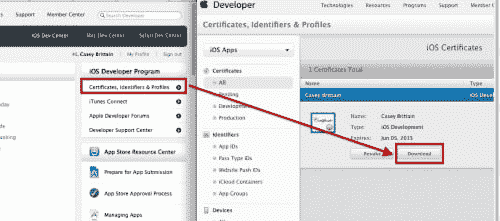T2】](https://res.cloudinary.com/practicaldev/image/fetch/s--qle4E0rp--/c_limit%2Cf_auto%2Cfl_progressive%2Cq_auto%2Cw_880/https://ladvien.cimg/Screenshot_2014-07-14_22_59_42.png)

您需要将此证书应用于您编写的应用程序以发布它们——即使是临时发布。

## 我们将要编写的应用程序

这篇文章描述了为蓝牙 4.0 iOS 设备编写一个应用程序，以支持与 Arduino 的串行连接。为了方便 Arduino-end 上的串行连接，HM-10 充当外围设备，反过来，它通过串行连接与 Ardunio 交互。

[https://www.youtube.com/embed/CfkU0xoOSNU](https://www.youtube.com/embed/CfkU0xoOSNU)

HM-10 的工作电压为 3.3v，Arduino 为 5v，但我创建了一个如何将 HM-10 转换为 5v 的指令。

*   [如何创建兼容 Arduino 的蓝牙 4.0 模块](http://www.instructables.com/id/How-to-Create-an-Arduino-Compatible-Bluetooth-40-M/)

HM-10 是一个低成本(6.87 美元，运费~.20)的蓝牙 4.0 模块。

*   来自 Fastech 的订单: [HM-10](http://www.fasttech.com/products/0/10004051/1292002-ti-cc2540-cc2541-bluetooth-4-0-ble-2540-2541)

## 准备在 Xcode 5 中开发

在我开始这个项目之前，我从未使用过 Mac，从未见过 Xcode 5，更不用说查看 Objective-C 代码了。但是，就像我这个妄想狂一样，我想，“嗯，它的名字里有‘C’这个词；对我来说，学起来不会那么难。”我真傻。

Objective-C 很傻。嗯，我不应该说它的整体是愚蠢的；然而，冗长和语法是愚蠢的。这个想法是所有的东西都被拼写出来，没有缩写，这使得代码很难读懂。无论如何，我将远离心理上关于简洁是智慧的本质的咆哮。或者人类如何在心理上被易于编码和解码的信息所吸引。

本文不打算深入讨论如何编写 Objective-C 或使用 Xcode，因为已经有很多优秀的指南了。

我发现最有用的网站是雷·温德里奇的

*   雷·温德里奇

他的书面教程是免费的，但是我花了 15 美元订阅了他的视频教程。文字和视频教程都很优秀。我从他和他的同龄人那里学到了我需要的几乎所有东西。

我会列出其他教程，但实际上，Ray 的教程涵盖了编写这个应用程序所需的所有内容——嗯，除了蓝牙部分，我会谈到。但是一个令人惊讶的有用视频是苹果对**core bluetooth Framework**的介绍。

1.  [101 芯蓝牙](https://developer.apple.com/videos/wwdc/2012/?include=703#703)(需要苹果设备才能看。)
2.  [高级核心蓝牙](https://developer.apple.com/videos/wwdc/2012/?include=705#705)(需要苹果设备才能观看。)

还有，我找到的几个视频和文章:

1.  [入侵代码](http://weblog.invasivecode.com/post/39707371281/core-bluetooth-for-ios-6-core-bluetooth-was)
2.  克里斯·迈尔斯

最后，我的 iOS 代码*不是我写的*。我只是把它切碎，希望能理解它。原作者是我的一个朋友:

*   穆萨维·沙阿

## UI 布局

我们将要编写的应用程序非常简单。*真的*，是。它从两个滑块控件中获取值，并通过蓝牙将其发送到 Ardunio。Arduino 依次将这些值转换为两个轮式电机的方向和 PWM 值。

好了，打开 Xcode，让我们开始一个新的项目。我们将使用单一视图项目。

[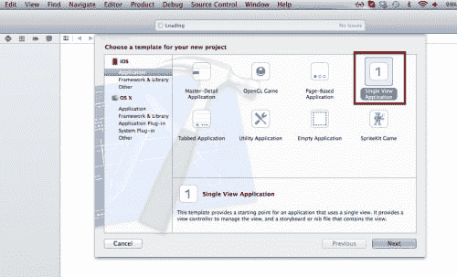T2】](https://res.cloudinary.com/practicaldev/image/fetch/s--vEsX27NF--/c_limit%2Cf_auto%2Cfl_progressive%2Cq_auto%2Cw_880/https://ladvien.cimg/Screenshot_2014-07-15_19_16_47.png)

创建我们的应用程序的第一步将是布局用户界面。这可以归结为几项。

背景图像视图:

*   3 个[标签](https://developer.apple.com/library/ios/documentation/uikit/reference/UILabel_Class/Reference/UILabel.html) -转向值、加速度值、接收数据
*   2 个[图像视图](https://developer.apple.com/library/ios/documentation/uikit/reference/uiimageview_class/Reference/Reference.html) -用于滑块轨道
*   2 个[滑块控制器](https://developer.apple.com/library/ios/documentation/UserExperience/Conceptual/UIKitUICatalog/UISlider.html) -用于 PWM 值
*   2 个[按钮](https://developer.apple.com/library/ios/documentation/UserExperience/Conceptual/UIKitUICatalog/UIButton.html#//apple_ref/doc/uid/TP40012857-UIButton-SW1) -测试发送和扫描设备菜单按钮
*   1 x 视图-充当被扫描设备的隐藏容器。

扫描设备视图将作为设备表视图的容器。我们将它的初始状态设置为 hidden，然后通过 Devices 菜单按钮以编程方式显示它。

扫描设备视图将有 2 个项目。

*   1 个[按钮](https://developer.apple.com/library/ios/documentation/UserExperience/Conceptual/UIKitUICatalog/UIButton.html#//apple_ref/doc/uid/TP40012857-UIButton-SW1) -返回
*   1 x 表格视图-包含 ble 设备信息

如果一切顺利，我们的用户界面应该看起来像这样:

[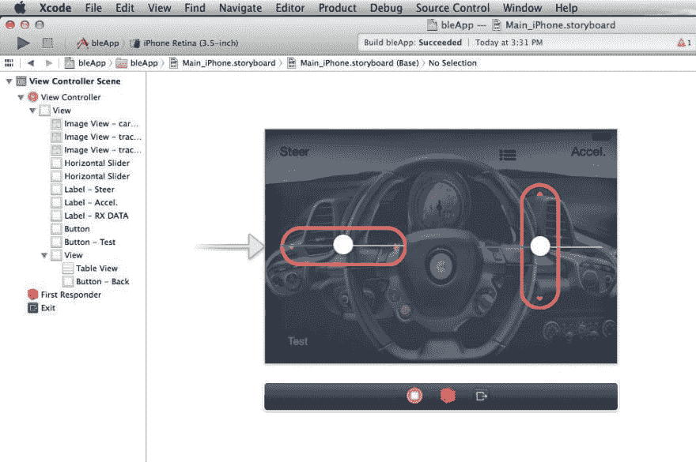T2】](https://res.cloudinary.com/practicaldev/image/fetch/s--ClI_pGN_--/c_limit%2Cf_auto%2Cfl_progressive%2Cq_auto%2Cw_880/https://ladvien.cimg/FMIP890HXII1V1E.LARGE.jpg)

如果你想创建自己的布局，我制作了一个视频，你可以跟着看:

[https://www.youtube.com/embed/yy91GB2trpA](https://www.youtube.com/embed/yy91GB2trpA)

或者，如果你愿意，你可以下载我的框架布局:

*   [Github bleApp](https://github.com/Ladvien/bleApp)

只需下载 zip 格式的项目。然后，在项目中有另一个名为:bleAppStartLayout.zip 的 zip 文件，如果您想编写自己的代码来使用框架布局，只需解压缩这个项目并在 xCode 中打开它。

## 代码

我们的应用程序代码有三个部分。

控制代码...

1.  蓝牙连接
2.  用户界面
3.  设备列表

在本文中，我将只深入讨论蓝牙代码。剩下的要么很简单

**Objective-C 蓝牙代码(还有一些 UI):**

在我们开始之前，稍微熟悉一下蓝牙 4.0 的标准和协议会有所帮助。还有 iOS 关于使用 CoreBluetooth 的建议，core Bluetooth 是苹果针对蓝牙 4.0 硬件的 API。

*   [蓝牙 4.0:低能耗](http://chapters.comsoc.org/vancouver/BTLER3.pdf) (16-19)
*   [iOS 核心蓝牙中心和外围角色概述](https://developer.apple.com/library/ios/documentation/NetworkingInternetWeb/Conceptual/CoreBluetooth_concepts/CoreBluetoothOverview/CoreBluetoothOverview.html#//apple_ref/doc/uid/TP40013257-CH2-SW1)

对我们来说，最重要的是核心角色和边缘角色之间的区别。

[T2】](https://res.cloudinary.com/practicaldev/image/fetch/s--miwXwxGy--/c_limit%2Cf_auto%2Cfl_progressive%2Cq_auto%2Cw_880/https://ladvien.cimg/Central_Peri_LMR.png)

这并不意味着我们的机器人不能接收数据或 iOS 设备不能发送数据，它只是定义了设备之间的关系。该角色决定哪个设备控制连接和数据流。为了这个应用程序，机器人* *将被设置为外围设备* *，iOS 设备* *将被设置为中央设备* *。这是我的观点，但似乎连接到速度最快的 uC 或 CPU 的 BLE 硬件应该起主要作用。

**头文件- bleApp.h**

为了访问兼容 iOS 设备的蓝牙 4.0 功能，苹果提供了 [CoreBluetooth 框架](https://developer.apple.com/library/ios/documentation/NetworkingInternetWeb/Conceptual/CoreBluetooth_concepts/AboutCoreBluetooth/Introduction.html#//apple_ref/doc/uid/TP40013257)。这个框架以典型的 C 风格被引入到你的应用程序代码中，通过导入* *bleApp.h* *

```
#import <CoreBluetooth/CoreBluetooth.h> 
```

Enter fullscreen mode Exit fullscreen mode

一旦框架被导入，我们就可以访问 API 方法了。

可以在以下位置找到这些方法的参考资料:

*   [CBCentralManagerDelegate 协议参考](https://developer.apple.com/library/mac/documentation/CoreBluetooth/Reference/CBCentralManagerDelegate_Protocol/translated_content/CBCentralManagerDelegate.html#//apple_ref/occ/intfm/CBCentralManagerDelegate/centralManagerDidUpdateState:)
*   [CB 外设代表协议参考](https://developer.apple.com/library/mac/documentation/CoreBluetooth/Reference/CBPeripheralDelegate_Protocol/translated_content/CBPeripheralDelegate.html)

好的，我将尝试解释一些我不太理解的东西，Objective-C 委托。

我认为委托是您的代码可以订阅的服务的集合。我认为它们很像 Arduino 中的中断。每次特定事件发生时，都会调用一个方法。您可以在* *bleApp.h* *:
的顶部设置您希望订阅的代表

```
@interface ViewController : UIViewController <CBPeripheralDelegate,
CBCentralManagerDelegate, UITableViewDelegate, UITableViewDataSource> 
```

Enter fullscreen mode Exit fullscreen mode

在这里，我们呼吁订阅四个代表:

1.  CBPeripheralDelegate
2.  CBCentralMAnagerDelegate
3.  UITableViewDelegate
4.  UITableViewDataSource

CoreBluetooth 中央管理器、CoreBluetooth 外围设备、用户界面表视图委托和用户界面表视图数据源。现在我们只打算* *关注蓝牙代表* *。

另一种看待代表的方式是一群小侦察机器人，它们在特定事件发生时进行报告。

[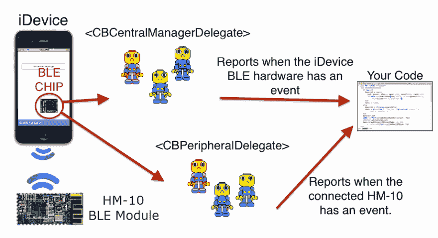T2】](https://res.cloudinary.com/practicaldev/image/fetch/s--IgPraMu---/c_limit%2Cf_auto%2Cfl_progressive%2Cq_auto%2Cw_880/https://ladvien.cimg/Central_Manager_Delegate_15.png)

这些委托是将在特定事件中被调用的小方法的集合。例如，CBPeripheralDelegate 具有方法**-(void)peripheral:(CBPeripheral *)peripheral didDiscoverServices:(NSError *)error**。每当 iOS 应用程序发现 BLE 外围设备时，都会调用此方法。同样，这些方法是由* *事件* *驱动的——这意味着在向你的代码报告之前通常会发生一些事情。

以下是我们将用来控制 iOS BLE 硬件的主要方法:

1.  **中央管理数据更新状态**
2.  **中央管理器发现外围设备**
3.  **中央管理器 didconnecperipheral**
4.  **外围设备发现服务**
5.  **外设 diddiscovercharactersforservice**
6.  **皮埃菲尔铁塔发现描述符特征**

接下来，我们声明我们将需要的属性。如果你像我一样对 Objective-C 属性知之甚少，这里有一个很好的教程。

```
//
//  ViewController.h
//  Carduino
//
//  Created by Ladvien on 6/21/14.
//  Copyright (c) 2014 Honeysuckle Hardware. All rights reserved.
//

#import <UIKit/UIKit.h>
#import <CoreBluetooth/CoreBluetooth.h> 
@interface ViewController : UIViewController <CBPeripheralDelegate,
CBCentralManagerDelegate, UITableViewDelegate, UITableViewDataSource>

// Instance of Central Manager.
@property (strong, nonatomic) CBCentralManager *centralManager;
// Stores a list of discovered devices, the key being their UUID.
@property (strong, nonatomic) NSMutableDictionary *devices;
// Instance method, used to act when a peripheral is discovered.
@property (strong, nonatomic) CBPeripheral *discoveredPeripheral;
// Instance method, used to act when a peripheral is selected to connect.
@property (strong, nonatomic) CBPeripheral *selectedPeripheral;
// Holds UUIDs.
@property (readonly, nonatomic) CFUUIDRef UUID;
// Stores peripheral characteristics.
@property (strong, nonatomic) CBCharacteristic *characteristics;
// Stores the advertising data of a peripheral.
@property (strong, nonatomic) NSMutableData *data;
@end 
```

Enter fullscreen mode Exit fullscreen mode

这应该是我们在头文件中需要的所有代码。

**bleApp.m -我们的实现**

## UI 连接

Objective-C 在[模态-视图-控制器](https://developer.apple.com/library/ios/documentation/general/conceptual/CocoaEncyclopedia/Model-View-Controller/Model-View-Controller.html)设计模态下运行。我们不必太深入这个设计理论是危险的，我们想要带走的主要东西是 UI 元素通过关键字连接到我们的代码。对于我们希望以编程方式改变的 UI 元素，我们设置一个* *IBOutlet* *对于我们希望生成一个动作的 UI 元素，我们使用**-【I action】**方法。

使用 IBOutlet 的示例如下:**rx label . text = @ " get data "；**

-(I action)方法的一个示例是:

**-(I action)menuButtonTouchUp:(id)sender {[do stuff]}；**

好了，现在我们如何制作 IBOutlets 和 IBActions？首先，点击“燕尾服”按钮

[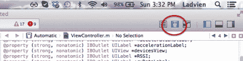T2】](https://res.cloudinary.com/practicaldev/image/fetch/s--i-34ecCv--/c_limit%2Cf_auto%2Cfl_progressive%2Cq_auto%2Cw_880/https://ladvien.cimg/Tux_View.png)

现在，按住 CONTROL 并单击您想要创建动作或出口的 UI 元素，然后拖动到* *@interface* *和* *[@end](https://dev.to/end) 之间的代码。* *

[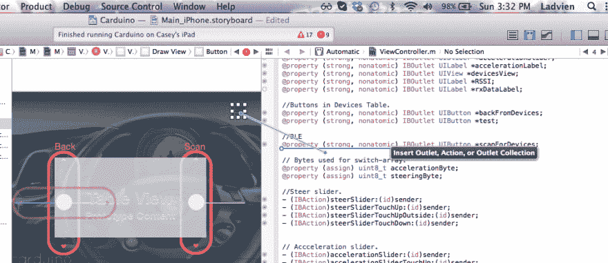T2】](https://res.cloudinary.com/practicaldev/image/fetch/s--rnfdGVSw--/c_limit%2Cf_auto%2Cfl_progressive%2Cq_auto%2Cw_880/https://ladvien.cimg/Drag_for_Outlet.png)

[Ray Wenderlich 的教程](http://www.raywenderlich.com/25561/learn-to-code-ios-apps-3-your-first-app)很好的解释了这个过程。所以，我不会重复。不过，有几个提示，您可以键入每个 IBOutlets 和 IBActions，但是除非它旁边的栏上的点被填充，否则它没有连接到元素。此外，如果在 tuxedo-view 中将鼠标悬停在小圆点上，它所连接的元素将高亮显示。

好的。因此，我们需要连接所有的 UI 元素。我将简单地参考一下我在布局上的视频。或者我建议你使用 skeleton bleApp 布局，因为我已经连接了 UI 元素。

无论哪种方式，我们都需要以类似这样的代码结束:

```
#import "ViewController.h" @interface ViewController ()

// Timers.
@property (nonatomic, retain) NSTimer *steerSliderRecoilTimer;
@property (nonatomic, retain) NSTimer *accelerationSliderRecoilTimer;
@property (strong, nonatomic) IBOutlet UITableView *tableView;

//Outlets.
@property (strong, nonatomic) IBOutlet UIView *mainView;
@property (strong, nonatomic) IBOutlet UILabel *steerLabel;
@property (strong, nonatomic) IBOutlet UISlider *steerSlider;
@property (strong, nonatomic) IBOutlet UISlider *accelerationSlider;
@property (strong, nonatomic) IBOutlet UILabel *accelerationLabel;
@property (strong, nonatomic) IBOutlet UIView *devicesView;
@property (strong, nonatomic) IBOutlet UILabel *RSSI;
@property (strong, nonatomic) IBOutlet UILabel *rxDataLabel;

//Buttons in Devices Table.
@property (strong, nonatomic) IBOutlet UIButton *backFromDevices;
@property (strong, nonatomic) IBOutlet UIButton *test;

//BLE
@property (strong, nonatomic) IBOutlet UIButton *scanForDevices;

// Bytes used for switch-array.
@property (assign) uint8_t accelerationByte;
@property (assign) uint8_t steeringByte;

//Steer slider.
- (IBAction)steerSlider:(id)sender;
- (IBAction)steerSliderTouchUp:(id)sender;
- (IBAction)steerSliderTouchUpOutside:(id)sender;
- (IBAction)steerSliderTouchDown:(id)sender;

// Accceleration slider.
- (IBAction)accelerationSlider:(id)sender;
- (IBAction)accelerationSliderTouchUp:(id)sender;
- (IBAction)accelerationSliderTouchUpOutside:(id)sender;
- (IBAction)accelerationSliderTouchDown:(id)sender;

// Menu
- (IBAction)menuButtonTouchUp:(id)sender;
@end 
```

Enter fullscreen mode Exit fullscreen mode

**1。CBCentralManager**

好了，让我们启动蓝牙吧。Objective-C 有一个在 UI 加载时运行一次的方法， **-(void)viewDidLoad** 方法。

```
- (void)viewDidLoad
{
    [super viewDidLoad];

    // Allocates and initializes an instance of the CBCentralManager.
    _centralManager = [[CBCentralManager alloc] initWithDelegate:self queue:nil];
} 
```

Enter fullscreen mode Exit fullscreen mode

稍后我们将在这个方法中添加更多的代码，但是现在这样做是可行的。这里，我们只是分配和初始化 CBCentralManager 对象的一个实例。它有两个参数， **initWithDelegate** ，我们将它设置为 self，将队列设置为 nil。这允许我们从 ViewController.h 继承 CBDelegate。将队列设置为 nil 仅仅意味着我们将允许 CentralManager 管理我们的数据。

[T2】](https://res.cloudinary.com/practicaldev/image/fetch/s--63iAvUZA--/c_limit%2Cf_auto%2Cfl_progressive%2Cq_auto%2Cw_880/https://ladvien.cimg/Msg_sir_3.jpg)

[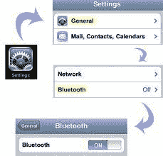T2】](https://res.cloudinary.com/practicaldev/image/fetch/s--xww8twHE--/c_limit%2Cf_auto%2Cfl_progressive%2Cq_auto%2Cw_880/https://ladvien.cimg/bluetoothOniOs.jpg)

**中央管理数据更新状态**

每次 iOS 设备上的 BLE 硬件更改状态时，都会调用此方法。在这里，我们用它来检查 iOS 的蓝牙硬件是否已经打开。

**centralmanagerdipdatestate**是一种方法，每当设备中的 BLE 硬件更改状态时，CoreBluetooth (CB)中央管理器代表都会调用该方法。在这里，当我们的应用程序第一次开始时，它被调用。每次打开或关闭 iOS 蓝牙时也会调用它。

```
// Make sure iOS BT is on.  Then start scanning.
- (void)centralManagerDidUpdateState:(CBCentralManager *)central {
    // You should test all scenarios
    if (central.state != CBCentralManagerStatePoweredOn) {
        // In case Bluetooth is off.
        return;
        // Need to add code here stating unable to access Bluetooth.
    }
    if (central.state == CBCentralManagerStatePoweredOn) {
        //If it's on, scan for devices.
        [_centralManager scanForPeripheralsWithServices:nil options:nil];
    }
} 
```

Enter fullscreen mode Exit fullscreen mode

[central.state](https://developer.apple.com/library/ios/documentation/CoreBluetooth/Reference/CBCentralManager_Class/translated_content/CBCentralManager.html) 属性由 CBCentralManager 委托设置。它有六个状态:

1.  CBCentralManagerStateUnknown -无法读取设备等。
2.  CBCentralManagerStateResetting-设备正在重置
3.  cbcentralmanagerstate unsupported-此设备不支持 BLE。
4.  CBCentralManagerStateUnauthorized 未经授权-你的应用未获得使用 BLE 的授权
5.  **CBCentralManagerStatePoweredOff**
6.  **CBCentralManagerStatePoweredOn**

我们将只使用最后两个状态。我们的代码检查 BLE 硬件是否启用；如果不是，它什么也不做。最后，我可能会添加一个警告来通知用户，但是现在，它什么也不做。如果硬件被启用，则它执行具有两个参数**scanForPeripheralsWithServices:nil**和* *选项:nil 的 centralManager 实例方法。* *

如果你没有时间阅读 BLE 协议手册，我将给你一个速成班。让我们从服务树开始。蓝牙的魅力在于它的广告协议。中央 BLE 设备正在扫描空气，而外围设备正在发布信息。广告的信息协调外围设备可用的服务。

如果你有时间，Ada 有一篇 Keven Townsend 写的关于通用属性概要(GATT)的*优秀*文章(我喜欢他的东西)。

*   关税及贸易总协定

[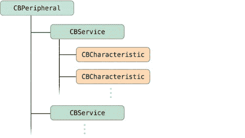T2】](https://res.cloudinary.com/practicaldev/image/fetch/s--1bEV2Hd5--/c_limit%2Cf_auto%2Cfl_progressive%2Cq_auto%2Cw_880/https://ladvien.cimg/TreeOfServicesAndCharacteristics_Remote_2x.png)

记住两件事，第一，我还在学习我到底在说什么。二、 [jnhuamao](http://www.jnhuamao.cn) 和我有一段历史。我观察了他们的 BLE 固件多年来的发展。当第一架生产 HM-10 时，它不符合*任何* BLE 协议。现在，他们有一个该死的好产品。当然，他们似乎试图让老派的蓝牙思维适应 BLE。例如，他们将模块的“主”角色等同于中心角色协议。同样，他们把“奴隶”等同于外围角色。这让我有点困惑，因为

对于 HM-10 来说，它看起来像这样，

[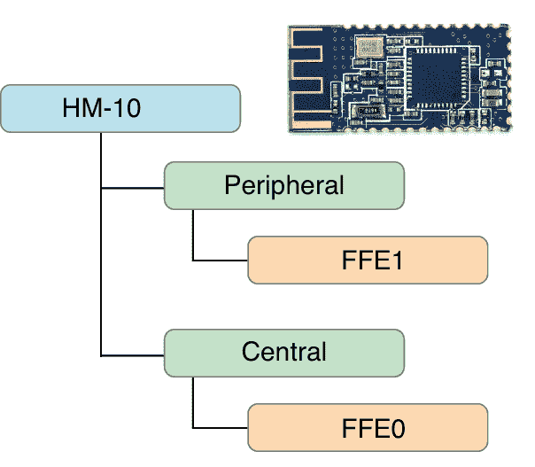T2】](https://res.cloudinary.com/practicaldev/image/fetch/s--9aBdpx0H--/c_limit%2Cf_auto%2Cfl_progressive%2Cq_auto%2Cw_880/https://ladvien.cimg/HM-10_Serv_Tree.png)

当 iDevice 扫描 HM-10 时，它将报告 FFE1 特征，这是 HM-10 上 RX/TX 的特征地址。

[T2】](https://res.cloudinary.com/practicaldev/image/fetch/s--63iAvUZA--/c_limit%2Cf_auto%2Cfl_progressive%2Cq_auto%2Cw_880/https://ladvien.cimg/Msg_sir_3.jpg)

**中央管理器发现外围设备**

每次发现新服务时，都会执行 central manager didDiscoverPeripheral 方法。它提供了关于所发现的外围设备的一些信息。首先是周边信息本身，这包括它的名字、UUID 等。可以从广告数据字典中获取更多信息。最后，这是 BLE 的一个简洁的属性，您可以在连接之前访问所发现设备的 RSSI。

```
 // Report what devices have been found.
- (void)centralManager:(CBCentralManager *)central
 didDiscoverPeripheral:(CBPeripheral *)peripheral
     advertisementData:(NSDictionary *)advertisementData
                  RSSI:(NSNumber *)RSSI
{
    // Set peripheral.
    _discoveredPeripheral = peripheral;

    // Create a string for the discovered peripheral.
    NSString * uuid = [[peripheral identifier] UUIDString];

    if (uuid) //Make sure we got the UUID.
    {
        //This sets the devices object.peripheral = uuid
        [self.devices setObject:peripheral forKey:uuid];
    }

    //Refresh data in the table.
    [self.tableView reloadData];

} 
```

Enter fullscreen mode Exit fullscreen mode

9:我们的代码将实例变量**_ discovered peripheral**设置为最近发现的外围设备。

12:创建一个字符串变量，并将其设置为发现的外围设备的 UUID。

14:检查 uuid 变量中是否有正确的 UUID 字符串。

17:这里我们调用* *设备 NSMutableDictionary* *的 setter 方法。我们正在从发现的外围设备设置对象服务信息，关键字是发现的外围设备的 UUID。这将允许我们召回至少 6 个发现的服务。

**- (NSMutableDictionary *)设备设置方法**

我们将存储最后发现的六个外围设备。

```
- (NSMutableDictionary *)devices
{
    // Make sure the device dictionary is empty.
    if (_devices == nil)
    {
        // Let's get the top 6 devices.
        _devices = [NSMutableDictionary dictionaryWithCapacity:6];
    }
    // Return a dictionary of devices.
    return _devices;
} 
```

Enter fullscreen mode Exit fullscreen mode

4:我们检查是否已经初始化了字典。7:如果我们没有，那么我们用六个设备插槽设置字典，然后，我们为最后发现的设备设置一个插槽。

10:当我们完成时，我们返回**设备**字典。

在我们的程序中，将会多次调用 devices 方法。最后，我们将使用字典来填充一个发现设备的表。

[T2】](https://res.cloudinary.com/practicaldev/image/fetch/s--63iAvUZA--/c_limit%2Cf_auto%2Cfl_progressive%2Cq_auto%2Cw_880/https://ladvien.cimg/Msg_sir_3.jpg)

**中央管理器已连接**

只要您的应用程序连接到特定的 BLE 设备，就会执行 centralManager didConnect 方法。

```
// Run this whenever we have connected to a device.
- (void)centralManager:(CBCentralManager *)central didConnectPeripheral:(CBPeripheral *)peripheral {

    // Set the peripheral delegate.
    peripheral.delegate = self;
    // Set the peripheral method's discoverServices to nil,
    // this searches for all services, its slower but inclusive.
    [peripheral discoverServices:nil];
} 
```

Enter fullscreen mode Exit fullscreen mode

5:一旦我们连接上了，我们就激活外设代理方法。

8:在我们连接到一个特定的外设之后，我们调用* *外设发现服务* *方法。同样，通过将* *discoverServices* *设置为* *nil* *我们搜索新连接的外围设备上的所有服务。

**2。CBPeripheralDelegate**

[T2】](https://res.cloudinary.com/practicaldev/image/fetch/s--63iAvUZA--/c_limit%2Cf_auto%2Cfl_progressive%2Cq_auto%2Cw_880/https://ladvien.cimg/Msg_sir_3.jpg)

**外围设备发现服务**

在这里，我们列举连接的外围设备上的所有服务。这是一种缓慢的发现服务的方式，但是它是包容的和容易的。由于 HM-10 只有两个服务，并且每次只有一个服务处于活动状态，因此我们不会浪费任何时间。

```
- (void)peripheral:(CBPeripheral *)peripheral didDiscoverServices:(NSError *)error
{
    // Enumerate through all services on the connected peripheral.
    for (CBService * service in [peripheral services])
    {
        // Discover all characteristics for this service.
        [_selectedPeripheral discoverCharacteristics:nil forService:service];
    }
} 
```

Enter fullscreen mode Exit fullscreen mode

4:这是一个奇特的 for 循环，叫做枚举。它会遍历* *(CBPeripheral *)外设* *中列出的所有服务，这是 HM-10 上的一个小列表。如果它处于外围角色，这是默认的，它只有一个服务。

7:在这里，我们在连接的设备上对每个服务调用**discover characters**方法。同样，传递* *nil* *参数意味着我们想要发现所有特征，而不是某个特定的特征。缓慢，但包容。

[T2】](https://res.cloudinary.com/practicaldev/image/fetch/s--63iAvUZA--/c_limit%2Cf_auto%2Cfl_progressive%2Cq_auto%2Cw_880/https://ladvien.cimg/Msg_sir_3.jpg)

**外设 diddiscovercharactersforservice**

对于每种服务，我们都列举了它的每个特征。

```
- (void)peripheral:(CBPeripheral *)peripheral
didDiscoverCharacteristicsForService:(CBService *)service
             error:(NSError *)error
{
    // Enumerate through all services on the connected peripheral.
    for (CBCharacteristic * character in [service characteristics])
    {
        // Discover all descriptors for each characteristic.
        [_selectedPeripheral discoverDescriptorsForCharacteristic:character];
    }
} 
```

Enter fullscreen mode Exit fullscreen mode

4:我们在连接的外围设备上检查每个服务的每个特征。

7:我们对每个发现的特征调用**discovered descriptors for characteristic**方法。

[T2】](https://res.cloudinary.com/practicaldev/image/fetch/s--63iAvUZA--/c_limit%2Cf_auto%2Cfl_progressive%2Cq_auto%2Cw_880/https://ladvien.cimg/Msg_sir_3.jpg)

**外围设备发现描述符特征**

我们用这种方法完成了两件事。首先，我们得到十六进制值 FFE0 的字符版本

[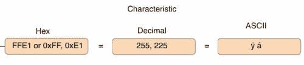T2】](https://res.cloudinary.com/practicaldev/image/fetch/s--EJGnmU9k--/c_limit%2Cf_auto%2Cfl_progressive%2Cq_auto%2Cw_880/https://ladvien.cimg/TreeOfServicesAndCharacteristics_Remote_Var4.png)

6:我们做的第一件事是将 HM-10 的特征从 FFE1 转换为字符值，255 和 225。

8:接下来，我们检查是否得到了两个字符，它们是 255 和 225

**12-23** :我们通过服务和特征进行快速列举。对于每个特征，对于每个服务，我们调用 selectedPeripheral setter 方法。我们将* *setNotifyValue* *参数传递给* *true* *。这会自动接收串行数据。每次接收串行数据时，方法

```
-(void)peripheral:(CBPeripheral *)peripheral didUpdateValueForCharacteristic:(CBCharacteristic *)characteristic error:(NSError *)error

{

    //Put RX data collection here.

} 
```

Enter fullscreen mode Exit fullscreen mode

当我们到达 UI 时，我们将编写我们的 RX 方法，因为我们将设置我们的 rxDataLabel 来自动更新传入的数据。

此外，我们正在建立一个自动接收通知方法。但是，另一种方法是将* *setNotifyValue* *设置为 false。然后，每次您想要获取 RX 数据时，您可以手动调用**diddupdatevalueforcharacteristic**方法。

```
- (void)peripheral:(CBPeripheral *)peripheral
didDiscoverDescriptorsForCharacteristic:(CBCharacteristic *)characteristic
             error:(NSError *)error
{
    //Store data from the UUID in byte format, save in the bytes variable.
    const char * bytes =[(NSData*)[[characteristic UUID] data] bytes];
    //Check to see if it is two bytes long, and they are both FF and E1.
    if (bytes && strlen(bytes) == 2 && bytes[0] == (char)255 && bytes[1] == (char)225)
    {
        // We set the connected peripheral data to the instance peripheral data.
        _selectedPeripheral = peripheral;
        for (CBService * service in [_selectedPeripheral services])
        {

            for (CBCharacteristic * characteristic in [service characteristics])
            {
                // For every characteristic on every service, on the connected peripheral
                // set the setNotifyValue to true.
                [_selectedPeripheral setNotifyValue:true forCharacteristic:characteristic];
            }
        }
    }
} 
```

Enter fullscreen mode Exit fullscreen mode

[T2】](https://res.cloudinary.com/practicaldev/image/fetch/s--63iAvUZA--/c_limit%2Cf_auto%2Cfl_progressive%2Cq_auto%2Cw_880/https://ladvien.cimg/Msg_sir_3.jpg)

**发送值**

每当我们想向外设发送信息时，就会调用这个方法。它有数据传递参数* *str* *，但是我们不会使用它。我们正在编写的应用程序会自动组装一个数据字符串，并在每次调用时将其发送给外设。要发送我们的数据，我们只需确保它在适当的变量中。

这个应用程序采用两个滑块的值，范围从-255 到 255。然后我们做一些数据处理。在 iOS 设备上，一个字节需要 8 位。对于无符号字符也是如此。但是我发现如果你赋一个大于 127 的值，那么 ARC 会自动为一个无符号值生成两个字节。为了解决这个问题并保持 Arduino 的全分辨率，我们将滑块范围从 255 转换为 125-0 或 125-1。一个是在开关阵列中设置的位，`controlByte`。然后，当 Arduino 接收到数据时，它将其转换回满量程，255。

关于方向，使用相同的开关阵列`controlByte`，我们根据滑块指示的是 0 到 255 还是 0 到 255 设置一个低位或高位。同样，当它到达 Arduino 时，它被转换成马达的方向。

好吧！让我们单步执行代码。

```
- (void)sendValue:(NSString *) str
{
    for (CBService * service in [_selectedPeripheral services])
    {
        for (CBCharacteristic * characteristic in [service characteristics])
        {
            // Round the float.
            steeringValue = lroundf(self.steerSlider.value);
            accelerationValue = lroundf(self.accelerationSlider.value);

            // SEND STRING
            //  DIR-MA    DIR-MB    PWM-MA  PWMA-MB EOTC
            //  CON Byte  CON Byte   0-255   0-255    :
            NSMutableData *myData = [NSMutableData data];

            // CONTROL BYTE
            //  BIT: 7=CAN'T BE USED
            //  BIT: 6=
            //  BIT: 5=Breaklights ON
            //  BIT: 4=Headlights ON
            //  BIT: 3=127+ MOTOR B
            //  BIT: 2=127+ MOTOR A
            //  BIT: 1=MOTOR B DIR
            //  BIT: 0=MOTOR A DIR
            NSUInteger controlByte = 0;

            //Steer value is negative number.
            if(steeringValue < 0)
            {
                // Set the reverse bit.
                controlByte |= 1 << 0;
                steeringValue = (steeringValue * -1);
            }

            // Acceleration value is a negative number.
            if(accelerationValue < 0)
            {
                // Set the reverse bit.
                controlByte |= 1 << 1;
                accelerationValue = (accelerationValue * -1);
            }

            // If steer motor is greater than 127.
            if (steeringValue > 127) {
                // Set the bit indicating 128-255.
                controlByte |= 1 << 2;
                // Remove excess from text.label
                steeringValue -= 128;
            }

            // If steer motor is greater than 127.
            if (accelerationValue > 127) {
                // Set the bit indicating 128-255.
                controlByte |= 1 << 3;
                // Remove excess from text.label
                accelerationValue -= 128;
            }

            //NSLog(@"After: %i", controlByte);
            // Breaklights
            //controlByte |= 1 << 5;
            // Headlights
            //controlByte |= 1 << 4;

            // Load all the data into myData.
            [myData appendBytes:&controlByte length:sizeof(unsigned char)];
            [myData appendBytes:&steeringValue length:sizeof(unsigned char)];
            [myData appendBytes:&accelerationValue length:sizeof(unsigned char)];

            // Create a string with all the data, formatted in ASCII.
            NSString * strData = [[NSString alloc] initWithData:myData encoding:NSASCIIStringEncoding];
            // Add the end-of-transmission character to allow the
            // Arduino to parse the string
            str = [NSString stringWithFormat:@"%@:", strData];

            // Write the str variable with all our movement data.
            [_selectedPeripheral writeValue:[str dataUsingEncoding:NSUTF8StringEncoding]
            forCharacteristic:characteristic type:CBCharacteristicWriteWithoutResponse];
                self.rxData = @" ";
        }
    }
} 
```

Enter fullscreen mode Exit fullscreen mode

3-6:像以前一样，我们正在枚举连接的外围设备上的所有服务和特性。

**8-9** :我们获取滑块值，将其四舍五入为整数，并加载到适当的整数变量**转向值**和**加速值**。

14:设置一个数据变量来保存我们的发送字符串。

25:我们创建一个字节变量作为我们的开关数组。

29-42:根据滑块的符号确定电机的运行方向。

45-58:决定我们是否需要划分范围。

67-69:将处理后的数据加载到数据变量中。

72:使用我们处理过的数据创建一个字符串，然后将其转换为 ASCII 码，发送到 Arduino。

75:添加“:”字符，它将作为我们的传输结束字符。

78: *最后，*我们把完成的数据串发送给外设。

*看！*

这个项目的完整源代码可以在这里找到:

*   [拉德维恩的 HM-10 Carduino 应用](https://github.com/Ladvien/Carduino)

这是与之配套的 Arduino 草图:

*   [拉德维恩的卡杜伊诺草图](https://github.com/Ladvien/Carduino/blob/master/Carduino_iOS.ino)