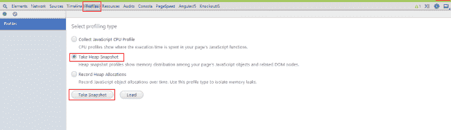
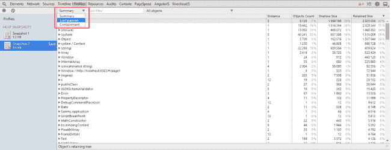
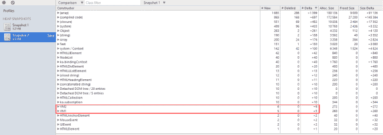

# 用 Knockout.js 构建的 SPA 中的内存泄漏

> 原文:[https://dev . to/for foreach/memory-leaks-in-spa-build-with-knockout-js-59ej](https://dev.to/forforeach/memory-leaks-in-spa-built-with-knockout-js-59ej)

### 用 Knockout.js 构建的 SPA 内存泄露

**问题:**

当我们使用具有数据绑定的 MV*框架(如 Knockout.js)构建大型 SPA 应用程序时，我们实际上在 js 模型和 DOM 元素之间创建了一个连接。这些连接可以通过多种方式实现，但底线是 DOM 元素可以引用我们的模型。例如，在 Knockout 中，每个具有绑定的元素都与存储绑定上下文引用的闭包对象相关。这个绑定上下文有一个指向我们模型的指针。现在，考虑到这一点，我们可以看到将要出现的问题。如果我们简单地删除有绑定的 DOM 元素，那么上面的闭包仍然会保存一个指向我们模型的指针，结果是永远不会从内存中释放。这个问题在 SPA 应用程序中尤其严重，因为当我们改变页面时，我们只是简单地交换一些容器的内部 HTML，而从不完全重载页面。

**检测:**

要用 Knockout 检测 SPA 中的上述问题，我们不需要做太多工作。如果我们绑定我们的模型，并且从不解除绑定，我们几乎肯定会有漏洞。然而，我将展示一种使用 Chrome DevTools 来确保这一点的方法。

我们需要运行我们的应用程序并打开一个 dev tools(Windows 用户使用 F12)。我用 Knockout 和 Sammy.js 创建了一个简单的路由应用程序。[在这里下载](https://docs.google.com/uc?id=0B3tmSeYWpEi4eWxSRERuenVINGc&export=download)。在我们运行一个应用程序之后，我们需要获取一个堆快照。按 DevTools 中的“配置文件”选项卡，选中“获取堆快照”并按“获取快照”

[T2】](https://res.cloudinary.com/practicaldev/image/fetch/s--F_YBYyl1--/c_limit%2Cf_auto%2Cfl_progressive%2Cq_auto%2Cw_880/https://dev-to-uploads.s3.amazonaws.com/i/o0lozambh4nwxnbv3mh7.png)

之后，在第 1 页和第 2 页之间切换 10 次，并拍摄另一张快照。现在，当我们有了这两张快照，我们可以比较它们。我们只需将快照预览模式切换到“比较”

[T2】](https://res.cloudinary.com/practicaldev/image/fetch/s--ORN0G3Lb--/c_limit%2Cf_auto%2Cfl_progressive%2Cq_auto%2Cw_880/https://dev-to-uploads.s3.amazonaws.com/i/wbsqfwvp9tamtyyp2grx.png)

在比较模式下，我们可以通过“# Delta”字段对结果进行排序。这个字段表示现在内存中有多少特定类型的对象。您还可以通过分别查看' # New '和' # Deleted '字段来检查创建了多少个新对象和释放了多少个对象。我们现在要找的是那些创造过而从未释放过的对象。在我的测试中，应用程序非常简单。我们知道我们访问了每个页面 5 次，所以我将寻找在“Delta”字段中有 5 的对象。

[T2】](https://res.cloudinary.com/practicaldev/image/fetch/s--ei3Sbe2b--/c_limit%2Cf_auto%2Cfl_progressive%2Cq_auto%2Cw_880/https://dev-to-uploads.s3.amazonaws.com/i/rla19ik6kvprb9b5gjei.png)

正如我们所看到的，在我们的会话期间，VM1 和 VM2 都没有发布。

**解决方案:**

这个问题的解决方法很简单。如前所述，我们只需要释放想要移除的 DOM 节点的 bindingContext 对象。Knockout 为我们提供了许多在这种情况下有用的方法。我们可以在移除 HTML 之前使用 ko.cleanNode(element)方法，或者使用 ko.removeNode(element)方法来清除节点并移除它。无论我们选择使用哪种方式，我们都需要记住**——如果我们创建了绑定，我们必须解除绑定！**

* * *