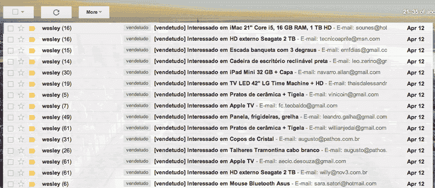
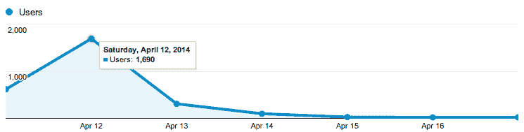
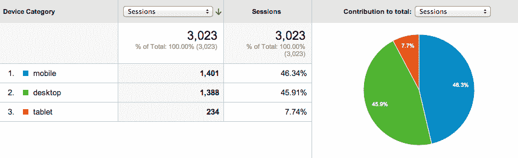

# 我卖掉所有东西的那天

> 原文:[https://dev.to/wes/the-day-i-sold-everything-3g9d](https://dev.to/wes/the-day-i-sold-everything-3g9d)

#### 以及我对移动互联网的了解

2014 年 5 月，我将搬到阿姆斯特丹(在未来的帖子中会有更多相关内容)，就像每一个需要搬出整栋公寓的人一样，是时候做典型的帖子“家庭出售一切”了。

而且，由于我休了几周假——因此我有了很多空闲时间——我决定用一些新东西比如 Node.js 和 MongoDB 来构建一个项目，看看会发生什么。

### 网站

我的网站基于我在为 [Scup](http://www.scup.com/) 工作时建立的 CSS 框架，默认情况下是响应式的，因为我不想花太多时间去寻找一个完美的电子商务，除了相信简单的东西更好。

我定义了价格，向我的朋友[达维·帕斯夸莱蒂](http://www.davipasqualetti.com/)寻求帮助以获得高质量的照片，完成了网站，测试了它，[发布了它](http://vendetudo.wex.vc/)并在[上发布了我的脸书简介](http://fb.me/wesley.souza)，时间是周五晚上 9 点。出去了。

### 轰

几分钟后，我的手机不停地显示电子邮件到达——因为我让网站给我发了一封电子邮件，表明人们对某样东西感兴趣，谁知道数据库会不会爆炸，对吧。

[T2】](https://res.cloudinary.com/practicaldev/image/fetch/s--o4qL-VgY--/c_limit%2Cf_auto%2Cfl_progressive%2Cq_auto%2Cw_880/https://cdn-images-1.medium.com/max/880/0%2AOOiA80un8XULFP-O.png)

所有这些结合，再加上对网站简单性和响应性的尊重，保证了比我预期的更大的成功。仅前 3 个小时就有 619 次访问，第二天就有 1690 次。

[T2】](https://res.cloudinary.com/practicaldev/image/fetch/s--DfGhBf60--/c_limit%2Cf_auto%2Cfl_progressive%2Cq_auto%2Cw_880/https://cdn-images-1.medium.com/max/745/0%2ASnEf4Ozui1Au1zkD.png)

现在，是什么让我相信成功的最大部分是对简单性和响应性的尊重？看看下面的图表:

[T2】](https://res.cloudinary.com/practicaldev/image/fetch/s--pngeAMBd--/c_limit%2Cf_auto%2Cfl_progressive%2Cq_auto%2Cw_880/https://cdn-images-1.medium.com/max/858/0%2Aq_mgxolYJIdHb4YD.png)

大部分访客使用他们的 iPhone 或 Android，来自[《脸书邮报》](https://www.facebook.com/shares/view?id=10203583395610457)。由于网站尊重他们的设备，非常简单，每个人都在自己的手机上完成了整个结账过程，保证了大量感兴趣的人，并在几个小时内预订了一切。

### 那又怎样？

所以答案很简单:了解你的观众并尊重他们。我的受众是口碑:社交媒体，主要是脸书，我的大部分帖子都在那里分享。由于超过 10 亿人通过手机使用它们，一个简单且响应迅速的网站自然会拥有满意的用户。

我衷心感谢网站上的 300 多条信息，从亲密的朋友到我从未见过的人。

现在让我们清空公寓，飞往阿姆斯特丹。