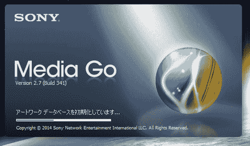

# 具备媒体共享功能！ 也介绍了在进化后的 Media Go 2.7 评论 iOS/Android 终端上的使用方法！

> 原文:[https://dev.to/takimura/-media-go-27-IOs Android-3pa 4](https://dev.to/takimura/-media-go-27--iosandroid-3pa4)

[T2】](http://livedoor.blogimg.jp/cv_k/imgs/f/0/f0f4c372.png)

终于搭载了媒体共享功能！

日前，索尼媒体文件管理软件 Media Go 的最新版 2.7 发布。 Media Go 2.7 提供了您期望的媒体共享功能，使您可以从支持 DLNA 的各种设备上直接播放 Media Go 库中的文件。 另外，[walkman](http://amzn.to/2kL1eCZ)F880/ZX1 系列将于 4 月下旬进行可播放 DSD 文件(转换为 PCM )的更新。 这次就来介绍一下 Media Go 2.7 发生了什么变化，如何变得方便了。

接下来请继续。

[接下来的阅读](http://connect.coron.tech/archives/51838189.html)