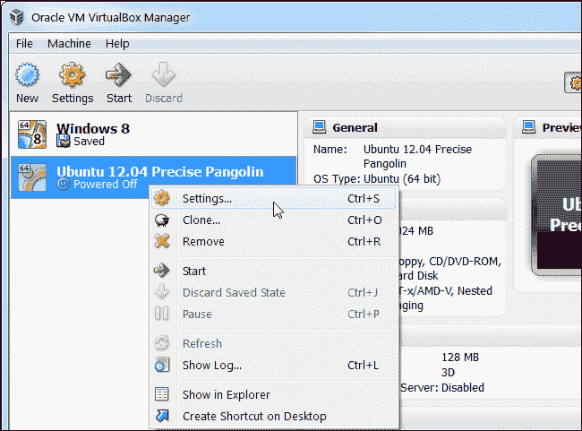

# 使用 node-inspector 在虚拟机中调试 Node.js 应用程序。

> 原文:[https://dev . to/leolanchas/debugging-a-nodejs-application-with-node-inspector-in-a-a-virtual-machine-CMP](https://dev.to/leolanchas/debugging-a-nodejs-application-with-node-inspector-within-a-virtual-machine-cmp)

如果你使用一个虚拟机来开发你的 Node.js 应用，并且可能使用[vagger](http://vagrantup.com/)来配置和移植你的工作环境，你迟早需要调试。虽然 node 有一个内置调试器的[,](http://vimeo.com/19465332)[node-inspector](https://github.com/node-inspector/node-inspector)为调试 node 程序提供了一个愉快的图形界面。Node Inspector 是 node.js 的调试器接口，使用 WebKit Web Inspector，这是 Safari 和 Chrome 中常见的 javascript 调试器。

### 安装

与 [npm](http://github.com/isaacs/npm) :

```
npm install -g node-inspector 
```

<svg width="20px" height="20px" viewBox="0 0 24 24" class="highlight-action crayons-icon highlight-action--fullscreen-on"><title>Enter fullscreen mode</title></svg> <svg width="20px" height="20px" viewBox="0 0 24 24" class="highlight-action crayons-icon highlight-action--fullscreen-off"><title>Exit fullscreen mode</title></svg>

### 转发端口

–最直接的方法是打开 VirtualBox，转到机器配置设置。

[T2】](https://res.cloudinary.com/practicaldev/image/fetch/s--PHkYz49B--/c_limit%2Cf_auto%2Cfl_progressive%2Cq_auto%2Cw_880/https://cdn-images-1.medium.com/max/650/0%2ACCeEmqmKBIGrfPh0.png)

虚拟机器设置

然后到网络->高级->端口转发:

[T2】](https://res.cloudinary.com/practicaldev/image/fetch/s--fvmHWE-M--/c_limit%2Cf_auto%2Cfl_progressive%2Cq_auto%2Cw_880/https://cdn-images-1.medium.com/max/650/0%2A5lR_0ZguAMkRlaCQ.png)

虚拟盒端口转发

您可以使用 VirtualBox 的端口转发规则窗口来转发端口。您不必指定任何 IP 地址。更改会立即生效。—如果你用的是流浪者，那就简单多了。在你的流浪档案里写下这一行(我以 3001 为例)

```
config.vm.network :forwarded\_port, guest: 3001, host: 3001 # node-inspector 
```

<svg width="20px" height="20px" viewBox="0 0 24 24" class="highlight-action crayons-icon highlight-action--fullscreen-on"><title>Enter fullscreen mode</title></svg> <svg width="20px" height="20px" viewBox="0 0 24 24" class="highlight-action crayons-icon highlight-action--fullscreen-off"><title>Exit fullscreen mode</title></svg>

更改将在下次启动虚拟机时生效。

### 用节点检查器调试

现在，您可以开始使用节点检查器了。转到您的虚拟机控制台并运行

```
node --debug your\_program.js 
```

<svg width="20px" height="20px" viewBox="0 0 24 24" class="highlight-action crayons-icon highlight-action--fullscreen-on"><title>Enter fullscreen mode</title></svg> <svg width="20px" height="20px" viewBox="0 0 24 24" class="highlight-action crayons-icon highlight-action--fullscreen-off"><title>Exit fullscreen mode</title></svg>

注意:确保–debug 标志在/node/program.js 之前，否则您可能会看到 EADDRINUSE 错误。然后，在另一个控制台中，运行

```
node-inspector --web-port=3001 
```

<svg width="20px" height="20px" viewBox="0 0 24 24" class="highlight-action crayons-icon highlight-action--fullscreen-on"><title>Enter fullscreen mode</title></svg> <svg width="20px" height="20px" viewBox="0 0 24 24" class="highlight-action crayons-icon highlight-action--fullscreen-off"><title>Exit fullscreen mode</title></svg>

我用 3001 作为例子，你可以用任何你想要的。现在打开 [http://127.0.0.1:3001/debug？在您最喜欢的基于 WebKit 的浏览器中。现在，您应该可以从 node 中看到 javascript 源代码。如果没有，请单击脚本选项卡。选择一个脚本并设置一些断点(最左边的行号)，或者简单地在代码中添加一个调试器调用(node 将在调用时自动中断，就像 V8 一样)。](http://127.0.0.1:3001/debug?port=5858)

*原载于 2014 年 3 月 15 日 leolanchas.com***。**