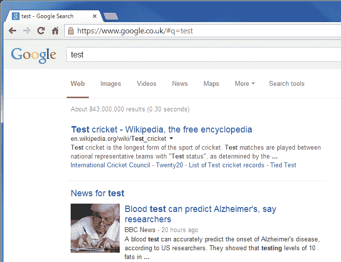
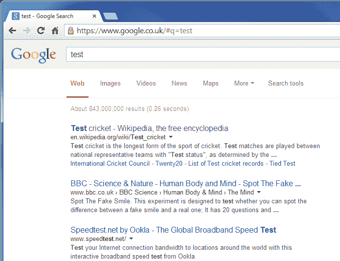

# 让谷歌重新变得好看

> 原文:[https://dev.to/adamkdean/make-google-look-good-again-26kg](https://dev.to/adamkdean/make-google-look-good-again-26kg)

如果你和我一样，你可能会觉得你的周三被谷歌测试更大的、没有下划线的页面结果标题给毁了。这看起来很可怕，绝对是个糟糕的决定。

[T2】](https://res.cloudinary.com/practicaldev/image/fetch/s--7eYgcRCH--/c_limit%2Cf_auto%2Cfl_progressive%2Cq_auto%2Cw_880/http://i.imgur.com/C0ZnCUR.png)

不过，如果谷歌拖后腿，还是有办法帮你度过难关的。如果你用的是 Chrome，那就是。安装[时尚](https://chrome.google.com/webstore/detail/stylish/fjnbnpbmkenffdnngjfgmeleoegfcffe)(一个允许你覆盖网站风格的扩展)，为谷歌安装任何主题。然后编辑它，删除所有现有的 css，并将其粘贴到:

```
#res h3 { 
  font-size: 16px !important; 
}
#newsbox, .rgsep { 
  display: none;
} 
```

<svg width="20px" height="20px" viewBox="0 0 24 24" class="highlight-action crayons-icon highlight-action--fullscreen-on"><title>Enter fullscreen mode</title></svg> <svg width="20px" height="20px" viewBox="0 0 24 24" class="highlight-action crayons-icon highlight-action--fullscreen-off"><title>Exit fullscreen mode</title></svg>

这将使你的页面标题更容易被接受，并从 SERP 中移除巨大的新闻箱。

[T2】](https://res.cloudinary.com/practicaldev/image/fetch/s--3cv3v5Nw--/c_limit%2Cf_auto%2Cfl_progressive%2Cq_auto%2Cw_880/http://i.imgur.com/qnNfVE2.png)

看起来好多了！