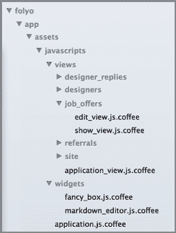

# 没有 JS 框架的 Rails

> 原文：<https://dev.to/cblavier/rails-with-no-js-framework-p8f>

### 因为所有 app 都不需要 Ember 或者 Angular

[T2】](https://res.cloudinary.com/practicaldev/image/fetch/s--9fo13kSl--/c_limit%2Cf_auto%2Cfl_progressive%2Cq_auto%2Cw_880/https://www.christianblavier.com/conteimg/2019/12/library.jpeg)

我写代码已经十多年了，我认为自己是一个极客，作为一个极客，我总是对任何不时发布的新技术非常好奇和兴奋。

这些天来，客户端 MVC 框架非常流行，老实说，我阅读和了解到的关于 *Ember* 或 *Angular* (还有许多其他的)看起来非常闪亮和深思熟虑。这些是我喜欢的典型框架。

但现在，我不需要它们。你呢？

* * *

### 操场

除了我的自由职业活动，我还在经营 [Folyo](http://www.folyo.me/) (顺便说一下，这可以帮助你发现优秀的设计师人才)。它就像是 *Ruby on Rails* 网站，它的用户界面可以被定义为流畅、反应灵敏(特别感谢我的联合创始人[萨查](http://sachagreif.com/)，但**一点也不复杂**。

作为一个工作板，Folyo 有一个非常常见的*页面驱动架构*，在页面上执行的任何操作通常会将你带到另一个页面或刷新当前页面内容。Folyo 的 UI **不涉及丰富的交互**，像*实时数据图表*或*动态数据绑定。没有，只有网页，完全没问题！*

#### 那么客户端框架呢？

为什么不呢，因为这似乎是最近的趋势。

因为这样的框架是设计用来解决复杂交互问题的复杂工具。你必须意识到他们在生产率、测试、搜索引擎优化等方面也有严重的缺陷。(读[这个](https://sourcegraph.com/blog/switching-from-angularjs-to-server-side-html))也有一个陡峭的学习曲线。

用客户端 MVC 框架构建一个网站将需要你构建你的 Rails 服务器端应用程序，只作为一个 API 应用程序，这意味着剥夺了你的一些 Rails 的美丽，并大大增加了你的开发工作(API + UI)。

尽管如此，使用框架也带来了一些好处。首先是帮助您以更易于管理的方式组织代码。虽然 Rails 对于组织服务器端代码的方式确实有指导意义，但它只规定了 Javascript 的一条规则:

*在 application.js 中放入任何你想要的东西*

**呃。真的吗？**

### 清理的时间到了

我现在将解释我们决定在 [Folyo](http://www.folyo.me/) 上组织 Javascript 代码的方式，这种方式比*application . js*中的一切更易于管理。我相信它非常实用，并且我确信它将适用于许多其他应用程序。

必需的库:

*   *jQuery* ，很明显。
*   Coffeescript ，不是强制性的，但是它的语法对于类定义来说非常方便。
*   *Turbolinks。仅使用 AJAX 实现页面间导航将真正改善用户体验。*
*   *HeadJS，*通过 *headjs-rails* gem 使用，通过异步加载你的 JS 来加速你的应用。

#### 代码层次结构

为了组织代码，我将简单地遵守以下规则:

<figure>[](https://res.cloudinary.com/practicaldev/image/fetch/s--RBSYUVsH--/c_limit%2Cf_auto%2Cfl_progressive%2Cq_auto%2Cw_880/https://cdn-images-1.medium.com/max/800/1%2AUpRTNIf-ll1ovWBUtolpJA.png) 

<figcaption>Folyo JS 代码层级</figcaption>

</figure>

*   任何需要 JS 代码的页面都有自己的类(JS 视图)。
*   如果您需要在视图之间共享一段代码，将它放在一个小部件类中。
*   application.js 只是在你的类、jQuery、HeadJS 和 Turbolinks 之间做粘合。
*   仅此而已！

#### 视图

ApplicationView 是默认视图，由任何其他视图继承，并且在没有提供特定视图时默认实例化。

```
window.Views ||= {}
class Views.ApplicationView

 render: ->
   Widgets.FancyBox.enable()
   Widgets.MarkdownEditor.enable()

 cleanup: ->
   Widgets.FancyBox.cleanup()
   Widgets.MarkdownEditor.cleanup() 
```

因为我们想让 *FancyBox* 和我们的 *Markdown* 编辑器在很多页面上工作，我们把它放在 *ApplicationView* 中作为默认行为。

那么典型的视图应该是这样的:

```
window.Views.Newsletters ||= {}
class Views.Newsletters.EditView extends Views.ApplicationView

 render: ->
   super()
   $('a.preview').click (e) ->
     e.preventDefault()
     url = $(e.target).attr('href')
     window.open(url, '_blank', 'width=800,height=800')

 cleanup: ->
   super() 
```

就这么简单！但是为什么要清理呢？

因为使用 *Turbolinks，*Javascript 环境不会在每个页面之间重置。例如，如果你在一个页面上定义了一个计时器，它将在下一个页面上继续计时。所以，只要记住在 cleanup 方法中停止你的定时器(或者删除任何文档范围的事件监听器)

#### **微件**

抱歉，这里没有火箭科学。

```
window.Widgets ||= {}

class Widgets.FancyBox
  @enable: -> $(".fancybox").fancybox()
  @cleanup: -> $(".fancybox").off() 
```

#### 胶水

*application.js* 现在是唯一的入口点，它将监听 *Turbolinks* 事件以呈现适当的视图并清理它们。#=需要您需要的一切

```
#= require everything you need

pageLoad = ->
  className = $('body').attr('data-class-name')
  window.applicationView = try
    eval("new #{className}()")
  catch error
    new Views.ApplicationView()
  window.applicationView.render()

head ->
  $ ->
    pageLoad()
    $(document).on 'page:load', pageLoad

    $(document).on 'page:before-change', ->
      window.applicationView.cleanup()
      true

    $(document).on 'page:restore', ->
      window.applicationView.cleanup()
      pageLoad()
      true 
```

您还需要在每个页面上定义一个特定的数据属性，以指示需要呈现哪个 JS 视图。

在你的*application _ controller . Rb*中，定义 *js_class_name* 方法:

```
def js_class_name
   action = case action_name
     when 'create' then 'New'
     when 'update' then 'Edit'
    else action_name
   end.camelize
   "Views.#{self.class.name.gsub('::', '.').gsub(/Controller$/, '')}.#{action}View"
 end 
```

然后在你的布局中使用它(以及 *HeadJS* 初始化)

```
%html
  %head
    = javascript_include_tag 'head.min'
    = headjs_include_tag 'vendor', 'application'
  %body{'data-class-name' => js_class_name} 
```

### 最后的话

我发现大多数 Rails 项目都是使用 *Angular* 、 *Ember* 或 *Backbone* 作为他们事实上的*选择。*

虽然这些框架非常强大，但我希望读完这篇文章后，你会认为*不使用 JS 框架*也是一个有效的选择。