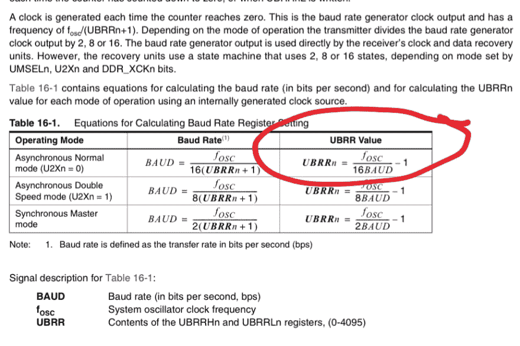
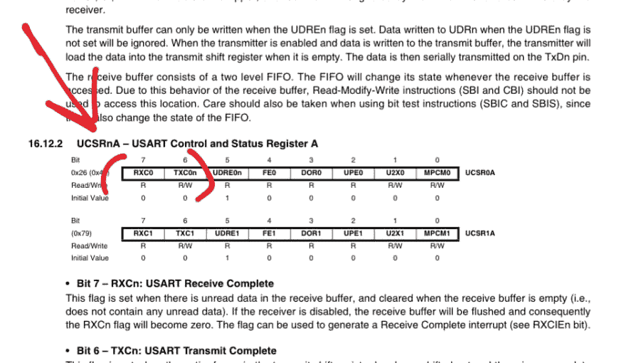
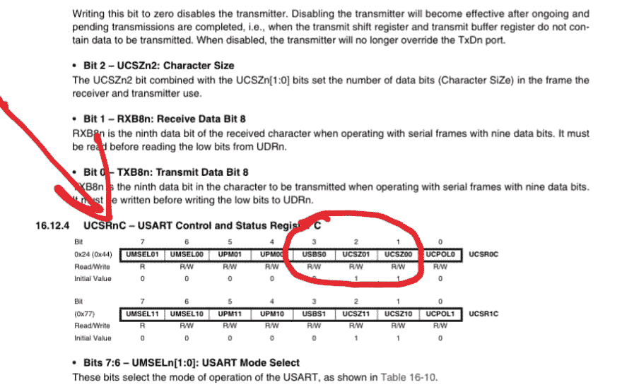
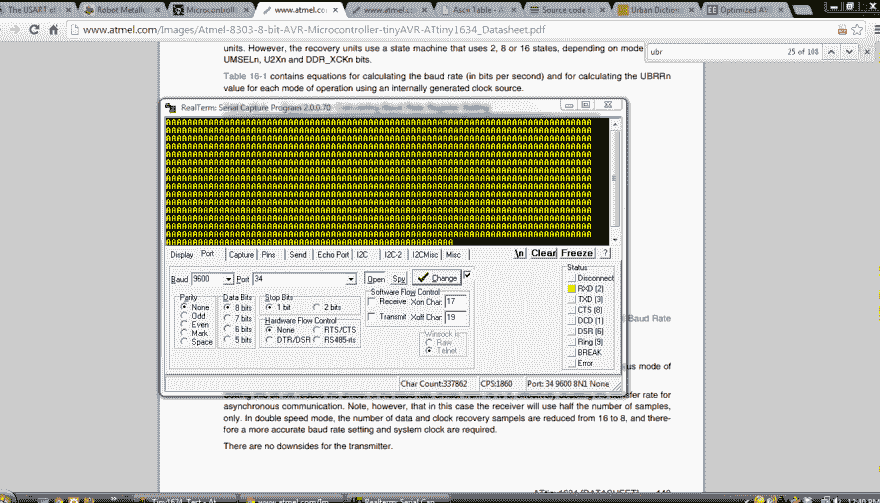
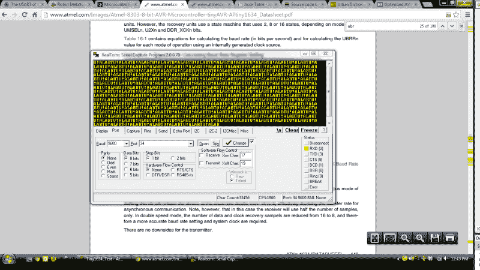
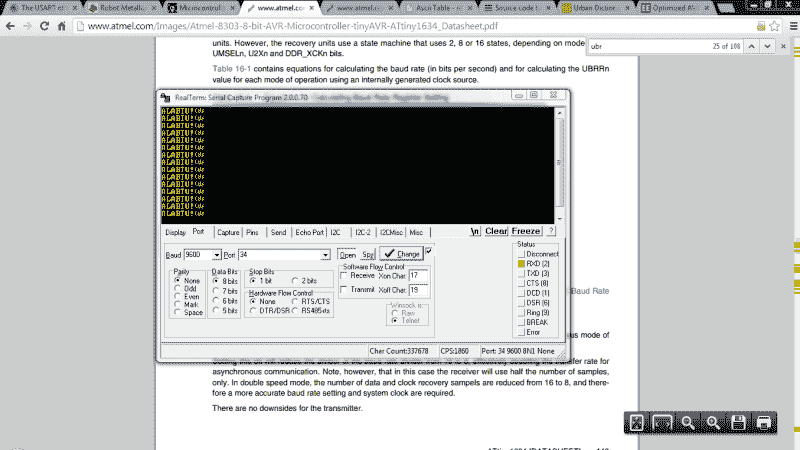
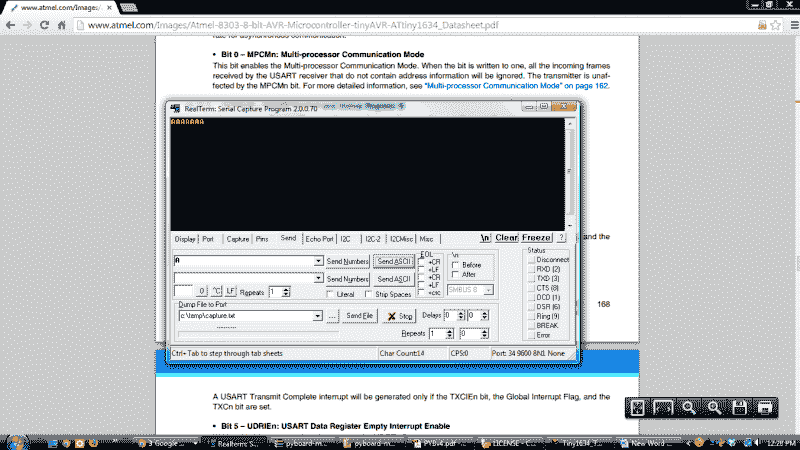
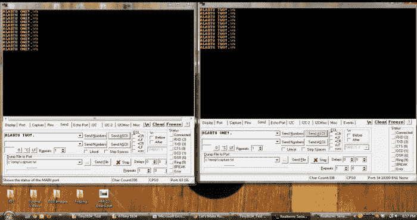

# 冶金 101 - AVR UART

> 原文：<https://dev.to/ladvien/metallurgy-101-avr-uart-3ml6>

这是我的[机器人冶金 101 - AVR 课日志](http://letsmakerobots.com/node/39996)的延续

*   [usrt _ 1634 码运行库](https://github.com/Ladvien/ATtiny1634_AVR_Code)

我开始浏览新手 Hack 在 AVR 上的教程，试图找到解决第一个 LCD 程序的能量。许多人不知道这一点，但我*鄙视*液晶显示器的工作。我认为是两部分，第一，我生活在一个高分辨率屏幕嵌入一切事物的世界，从[咖啡机](http://www.goodfood.com.au/photogallery/good-food/home-coffee-machine-road-test-20130304-2ffma.html?aggregate=&selectedImage=2)到[马桶](https://www.google.com/search?q=high+resolution+screen+on+toilet&sa=X&rlz=2C2OPRA_enUS0538US0538&tbm=isch&tbo=u&source=univ&ei=SVMSU_r3N8nlyAHXqYCAAQ&ved=0CGsQsAQ&biw=1342&bih=556#q=toliet+with+screen&tbm=isch&facrc=_&imgdii=_&imgrc=-CVkeG8NeiqIeM%253A%3BJjCd_KvddwpmGM%3Bhttp%253A%252F%252F25.media.tumblr.com%252Ftumblr_mb84no1XCV1ruylkdo1_1280.jpg%3Bhttp%253A%252F%252Feveryinteraction.tumblr.com%252Fpost%252F32674222735%252Frate-my-toilet-touch-screen-on-exit-to-singapore%3B1280%3B960)。试图用一个旧的学校液晶显示器来解决并不适合我。此外，连接非串行接口 LCD 是一件痛苦的事情。

但是看着剩下的新手黑客教程，我知道我需要一些方法来显示来自 ATtiny1634 的信息。我考虑了一下，做出了妥协:接下来我将专注于 UART。这样我就可以在我的桌面屏幕上显示信息。

我开始在 AVR 上阅读 UART 这是我找到的一些好的，

1.  新手黑客的[单向沟通](http://www.youtube.com/watch?v=U1kr9gYviMc)
2.  新手黑客的[双向沟通](http://www.youtube.com/watch?v=dkAbPzzn2K4)
3.  maxEmbedded 的 [USART](http://maxembedded.com/2013/09/30/the-usart-of-the-avr/)

阅读完文章后，我打开 ATtiny1634 数据手册，决定先尝试将“ALABTU”输出到串行端口，转换成[实数项](http://realterm.sourceforge.net/)。

我大概花了一两个小时才把东西修好；以下是我一路走来学到的东西。

**1。AVR UART 很简单。**

以下代码使用数据表中的 UBBR 图表设置 ATtiny 1634 的波特率，然后发送字母“a”

**UART 代码 v01**

```
//
// UART Example on the ATtiny1634 using UART0.
// C. Thomas Brittain
// letsmakerobots.com

#define F_CPU 8000000    // AVR clock frequency in Hz, used by util/delay.h
#include <avr/io.h> #include <util/delay.h>  // define some macros
#define UBBR 51 // 9600, .02% 
// function to initialize UART
void uart_init (void)
{
    /* Set baud rate */
    UBRR0H = (unsigned char)(UBBR>>8);
    UBRR0L = (unsigned char)UBBR;
    /* Enable receiver and transmitter */
    UCSR0B = (1<<RXEN0)|(1<<TXEN0);
    /* Set frame format: 8data, 1stop bit */
    UCSR0C = (1<<USBS0)|(1<<UCSZ00)|(1<<UCSZ01);   // 8bit data format
}

void USART_Transmit( unsigned char data )
{
    /* Wait for empty transmit buffer */
    while ( !( UCSR0A & (1<<UDRE0)) );

    /* Put data into buffer, sends the data */
    UDR0 = data;
}

int main()
{
    uart_init();

    while(1){

        USART_Transmit(0x41);
    }
} 
```

Enter fullscreen mode Exit fullscreen mode

*   **第 10 行:**这为 UART 波特率寄存器(UBBR)创建了一个宏。该数值可以使用[数据表](http://www.atmel.comhttps://ladvien.cimg/Atmel-8303-8-bit-AVR-Microcontroller-tinyAVR-ATtiny1634_Datasheet.pdf)第 148 页的公式计算。应该是:UBBR =((CPU _ SPEED)/16 * DESIRED _ BAUD)-1。对我来说，我想把我的速率设为 9600，因此:UBBR = (8，000，000/16 * 9600)-1；或者:UBBR = (8，000，000/153，600)-1 = **51.083。* *它可能有微小的误差，因为我们不能使用浮点数，所以我四舍五入到 51。 [](https://res.cloudinary.com/practicaldev/image/fetch/s--R1yP715U--/c_limit%2Cf_auto%2Cfl_progressive%2Cq_auto%2Cw_880/https://ladvien.cimg/BAUD_CALC.png)

*   然后，我们设置函数来初始化 UART 连接。**第 16-17 行**将我们计算的波特率加载到一个寄存器中，该寄存器将实际设置我们决定的速度。这通过使用 UBBR0L 和 UBBR0H 寄存器中的 4 位来实现。如果> >对你来说不熟悉，那它就是[右移运算符](http://www.cprogramming.com/tutorial/bitwise_operators.html)，工作方式很像左移，但是矢野，在另一个方向。

*   仍在初始化中，**线 19** 使能 RX0 和 TX0 引脚(分别为 PA7 和 PB0)。我还没有使用 TX0 引脚，但我想我也可以启用它，因为我以后会用到它。【T2

*   第 21 行设置这些位来告诉 Tiny1634 我们想要什么样的通信。我们需要 8 位，非奇偶校验，1 个停止位。使能 USBS0、UCSZ00 和 UCSZ01 可以得到这些值。 [](https://res.cloudinary.com/practicaldev/image/fetch/s--2WvOUQK---/c_limit%2Cf_auto%2Cfl_progressive%2Cq_auto%2Cw_880/https://ladvien.cimg/UCSR2.png) 。

*   第 24 行是传输我们数据的函数的开始。**第 27 行**检查 ATtiny1634 是否完成发送，然后再让它发送。UDRE0 是 UCSR0A 寄存器中的一个位，仅当发送缓冲器清零时才会清零。所以，这个**虽然(！(UCSR0A&(1<<udre 0))；**检查该位，如果不清楚，则再次检查，直到清楚为止。这是一个奇特的暂停，取决于传输缓冲区是否被清空。第 30 行是奇迹发生的地方。UDR0 是发送寄存器，寄存器中的任何内容都会从 TX 线路射出。这里，我们传递的是在调用 USART_Transmit 函数时提供给它的数据。

*   **第 39 行**将字符“A”的十六进制值传递给传输函数。

这比预期的要简单一点。

这是代码 v01 的输出。

[T2】](https://res.cloudinary.com/practicaldev/image/fetch/s--wqI4Qzu0--/c_limit%2Cf_auto%2Cfl_progressive%2Cq_auto%2Cw_880/https://ladvien.cimg/ATtiny1634_A_0.png)

在稍作调整并观看了新手 Hack 关于[向 LCD](http://newbiehack.com/MicrocontrollersABeginnersGuidePassingaStringtotheLCD.aspx) 发送字符串的视频后，我修改了 NH 的代码，以供我的 UART_Transmit()函数使用，并以一整串“ALABTU！”在串行监视器上。

为此，我创建了一个名为 **Serial_Print，**的函数，它被传递了一个字符数组(字符串)。 **StringOfCharacters** 是一个[指针](http://pw1.netcom.com/~tjensen/ptr/ch1x.htm)并将每个字符传递给 UART 传输。指针只是指向其他变量内容的变量。当您查看变量中包含的信息而不是更改变量的数据时，它们非常有用。新手 Hack 很好地解释了[指针](http://youtu.be/6yi8RZmXvh0?t=4m25s)。

现在，无论何时调用 **Serial_Print** 函数，它都会启动包含的循环。循环(**第 60 行，代码 v02** )继续指出包含在字符串*中的每个值，直到*遇到“0”，此时它退出循环，随后是函数调用。

**[UART 代码 v02](https://github.com/Ladvien/ATtiny1634_AVR_Code/blob/master/Attiny1634_UART_Code_Evolution/ATtiny1634_UART_Code_v02.c)T3】**

上述代码在串行监视器中提供了以下输出。(ALABTU！)

[T2】](https://res.cloudinary.com/practicaldev/image/fetch/s--UOvpg5ts--/c_limit%2Cf_auto%2Cfl_progressive%2Cq_auto%2Cw_880/https://ladvien.cimg/ATtiny1634_ALABTU_NO_CRLF_0.png)

在这一点上，我简单的头脑对它陈腐的成就非常满意，我看到用我的代码构建一个库是相当容易的。但是我必须先解决几个问题:

**A .动态波特率初始化。**

在 Arduino C**serial . begin(9600)**中，初始化串行连接并设置波特率。无论运行 1mhz 的 Arduino Uno 还是 16mhz 的 Arduino Mega，这都是动态的。我想要同样的功能；能够通过将波特率传递给初始化函数 **uart_init()** 来设置波特率。

我通过在 **uart_init()** 函数中添加公式解决了这个问题(参见代码 v03 的**第 21 行和第 38 行)。简而言之，F_CPU 宏包含微控制器设置的任何速度，在我的例子中为 8mhz，用户知道他想要的代码集波特率，因此我有了求解 UBBR 方程的所有部分。我将 F_CPU 作为计算的一部分，并允许 uart_init()将所需的波特率传递给公式。这允许我简单地通过传递 uart_init()函数来设置我想要的波特率。如**UART _ init(9600)；****

**B .传输结束时的回车和换行(EOT)。**

在 Arduino C 中，每次发送串行数据时， **Serial.print("你好吗，眼罩妈妈！?")**，还有两个字补充。如果你和我一样是微控制器领域的新手，那么每当你连续打印一些东西时，你可能会很头疼地发现这些额外的字符是从哪里来的。Arduino C 的**连载。Print()** 功能自动添加回车和换行符。在 [ASCII 码](http://www.asciitable.com/)中分别是“13”和“10”，在十六进制中分别是“0x0A”和“0x0D”。我相信 Arduino C 是这样做的，作为一个协议来标记传输的结束。这有助于串行接收器解析数据。

为了解决这个问题，我简单地创建了两个函数 **CR()** 和 **LF()** ，它们将传输换行字符和回车的十六进制代码。我走这条路是因为不是每一个串行设备都不包括它们，例如，我又爱又恨的 HM-10 不包括你发送的 at 命令中的字符。我想要一个简单的方法来发送这些字符，但不是那么深入，我不得不拔头发尝试**而不是**来发送它们。

下面的代码是我最后写的，

**[UART 代码 v03](https://github.com/Ladvien/ATtiny1634_AVR_Code/blob/master/Attiny1634_UART_Code_Evolution/ATtiny1634_UART_Code_v03.c)**

上面的代码提供了以下输出。请注意，我的串行监视器自动识别了 CR 和 LF 字符，这就是为什么“ALABTU！”每行一个，并且总是左对齐。Booyah！

[T2】](https://res.cloudinary.com/practicaldev/image/fetch/s--C5oZuaKz--/c_limit%2Cf_auto%2Cfl_progressive%2Cq_auto%2Cw_880/https://ladvien.cimg/ATtiny1634_ALABTU_WITH_CRLF.png)

好的。我还没做完，这是我接下来几天晚上要做的事情，

接收数据稍微复杂一点...一点点。

**2。RX 更不容易**

我首先回顾了新手 Hack 的代码[从芯片到芯片的单向通信](http://newbiehack.com/UART-OneWay-ChipToChip.aspx)，更具体地说，是他关于接收芯片的代码。我跳过了初始化的部分，因为我已经完成了，直接进入他的接收代码，

```
include <avr/io.h>
int main(void)
{
    DDRB |= (1 << PINB0);

    //Communication UART specifications (Parity, stop bits, data bit length)
    int UBRR_Value = 25; //This is for 2400 baud
    UBRR0H = (unsigned char) (UBRR_Value >> 8);
    UBRR0L = (unsigned char) UBRR_Value;
    UCSR0B = (1 << RXEN0) | (1 << TXEN0);
    UCSR0C = (1 << USBS0) | (3 << UCSZ00);

    unsigned char receiveData;
    while (1)
    {
        while (! (UCSR0A & (1 << RXC0)) );

        receiveData = UDR0;

        if (receiveData == 0b11110000) PORTB ^= (1 << PINB0);
    }
} 
```

Enter fullscreen mode Exit fullscreen mode

该代码接收数据，如果接收到任何数据，则打开/关闭 LED。它不关心收到的值，只关心是否收到了某个东西。

我能够复制这段代码，并让 LED 切换状态，但我很快注意到一个问题。**线 16** 上的 **While** 循环持续卡在检查是否收到任何东西。问题很明显；这冻结了微控制器做任何其他事情。该死的。

好吧，需要一个不同的解决方案；可悲的是，这个解决方案是我一年来一直在避免的，使用[中断](http://en.wikipedia.org/wiki/Interrupt)。

谈到电子产品，我不是最敏锐的，在 2012 年 7 月之前，我对电子产品所做的一切就是打开它们，检查脸书。(顺便说一句，去你的脸书。 **)** 自从我开始接受硬件教育以来，我一直避免学习中断，因为它们让我感到害怕。

我不会在这里讨论中断，因为我正在学习它们。但我会提到有两种类型，[内部和外部](http://www.avrfreaks.net/index.php?name=PNphpBB2&file=viewtopic&t=89843&start=all&postdays=0&postorder=asc)。

内部中断由微控制器的内部硬件产生，称为**软件中断、**，因为它们是由 CPU 根据其编码方式产生的。**外部中断**是传送到微控制器引脚的电压。此外，中断本质上导致 CPU 在它正在读取的代码中放一个书签，运行并处理任何事情，然后当完成时，返回到被书签标记的代码并继续读取。

也就是说，我建议你参考新手 Hack 关于 AVR 中断的教程。太棒了。此外， **Abcminiuser** 在 AVR 怪胎提供了一个关于 AVR 中断的[优秀教程](http://www.avrfreaks.net/index.php?name=PNphpBB2&file=viewtopic&t=89843&start=all&postdays=0&postorder=asc)。

好的。回到我的问题。

因此，我查阅了 ATtiny1634 的[数据表](http://www.atmel.comhttps://ladvien.cimg/Atmel-8303-8-bit-AVR-Microcontroller-tinyAVR-ATtiny1634_Datasheet.pdf)(第 168 页)，发现 ATtiny1634 有一个中断，每当 RX 数据缓冲区满时就会触发。要激活该中断，我们必须做两件事，启用全局中断并设置 UCSR0B 寄存器的 RXCIE0 位。这看起来很直接，但我找到了一个 [AVR 怪胎教程](http://www.avrfreaks.net/?name=PNphpBB2&file=viewtopic&t=48188)帮助解释它。

**警告**，我正在学习重读哪个寄存器找到一位。有时候，我发现自己很沮丧，一段代码不能工作，只是意识到我在一个不正确的端口上初始化了一点。例如，`UCSR0D |= (1<<RXCIE0)`可以正常编译，但它实际上会启用位 RXSEI，该位是您设置的在串行数据接收的*开始*时启用中断的位。这是因为寄存器和位的名称是 AVR 内核库的一部分，但它们只是数字的宏。在 RXCIE0 的情况下，它实际上代表 7，因此编码`UCSR0D |= (1<<RXCIE0)`只是设置**错误寄存器**的第 7 位。不是说我做了什么。

好了，现在我有了 attiny 1634*完成*接收字节时的中断设置。

**[UART 代码 v04](https://github.com/Ladvien/ATtiny1634_AVR_Code/blob/master/Attiny1634_UART_Code_Evolution/ATtiny1634_UART_Code_v04.c)**

当然，我还没有在字符数组转换中添加一个字符。我不确定是否要将它添加到当前功能中。我个人更愿意在特定项目的基础上处理我收到的角色。但它实际上应该像添加字符数组一样简单，然后使用一个函数将收到的每个字符添加到数组中，直到数组填满。然后，决定字符数组满了怎么办。

但是代码 v04 给出了以下输出:

[T2】](https://res.cloudinary.com/practicaldev/image/fetch/s--le0v76LT--/c_limit%2Cf_auto%2Cfl_progressive%2Cq_auto%2Cw_880/https://ladvien.cimg/ATtiny1634_ALABTU_WITH_RXI.png)

每次从串行端子发送字母“A”时，都会发生一个 RX 中断事件。中断将字节传输到一个变量，然后由 Serial_Print()函数发送回来。因此，回显您发送的数据。

**3。完全中断**

好了，中断有点棘手。好吧，一个技巧。当你使用一个中断来修改一个变量时，你需要在修改之前禁用这个中断。防止数据损坏或不完整。

还有，我用的是穷人的缓冲液。这是一个简单的覆盖自身的缓冲区，需要一个传输结束字符，在我的例子中是一个“.”从发送器知道缓冲区的上限。尽管如此，我相信这将为我想使用它的很多工作。

当我在 Tiny1634 上启用第二个 UART 时，我确实预见到了一个问题，因为实际上只有一个 RX 中断可以运行。我们走着瞧。我有点厌倦在这里详述事情，但这是我结束时的代码，我试图对它进行注释。

**[UART 代码 v05](https://github.com/Ladvien/ATtiny1634_AVR_Code/blob/master/Attiny1634_UART_Code_Evolution/ATtiny1634_UART_Code_v05.c)**

我做的另一件事是在 Tiny1634 上启用睡眠模式。它设置在第 39 行，是主循环的一部分。它在接收串行数据时唤醒。我没有测试功耗，但这是*假设*使**芯片下降到约 5uA。**

漂亮吧？:)

好了，第二个 UART 的代码。

[UART 代码 v06](https://github.com/Ladvien/ATtiny1634_AVR_Code/blob/master/Attiny1634_UART_Code_Evolution/ATtiny1634_UART_Code_v06.c)

[T2】](https://res.cloudinary.com/practicaldev/image/fetch/s--kuMLt-i5--/c_limit%2Cf_auto%2Cfl_progressive%2Cq_auto%2Cw_880/https://ladvien.cimg/UART0_TO_UART1_ATTINY1634.png)

我很惊讶。这些中断似乎并没有把对方绊倒。当然，我只是做了一个简单的测试，将数据从一个终端发送到 ATtiny1634，然后从另一个终端输出。这将是:数据- >RX0 - >TX1 和数据- >RX1 - >TX0

因此，实际上不应该有任何原因导致代码跳闸，因为 RX0 和 RX1 中断不是同时触发的。我将从这段代码创建一个库，当我开始在应用程序中使用这个库时，我将进行更多的调试和改进。此外，如果有人感到无聊，想批评代码，我已经穿上了我的大男孩裤子，我会感谢批评。

1.  **都在一起！**

我只用了 30 分钟左右就把 UART 代码转换成了一个库。这是一个包含 12 个函数的 UART 库。

1.  USART_init0()
2.  USART_init1()
3.  USART_Transmit0()
4.  USART_Transmit1()
5.  Serial_Print0()
6.  串行打印 1()
7.  clear buffer 0()；
8.  clear buffer 1()；
9.  LF0()
10.  LF1()
11.  CR0()
12.  CR1()

编号为 0 的功能与串行线 0 相关，即引脚 PA7 (Rx0)和 PB0 (Tx0)。编号为 1 的功能是串行线 1，即引脚 PB1 (Rx1)和 PB2 (Tx1)。

**USART_init**

*   **初始化一条串行线。启用 TX 和 RX 引脚，分配波特率，并在接收时启用 RX 中断。它还将通信设置为 8 位、1 个停止位和非奇偶校验。**

**USART_Transmit**

*   **将传输单个字符。**

**连载 _ 打印**

*   打印一个字符串。

**清除缓冲区**

*   清空接收缓冲区。

**LF 和 CR**

*   **传送换行符或回车符。**

这是图书馆代码: **[1634_UART.h](https://github.com/Ladvien/ATtiny1634_AVR_Code/blob/master/1634analogWrite.h)**

```
#ifndef UART_1634
#define UART_1634 
#include <avr/interrupt.h> //Add the interrupt library; int. used for RX.  
//Buffers for UART0 and UART1
//USART0
char ReceivedData0[32]; //Character array for Rx data.
int ReceivedDataIndex0; //Character array index.
int rxFlag0;            //Boolean flag to show character has be retrieved from RX.

//USART1
char ReceivedData1[32]; //Character array for Rx data.
int ReceivedDataIndex1; //Character array index.
int rxFlag1;            //Boolean flag to show character has be retrieved from RX.

//Preprocessing of functions.  This allows us to initialize functions
//without having to put them before the main.
void USART_init0(int BUADRATE);
void USART_Transmit0( unsigned char data);
void Serial_Print0(char *StringOfCharacters);
void clearBuffer0();

void USART_init1(int BUADRATE);
void USART_Transmit1( unsigned char data);
void Serial_Print1(char *StringOfCharacters);
void clearBuffer1();

//EOT characters.
void LF0();
void CR0();

//EOT characters.
void LF1();
void CR1();

// function to initialize UART0
void USART_init0(int Desired_Baudrate)
{
    //Only set baud rate once.  If baud is changed serial data is corrupted.
    #ifndef UBBR
    //Set the baud rate dynamically, based on current microcontroller
    //speed and the desired baud rate given by the user.
    #define UBBR ((F_CPU)/(Desired_Baudrate*16UL)-1)
    #endif 
    //Set baud rate.
    UBRR1H = (unsigned char)(UBBR>>8);
    UBRR1L = (unsigned char)UBBR;

    //Enables the RX interrupt.
    //NOTE: The RX data buffer must be clear or this will continue
    //to generate interrupts. Pg 157.
    UCSR1B |= (1<<RXCIE1);

    //Enable receiver and transmitter
    UCSR1B |= (1<<RXEN1)|(1<<TXEN1);

    //Set frame format: 8data, 1 stop bit
    UCSR1C |= (1<<UCSZ00)|(1<<UCSZ01);   // 8bit data format

    //Enables global interrupts.
    sei();
}

// Function to initialize UART1
void USART_init1(int Desired_Baudrate)
{
    //Only set baud rate once.  If baud is changed serial data is corrupted.
    #ifndef UBBR
        //Set the baud rate dynamically, based on current microcontroller
        //speed and the desired baud rate given by the user.
        #define UBBR ((F_CPU)/(Desired_Baudrate*16UL)-1)
    #endif 
    //Set baud rate.
    UBRR0H = (unsigned char)(UBBR>>8);
    UBRR0L = (unsigned char)UBBR;

    //Enables the RX interrupt.
    //NOTE: The RX data buffer must be clear or this will continue
    //to generate interrupts. Pg 157.
    UCSR0B |= (1<<RXCIE0);

    //Enable receiver and transmitter
    UCSR0B |= (1<<RXEN0)|(1<<TXEN0);

    //Set frame format: 8data, 1 stop bit
    UCSR0C |= (1<<UCSZ00)|(1<<UCSZ01);   // 8bit data format

    //Enables global interrupts.
    sei();
}

//USART0
void USART_Transmit0( unsigned char data )
{
    //We have to disable RX interrupts.  If we have
    //an interrupt firing at the same time we are
    //trying to transmit we'll lose some data.
    UCSR0B ^= ((1<<RXEN0)|(1<<RXCIE0));

    //Wait for empty transmit buffer
    while ( !( UCSR0A & (1<<UDRE0)) );

    //Put data into buffer, sends the data
    UDR0 = data;

    //Re-enable RX interrupts.
    UCSR0B ^= ((1<<RXEN0)|(1<<RXCIE0));

}

//USART1
void USART_Transmit1( unsigned char data )
{

    //We have to disable RX interrupts.  If we have
    //an interrupt firing at the same time we are
    //trying to transmit we'll lose some data.
    UCSR1B ^= ((1<<RXEN1)|(1<<RXCIE1));

    //Wait for empty transmit buffer
    while ( !( UCSR1A & (1<<UDRE1)) );

    //Put data into buffer, sends the data
    UDR1 = data;

    //Re-enable RX interrupts.
    UCSR1B ^= ((1<<RXEN1)|(1<<RXCIE1));

}

//This functions uses a character pointer (the "*" before the StringOfCharacters
//makes this a pointer) to retrieve a letter from a temporary character array (string)
//we made by passing the function "ALABTU!"

//USART0
void Serial_Print0(char *StringOfCharacters){
    UCSR0B ^= ((1<<RXEN0)|(1<<RXCIE0));

    //Let's do this until we see a zero instead of a letter.
    while(*StringOfCharacters > 0){

        //This function actually sends each character, one by one.
        //After a character is sent, we increment the pointer (++).
        USART_Transmit0(*StringOfCharacters++);
    }
    //Re-enable RX interrupts.
    UCSR0B ^= ((1<<RXEN0)|(1<<RXCIE0));
}

//USART1
void Serial_Print1(char *StringOfCharacters){
    UCSR1B ^= ((1<<RXEN1)|(1<<RXCIE1));

    //Let's do this until we see a zero instead of a letter.
    while(*StringOfCharacters > 0){

        //This function actually sends each character, one by one.
        //After a character is sent, we increment the pointer (++).
        USART_Transmit1(*StringOfCharacters++);
    }
    //Re-enable RX interrupts.
    UCSR1B ^= ((1<<RXEN1)|(1<<RXCIE1));
}

//USART0
void clearBuffer0(){
    //Ugh.  A very inefficient way to clear the buffer. :P
    ReceivedDataIndex0=0;
    for (unsigned int i = 0; i < 64;)
    {
        //We set the buffer to NULL, not 0.
        ReceivedData0[i] = 0x00;
        i++;
    }
}

//USART1
void clearBuffer1(){
    //Ugh.  A very inefficient way to clear the buffer. :P
    ReceivedDataIndex1=0;
    for (unsigned int i = 0; i < 64;)
    {
        //We set the buffer to NULL, not 0.
        ReceivedData1[i] = 0x00;
        i++;
    }
}

void LF0(){USART_Transmit0(0x0A);}  //Function for sending line-feed character.
void CR0(){USART_Transmit0(0x0D);}  //Function for sending carriage-return character.

void LF1(){USART_Transmit1(0x0A);}  //Function for sending line-feed character.
void CR1(){USART_Transmit1(0x0D);}  //Function for sending carriage-return character.

ISR(USART0_RX_vect){
    //RX0 interrupt

    //Show we have received a character.
    rxFlag0 = 1;

    //Load the character into the poor man's buffer.
    //The buffer works based on a end-of-transmission character (EOTC)
    //sent a the end of a string.  The buffer stops at 63 instead of 64
    //to always give room for this EOTC.  In our case, "."
    if (ReceivedDataIndex0 < 63){
        //Actually pull the character from the RX register.
        ReceivedData0[ReceivedDataIndex0] = UDR0;
        //Increment RX buffer index.
        ReceivedDataIndex0++;
    }
    else {
        //If the buffer is greater than 63, reset the buffer.
        ReceivedDataIndex0=0;
        clearBuffer0();
    }
}

ISR(USART1_RX_vect){
    //RX1 interrupt
    PORTA ^= (1 << PINA6);
    //Show we have received a character.
    rxFlag1 = 1;

    if (ReceivedDataIndex1 < 63){
        //Actually pull the character from the RX register.
        ReceivedData1[ReceivedDataIndex1] = UDR1;
        //Increment RX buffer index.
        ReceivedDataIndex1++;
    }
    else {
        //If the buffer is greater than 63, reset the buffer.
        ReceivedDataIndex1=0;
        clearBuffer1();
    }
}

#endif 
```

Enter fullscreen mode Exit fullscreen mode

实际上，它是将所有的函数移到一个头文件中。h)。我要指出的一点是，#ifndef 确保了头文件不会被包含两次，但是我曾经有一段时间遇到一个错误，后来我发现，你**不能**用一个数字开始#ifndef 的#define name，例如，

1.  #ifndef 1634_UART -这将不起作用。
2.  #ifndef UART_1634 -非常好用！

呃。细节决定成败。

这是一个利用这个库的程序。

**[代号 v07](https://github.com/Ladvien/ATtiny1634_AVR_Code/blob/master/UART_Example.c)**

```
// UART Example on the ATtiny1634 using UART0.
// C. Thomas Brittain
// letsmakerobots.com
#define F_CPU 8000000UL     //AVR clock frequency in Hz, used by util/delay.h
#include <avr/io.h> //Holds Pin and Port defines. #include <util/delay.h> //Needed for delay. #include <avr/sleep.h> //Needed for sleep mode. #include "1634_UART.h"  
// Main
int main()
{
    //Setup received data LED.
    DDRA |= (1 << PINA6);

    //Light LED on PA6 to show the chip has reboot.
    PORTA ^= (1 << PINA6);
    _delay_ms(500);
    PORTA ^= (1 << PINA6);

    //Initialize the serial connection and pass it a desired baud rate.
    USART_init0(19200);
    USART_init1(19200);

    //Set Sleep
    set_sleep_mode(SLEEP_MODE_IDLE);

    //Forever loop.
    while(1){
        //ReceivedData = "ASDASDAS";
        sleep_mode();

        //USART0
        if (ReceivedData0[(ReceivedDataIndex0)-1]==0x2E){
            //Function to print the RX buffer
            Serial_Print1(ReceivedData0);
            //Let's signal the end of a string.
            LF1();CR1(); //Ending characters.
            //After we used the data from buffer, clear it.
            clearBuffer0();
            //Reset the RX flag.
            rxFlag0 = 0;
        }

        //USART1
        if (ReceivedData1[(ReceivedDataIndex1)-1]==0x2E){
            //Function to print the RX buffer
            Serial_Print0(ReceivedData1);
            //Let's signal the end of a string.
            LF0();CR0(); //Ending characters.
            //After we used the data from buffer, clear it.
            clearBuffer1();
            //Reset the RX flag.
            rxFlag1 = 0;
        }

    }
} 
```

Enter fullscreen mode Exit fullscreen mode

这个程序和上面的一样，但是使用了库。它只是从一个 UART 接收数据，然后从另一个 UART 发送出去。

好了，UART 暂时到此为止。当我遇到 bug 时，我可能会更新这个，我会的，我是个黑客。因此，使用此代码的风险由您自己承担。

我没有精力完成的事情。

1.  实现一个[循环缓冲区](http://en.wikipedia.org/wiki/Circular_buffer)(如果我足够聪明的话)。
2.  至少使缓冲区大小可由用户定义。:)