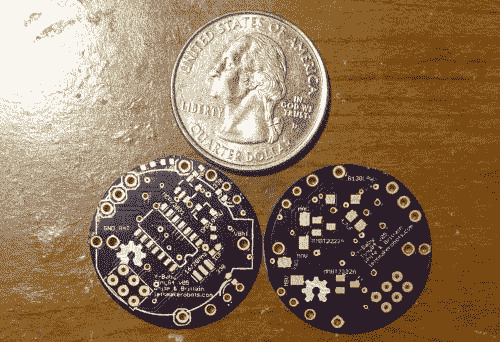
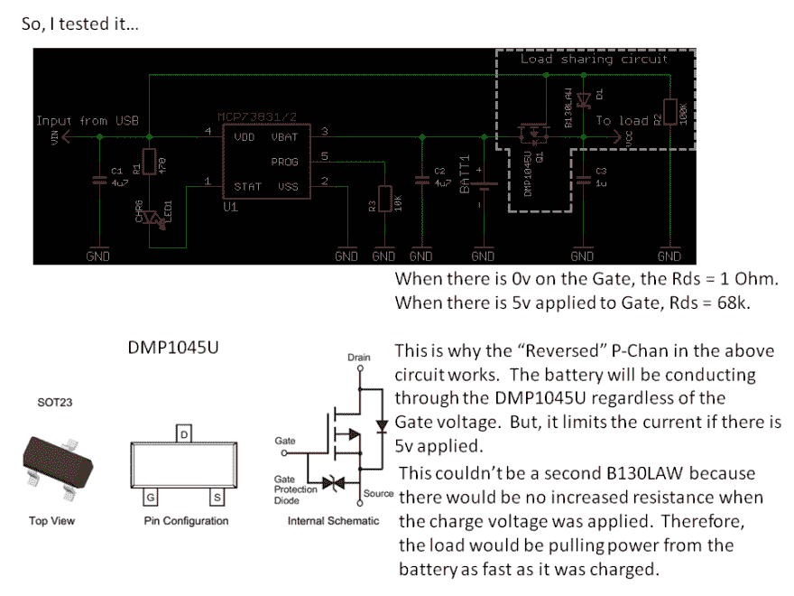

# 圣甲虫

> 原文：<https://dev.to/ladvien/scarab-39e1>

更新:2014 年 8 月 10 日

我打印了一个身体，并添加了 BLE。我明天休息后会解释，但是 BLE 允许我测试定向运动。我还做了一些功能测试(负载共享、充电电路、“饥饿”ADC)，该板实际上是一个很好的设计。效果很好。

BLE 是 HM-11，小小的 BLE。

我的目标是测试 ATtiny84 的物理和功能设计，当 Bdk6 先生发布 LPC1114 的工具链时，将其作为控制芯片。

这是我版本的 Yahmez ' T0 '婴儿机器人 T1，ATtiny84 Y-Baby (YB84)。与 Yahmez 的版本差别不大。

1.  这个版本使用的是 ATtiny84。
2.  它用的是 LIR2032。
3.  它内置一个充电电路，使用 MCP73831。该电路具有负载共享能力，因此婴儿可以在不睡觉的情况下“进食”。
4.  YB84 有两个 LED 指示灯。
5.  YB84 上的一个引脚监控电池电压，因此它可以告诉你它有多“饿”。

这个版本的出现是因为 Yahmez 的婴儿机器人太酷了，我不得不复制它们。这里是[节点](http://letsmakerobots.com/node/39650)，我在这里请求许可并添加了设计说明。此外，我还想制造一个小型、廉价的小型机器人来配合我的[霸王](http://letsmakerobots.com/node/38883)项目，希望开发一种电子实验室老鼠。

这是物料清单:

1.  1 x[lir 2032](http://www.ebay.com/itm/10-pcs-lot-rechargeable-LIR2032-3-6V-Li-ion-coin-battery-button-battery-/331062082577?pt=US_Rechargeable_Batteries&hash=item4d14d67c11)-0.44 美元
2.  1 个 1uF 0402-0.08 美元
3.  1 个 4.7 uf 0805-0.10 美元
4.  1 x[b 130 law](http://www.mouser.com/ProductDetail/Diodes-Incorporated/B130LAW-7-F/?qs=%2fha2pyFadujUWfJaost%2fO%2fm5EB%2flfSlr7qduYb4tkr4%3d)-0.41 美元
5.  1 x [DMP1045U](http://www.mouser.com/ProductDetail/Diodes-Incorporated/DMP1045U-7/?qs=sGAEpiMZZMshyDBzk1%2fWi1RgPhdS2EhaLQWFAsmm01A%3d) - $..51
6.  2 个 3 毫米红外发光二极管？
7.  1 个红外接收器
8.  3 个七彩发光二极管 0603-0.33 元
9.  2 个[mbt 2222 a](http://www.ebay.com/itm/100pcs-MMBT2222A-MMBT2222-Sot-23-2N2222-SMD-NPN-Transistor-SSY-2310-KDQ6-/360798731492?pt=LH_DefaultDomain_2&hash=item540147bce4)(SOT-23)-0.24 美元
10.  1 个 60k 电阻器 0402-0.10 美元
11.  1 个 100k 电阻器 0402-0.10 美元
12.  5 x 330 电阻器 0402 美元 50 美分
13.  1 个[MCP 73831](http://www.mouser.com/ProductDetail/Microchip-Technology/MCP73831T-2DCI-OT/?qs=sGAEpiMZZMtLck3p7ZBovbAQ8wdoIcbK)-0.61 美元
14.  1×t0 方位 84￥1.30
15.  1 个[YB84 PCB](http://www.oshpark.com/shared_projectss/DCG21mrl)-1.76 美元
16.  2 个[振动电机](http://www.ebay.com/itm/181121246372?ssPageName=STRK:MEWNX:IT&_trksid=p3984.m1439.l2649)-1.95 美元

注意，我没有在 BOM 中包括红外接收器或红外发射器。我还没有测试电路，也没有找到便宜的零件。但我努力让它们低于 10 美元。

YB84 BOM 合计:7.70 美元

**YB84 v_05**

[T2】](https://res.cloudinary.com/practicaldev/image/fetch/s--C3r3fvSE--/c_limit%2Cf_auto%2Cfl_progressive%2Cq_auto%2Cw_880/https://ladvien.cimg/IMG_0404_0.jpg)

真的，开发这个小家伙没什么，Yahmez 已经做了所有的工作。我只是选择了一个 Atmel uC，我觉得它足够便宜，并提供了足够多的引脚来完成我想对这个小家伙做的事情。我遇到的一个问题是我试图从 Zak Kemble 复制的[负载共享电路](http://blog.zakkemble.co.uk/a-lithium-battery-charger-with-load-sharing/#comment-54494)。

当我去设计负载电路时，我的思维陷入了一个旧的想法，“MOSFET 二极管与电流相反。”这导致我将 DMP1045U 向后放置，这实质上使电池短路。

[T2】](https://res.cloudinary.com/practicaldev/image/fetch/s--diT2NLN6--/c_limit%2Cf_auto%2Cfl_progressive%2Cq_auto%2Cw_880/https://ladvien.cimg/Drop_Charger_Notes_1.png)

[扎克的负载分担电路](http://blog.zakkemble.co.uk/wp-content/uploads/2013/05/MCP73831_loadshare.png)

我花了一点时间才弄明白。显然我不是唯一一个犯这个错误的人，因为 Zak 博客上的一个评论有一个人替我问了我的问题。最后，我把电路整理好了，现在这个小家伙可以正常工作了。

暂时就这些了。我对这个小家伙还有很多测试要做。

1.  正确运动的电机位置。
2.  调整腿部角度以获得正确的步态。
3.  红外接收电路。
4.  红外发射电路。

目前，我有一个弹簧针编程头。但是当务之急是让这个小家伙通过红外编程来完成我的目标。这应该允许我在没有人工干预的情况下为一大群这样的小家伙编程。我知道 Kilotbot 项目修改了 Arduino 代码来做这件事。我的理想设置是在一大群人的上方加一个移动电话。这个手机上有:红外发射，红外接收和一个摄像头。摄像机将使用[霸王](http://letsmakerobots.com/node/38883)追踪这些家伙，并通过红外线与他们进行大规模交流。

一如既往，我欢迎想法、观点和批评:)

[https://www.youtube.com/embed/etl3zJbOEW0](https://www.youtube.com/embed/etl3zJbOEW0)

[https://www.youtube.com/embed/9svlosASuNk](https://www.youtube.com/embed/9svlosASuNk)