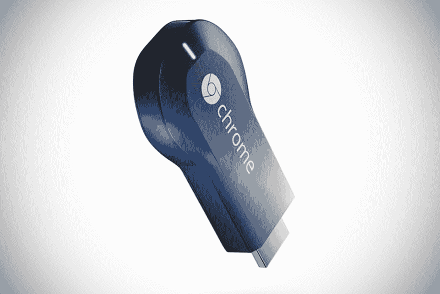
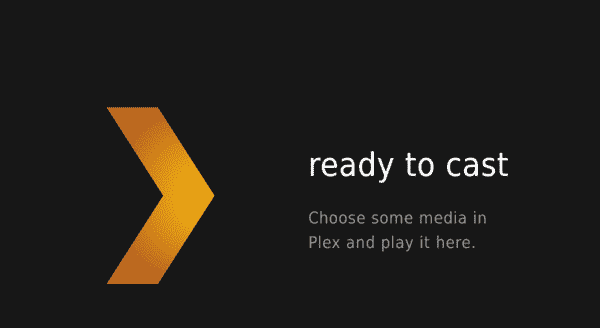

# 用于 Chromecast 的 Plex

> 原文：<https://dev.to/scottrobertson/plex-for-chromecast-2lce>

当 Plex 宣布它将成为 Chromecast 的官方合作伙伴时，我知道我必须得到一个。圣诞节那天，我跳上亚马逊，花 35 英镑订了一个。

[T2】](https://res.cloudinary.com/practicaldev/image/fetch/s--yY9Taz9N--/c_limit%2Cf_auto%2Cfl_progressive%2Cq_auto%2Cw_880/https://scottrobertson.me/img/posts/chromecast.jpg)

在此之前，我已经使用了大约 4 个月的 Plex，但是由于将它用作 DLNA 设备，我只能使用非常有限的一组功能。我可以浏览媒体(缩略图和标题)并播放，仅此而已。

[T2】](https://res.cloudinary.com/practicaldev/image/fetch/s--XoSPlevV--/c_limit%2Cf_auto%2Cfl_progressive%2Cq_auto%2Cw_880/https://scottrobertson.me/img/posts/plex-for-chromecast.png)

获得 Chromecast 已经解锁了更多功能，使观看电视节目和电影变得更加美好。

比如我大量使用 [trakt.tv](http://trakt.tv/user/Scottymeuk) ，通过一个简单的插件，Plex 自动将我正在看的内容发送到 trakt。这意味着我可以跟踪我正在观看的内容，甚至告诉 Plex 只过滤“未观看的”剧集/电影。由于他们的 Chromecast 支持，这现在可以在我的电视上观看的东西上工作，所以我再也不用担心用[应用](http://seriesgui.de/)将东西标记为手动观看。

另一个很大的优势是可以用家里的任何设备来控制你的电视。我可以拿起我的 Mac，选择一个电视节目并开始观看，然后拿起我的手机并调低电视的音量。这使得一切无缝和更好地使用。

因为这一切都是通过 Plex 进行的，这也意味着我可以在中途停止观看某些内容，并从我手机上停止的地方继续观看。例如，我可以在地铁回家的路上看 QI，当我上车时，我可以使用 Chromecast 在我的电视上看完一集。

如果你用的是 Plex，还没有拿到 Chromecast，那么我真的推荐。总体而言，它让观看媒体变得更加美好。如果您不使用 Plex，请尝试一下！

请在评论中告诉我你的进展。