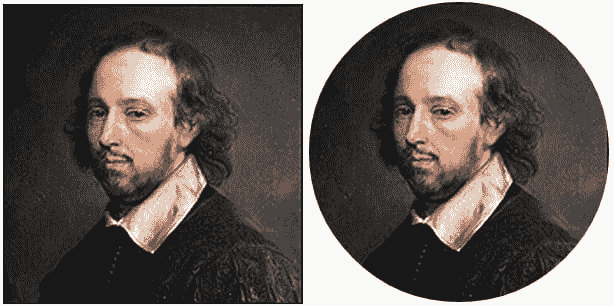

# 带有 CSS 的圆形图像

> 原文：<https://dev.to/adamkdean/circular-images-with-css-231f>

一种趋势，虽然已经存在了一段时间，但最近似乎越来越多地出现在圆形图像中。使用`border-radius`很容易做到这些，下面你可以看到如何做。你可以在 CSS 中使用一个`background-image`，或者将`border-radius`添加到一个`img`标签中，这是我更喜欢的。

我们将用这张威廉·莎士比亚的照片。

```
.circular {
    width: 300px;
    height: 300px;
    border-radius: 150px;
    -webkit-border-radius: 150px;
    -moz-border-radius: 150px;
}

<!-- regular image -->


<!-- circular image -->
 
```

Enter fullscreen mode Exit fullscreen mode

输出是:

[T2】](https://res.cloudinary.com/practicaldev/image/fetch/s--B_ndOPZT--/c_limit%2Cf_auto%2Cfl_progressive%2Cq_auto%2Cw_880/http://i.imgur.com/UgACoIw.png)

要记住的一件事是**边框半径必须是高度和宽度**的一半，以使图像呈圆形。宽度&高度等于 300 像素，边框半径等于 150 像素。宽度&高度等于 600 像素，边框半径等于 300 像素。