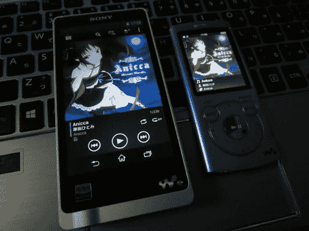

# 什么是高解析度？ ZX1 的音质有多厉害？ 索尼 walkman NW-zx1 评论高清解说&音质评价篇

> 原文:[https://dev.to/takimura/-zx1-NW-zx1-413 e](https://dev.to/takimura/-zx1---nw-zx1---413e)

[T2】](http://livedoor.blogimg.jp/cv_k/imgs/b/f/bf848306.jpg)

与 2 年前的 walkman s 系列音质比较

walkman zx1 发售已经过去一个多星期了，但目前各店铺的缺货或脱销状况似乎仍在持续。 我想，与之前的索尼 walkman 相比，在音质方面的努力方式有所不同，这一点渐渐地在各店铺开始尝试，消费者也能切实感受到，这一点很大程度上是存在的。 虽然索尼可能也没有想到 7 万日元以上的本产品会卖得很好……

因此，这次我们不想进行上次的开封&第一次的评论，而是想就这个 walkman zx1 的音质进行探讨。 本来准备 x 系列或 z 系列就好了，但是管理员持有的其他 walkman 只有 2 年前的 s 系列和 CD walkman，所以要和 2 年前的 walkman s 系列进行比较。

接下来请继续。

[接下来的阅读](http://connect.coron.tech/archives/51821097.html)