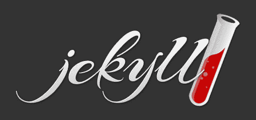
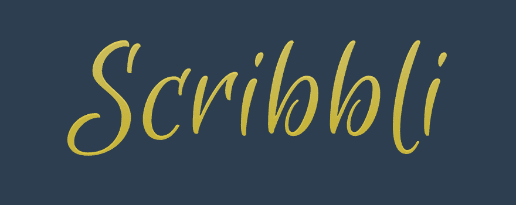
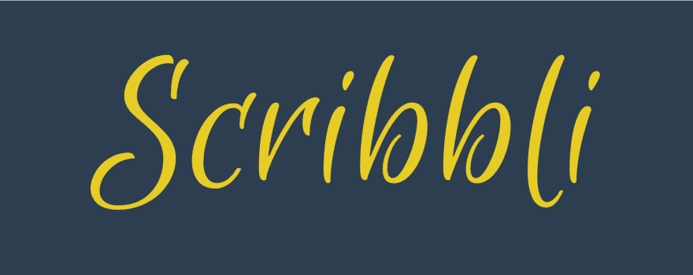
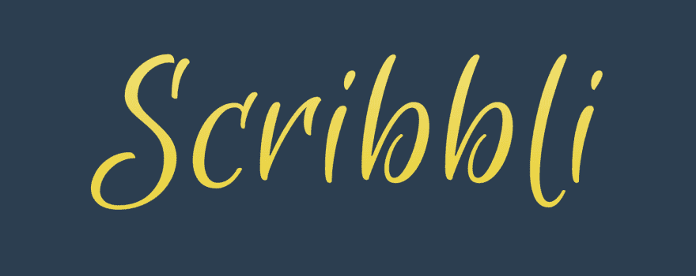
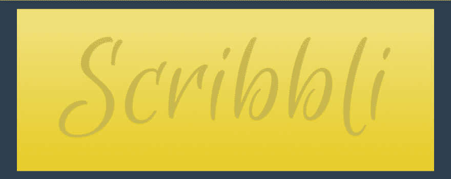

# 仅限 CSS 的文本渐变

> 原文：<https://dev.to/mjswensen/css-only-text-gradients-1l0o>

如今你可以用 CSS 做的事情是惊人的。我受到美丽的 Jekyll 标志的启发，开始尝试只用 CSS 做类似的事情。

这就是我想要的样子:

[T2】](https://res.cloudinary.com/practicaldev/image/fetch/s---fwVgCMO--/c_limit%2Cf_auto%2Cfl_progressive%2Cq_auto%2Cw_880/https://mjswensen.com/blimg/jekyll-logo.png)

我很兴奋在我第一次尝试谷歌的时候发现了一个由令人敬畏的[克里斯·科伊尔](http://chriscoyier.net/)写的简洁的帖子，我在几分钟内就达到了预期的效果。我认为这对我正在进行的一个名为 [Scribbli](https://github.com/mjswensen/scribbli) 的新项目来说会很不错。

以下是完整的 Sass 代码:

```
$yellow: hsl(52, 80%, 53%)
h1
  color: $yellow// Fallback
  background: -webkit-linear-gradient(lighten($yellow, 20%), $yellow)
  -webkit-background-clip: text
  -webkit-text-fill-color: transparent
  text-shadow: 0 1px 1px hsla(0, 0%, 0%, 0.15) 
```

Enter fullscreen mode Exit fullscreen mode

这是 Webkit 浏览器(Chrome、Safari、Opera)的最终结果:

[T2】](https://res.cloudinary.com/practicaldev/image/fetch/s--RsO_RWge--/c_limit%2Cf_auto%2Cfl_progressive%2Cq_auto%2Cw_880/https://mjswensen.com/blimg/scribbli-logo-final.png)

## 击穿

我想我们可以仔细看看这里发生了什么。首先，让我们来看看非 Webkit 浏览器的回退:

```
$yellow: hsl(52, 80%, 53%)
h1
  color: $yellow// Fallback 
```

Enter fullscreen mode Exit fullscreen mode

这给了我们一个简单的文本颜色，没有效果。不像我们用渐变和阴影得到的细节那么酷，但对于后退来说足够好了。

[T2】](https://res.cloudinary.com/practicaldev/image/fetch/s--SNjXWG51--/c_limit%2Cf_auto%2Cfl_progressive%2Cq_auto%2Cw_880/https://mjswensen.com/blimg/scribbli-logo-fallback.png)

诀窍就在下一部分。我们在整个`h1`元素上设置了背景渐变，但是我们将渐变的可见性限制在文本的形式上！我们还需要使文本透明，这样渐变就不会被我们之前设置的黄色渐变隐藏。

```
$yellow: hsl(52, 80%, 53%)
h1
  color: $yellow// Fallback
  background: -webkit-linear-gradient(lighten($yellow, 20%), $yellow)
  -webkit-background-clip: text
  -webkit-text-fill-color: transparent 
```

Enter fullscreen mode Exit fullscreen mode

请注意，我们可以使用一些漂亮的 Sass 函数，以最小的努力来计算渐变的颜色停止。还要注意，对于背景渐变，我们只使用了`-webkit-`前缀，而忽略了其他浏览器的前缀。这是因为`text-fill-color`目前仅在 Webkit 中受支持，如果其余部分不工作，我们不希望背景渐变出现在那里。

[T2】](https://res.cloudinary.com/practicaldev/image/fetch/s--ASibLRcj--/c_limit%2Cf_auto%2Cfl_progressive%2Cq_auto%2Cw_880/https://mjswensen.com/blimg/scribbli-logo-clipped-gradient.png)

酷毙了。我们快到了。最后要做的是添加一点阴影，给文本一些深度。将文本阴影添加到透明文本不同于通常的文本阴影效果，因为您可以看到文本下的整个阴影。例如:如果我们移除背景剪辑蒙版，这就是阴影的样子:

[T2】](https://res.cloudinary.com/practicaldev/image/fetch/s--oDi7MIEg--/c_limit%2Cf_auto%2Cfl_progressive%2Cq_auto%2Cw_880/https://mjswensen.com/blimg/scribbli-logo-shadow.png)

无论如何，再把它们放在一起:

```
$yellow: hsl(52, 80%, 53%)
h1
  color: $yellow// Fallback
  background: -webkit-linear-gradient(lighten($yellow, 20%), $yellow)
  -webkit-background-clip: text
  -webkit-text-fill-color: transparent
  text-shadow: 0 1px 1px hsla(0, 0%, 0%, 0.15) 
```

Enter fullscreen mode Exit fullscreen mode

尽管阴影会极大地影响文本的外观颜色，因为它是完全可见的，但它实际上通过轻微的垂直偏移提供了一个不错的浮雕效果。再一次，这里是最终结果的截图；完全可选，搜索引擎友好的文本！

[T2】](https://res.cloudinary.com/practicaldev/image/fetch/s--RsO_RWge--/c_limit%2Cf_auto%2Cfl_progressive%2Cq_auto%2Cw_880/https://mjswensen.com/blimg/scribbli-logo-final.png)

## 附加资源

[这里的](http://css-tricks.com/image-under-text/)是来自 Chris Coyier 的相关且更深入的文章。