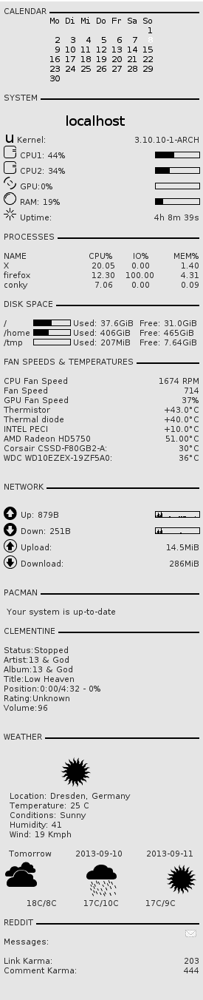

# 我的骗局

> 原文:[https://dev.to/rndmh3ro/my-conky-setup-4f57](https://dev.to/rndmh3ro/my-conky-setup-4f57)

我长期以来一直是 conky 设置的粉丝，并观看了许多用户张贴其配置的线程，但我懒得编写自己的配置。

但现在我家里有了第二个屏幕，我想我可以利用它给我的额外空间进行一些监控。没有更多恼人的文字，这里是:

[T2】](https://res.cloudinary.com/practicaldev/image/fetch/s--AtGbkZdz--/c_limit%2Cf_auto%2Cfl_progressive%2Cq_auto%2Cw_880/https://www.zufallsheld.img/conky.png)

下面是相应的配置:

```
# Use Xft?
use_xft yes
xftfont DejaVu Sans:size=8
xftalpha 0.8
text_buffer_size 2048

# Update interval in seconds
update_interval 2

# This is the number of times Conky will update before quitting.
# Set to zero to run forever.
total_run_times 0

own_window yes
own_window_transparent yes
own_window_type dock

# Use double buffering (reduces flicker, may not work for everyone)
double_buffer yes

# Draw shades?
draw_shades no

# Draw outlines?
draw_outline no

# Draw borders around text
draw_borders no

# Stippled borders?
stippled_borders 0

# Default colors and also border colors
default_color black

# Subtract file system buffers from used memory?
no_buffers yes

# number of cpu samples to average
# set to 1 to disable averaging
cpu_avg_samples 2

# number of net samples to average
# set to 1 to disable averaging
net_avg_samples 2

# Force UTF8? note that UTF8 support required XFT
override_utf8_locale yes

#  Specify a default width and height for bars. Example: 'default_bar_size 0 6'. This is particularly useful for execbar and execibar as they do not take size arguments. 
default_bar_size 60 8

TEXT

CALENDAR ${hr 2}
${font DejaVu Sans Mono:size=8}${execpi 3600 DJS=`date +%_d`; cal -m | sed '1d' | sed '/./!d' | sed 's/$/                     /' | fold -w 21 | sed -n '/^.\{21\}/p' | sed 's/^/${alignc} /' | sed /" $DJS "/s/" $DJS "/" "'${color2}'"$DJS"'${color}'" "/}${font}

SYSTEM ${hr 2}

${alignc 24}${font Arial Black:size=14}${nodename}${font}
${font OpenLogos:size=16}u${font} Kernel: ${alignr}${kernel}
${font StyleBats:size=16}A${font} CPU1: ${cpu cpu1}% ${alignr}${cpubar cpu1 8,60}
${font StyleBats:size=16}A${font} CPU2: ${cpu cpu2}% ${alignr}${cpubar cpu2 8,60}
${font StyleBats:size=16}h${font} GPU:${execi 60 aticonfig --od-getclocks | awk '/load/ {print $4}' | sed 's/%//'}%${alignr}${execibar 60 aticonfig --od-getclocks | awk '/load/ {print $4}'| sed 's/%//'}
${font StyleBats:size=16}g${font} RAM: $memperc% ${alignr}${membar 8,60}
${font StyleBats:size=16}q${font} Uptime: ${alignr}${uptime}

PROCESSES ${hr 2}

NAME ${goto 120}CPU%${goto 180}IO%${alignr}MEM%
${top name 1}${goto 120}${top cpu 1}${goto 170}${top io_perc 1}${alignr}${top mem 1}
${top name 2}${goto 120}${top cpu 2}${goto 170}${top io_perc 2}${alignr}${top mem 2}
${top name 3}${goto 120}${top cpu 3}${goto 170}${top io_perc 3}${alignr}${top mem 3}

DISK SPACE ${hr 2}

/${goto 45}${fs_bar 8,50 /}${goto 95} Used: ${fs_used /}${goto 185} Free: ${fs_free /}
/home ${goto 45}${fs_bar 8,50 /home}${goto 95} Used: ${fs_used /home}${goto 185} Free: ${fs_free /home}
/tmp ${goto 45}${fs_bar 8,50 /tmp}${goto 95} Used: ${fs_used /tmp}${goto 185} Free: ${fs_free /tmp}

FAN SPEEDS & TEMPERATURES ${hr 2}

CPU Fan Speed ${alignr}${exec sensors | grep fan1 | cut -d " " -f 9,10}
Fan Speed ${alignr}${exec sensors | grep fan2 | cut -d " " -f 9,10}
GPU Fan Speed ${alignr}${exec aticonfig --pplib-cmd "get fanspeed 0" | awk '/Result/ {print $4}'}
Thermistor ${alignr}${execi 10 sensors | grep temp1 | cut -d " " -f 9| grep -v "^$"}
Thermal diode ${alignr} ${execi 10 sensors | grep temp2 | cut -d " " -f 9| grep -v "^$"}
INTEL PECI ${alignr}${execi 10 sensors | grep temp3 | cut -d " " -f 9| grep -v "^$"}
AMD Radeon HD5750 ${alignr}${execi 60 aticonfig --od-gettemperature | grep Temperature | cut -d " " -f 23}°C
${execi 60 sudo hddtemp SATA:/dev/sda1 | awk '{print $2,$3}'} ${alignr}${execi 60 sudo hddtemp SATA:/dev/sda1 | awk '{print $4}'}
${execi 60 sudo hddtemp SATA:/dev/sdc1 | awk '{print $2,$3}'} ${alignr}${execi 60 sudo hddtemp SATA:/dev/sdc1 | awk '{print $4}'}
${execi 60 sudo hddtemp SATA:/dev/sdb1 | awk '{print $2,$3}'} ${alignr}${execi 60 sudo hddtemp SATA:/dev/sdb1 | awk '{print $4}'}

NETWORK ${hr 2}

${if_existing /proc/net/route eth0}
${voffset -6}${font PizzaDude Bullets:size=14}O${font} Up: ${upspeed eth0}${alignr}${upspeedgraph eth0 8,60 black black}
${voffset 4}${font PizzaDude Bullets:size=14}U${font} Down: ${downspeed eth0}${alignr}${downspeedgraph eth0 8,60 black black}
${voffset 4}${font PizzaDude Bullets:size=14}N${font} Upload: ${alignr}${totalup eth0}
${voffset 4}${font PizzaDude Bullets:size=14}T${font} Download: ${alignr}${totaldown eth0}
${endif}

PACMAN ${hr 2}

${execpi 1800 python2 /etc/conky/pacman.py}

CLEMENTINE ${hr 2}

${execp conkyClementine --template=/etc/conky/conkyclementine/conkyClementine.template}

WEATHER ${hr 2}

${goto 80}${font weather:size=46}${exec /etc/conky/google_weather/weather.sh "Dresden,Germany" cp}${font}
${exec /etc/conky/google_weather/weather.sh "Dresden,Germany"}

${alignc}${execi 60 /etc/conky/google_weather/weather.sh "Dresden,Germany" dl}
${font weather:size=46}${execi 60 /etc/conky/google_weather/weather.sh "Dresden,Germany" fcp}${font}
${alignc}${execi 60 /etc/conky/google_weather/weather.sh "Dresden,Germany" fct}

REDDIT ${hr 2}

${font}Messages: ${if_empty ${rss http://www.reddit.com/message/unread/.rss?feed=fb4759ead39540799fa7e2537320695c9cfe93f3&user=zufallsheld 1 item_titles 1}}${image /etc/conky/reddit/message.png -p 246,1274}${else}${image /etc/conky/reddit/newmessage.png -p 246,1274}${endif}

${font}Link Karma: ${alignr}${execpi 300 wget -O - http://www.reddit.com/user/zufallsheld/about.json | awk '{match($0, "k_karma\": ([0-9]+)", a); print a[1];}'}
${font}Comment Karma: ${alignr}${execpi 300 wget -O - http://www.reddit.com/user/zufallsheld/about.json | awk '{match($0, "t_karma\": ([0-9]+)", a); print a[1];}'} 
```

## 具体配置

### 显卡监控

我有一个 AMD 显卡，想监控显卡的负载、风扇速度和温度。幸运的是，有一个 cli 工具“aticonfig ”,它带有闭源驱动程序，可以让您读取您想要的指标。我在 Arch Linux wiki [的文章中找到了它们，并使用了输出中我感兴趣的部分。](https://wiki.archlinux.org/index.php/AMD_Catalyst#GPU.2FMem_frequency.2C_Temperature.2C_Fan_speed.2C_Overclocking_utilities) 

```
${font StyleBats:size=16}h${font} GPU:${execi 60 aticonfig --od-getclocks | awk '/load/ {print $4}' | sed 's/%//'}%${alignr}${execibar 60 aticonfig --od-getclocks | awk '/load/ {print $4}'| sed 's/%//'}
GPU Fan Speed ${alignr}${execi 60 aticonfig --pplib-cmd "get fanspeed 0" | awk '/Result/ {print $4}'}
AMD Radeon HD5750 ${alignr}${execi 60 aticonfig --od-gettemperature | grep Temperature | cut -d " " -f 23}°C 
```

### CPU+风扇监控

监控 CPU 和风扇的速度是相当容易的。你只需要安装“lm_sensors”，这是一个用户空间工具的集合。在安装和配置它之后，只需在 cli 上执行“sensors ”,就可以输出所有相关信息。然后再次 grep 有用的部分。

```
CPU Fan Speed ${alignr}${execi 10 sensors | grep fan1 | cut -d " " -f 9,10}
Temp 1 ${alignr}${execi 10 sensors | grep temp1 | cut -d " " -f 9| grep -v "^$"} 
```

### 高清温度监控

监控硬盘温度就像监控处理器温度一样简单。只需安装“hddtemp ”,并再次通过 greping 获取相关信息。

```
${execi 60 sudo hddtemp SATA:/dev/sdb1 | awk '{print $2,$3}'} ${alignr}${execi 60 sudo hddtemp SATA:/dev/sdb1 | awk '{print $4}'} 
```

### 吃豆人更新检查

由于我使用 Arch Linux，我想知道是否有任何软件包准备升级，或者我的系统是否是最新的。幸运的是，已经有人遇到了和我一样的问题，并为此写了一个 python 脚本。你可以在 Arch Linux [论坛帖子](https://bbs.archlinux.org/viewtopic.php?id=37284)中读到关于它的一切。

```
${execpi 3600 python2 /etc/conky/pacman.py} 
```

### 克莱曼婷

我使用[克莱曼婷](http://www.clementine-player.org/)来播放音乐，并希望显示当前正在播放的内容。幸运的是，已经有了一个可用的解决方案: [conkyClementine](https://code.launchpad.net/~conky-companions/+junk/conkyclementine) 。ConkyClementine 也在 AUR 中，所以你可以把它安装在 Arch Linux 中。

```
${execp conkyClementine --template=/etc/conky/conkyclementine/conkyClementine.template} 
```

模板文件如下所示:

```
Status:[--datatype=ST]
Artist:[--datatype=AR]
Album:[--datatype=AL]
Title:[--datatype=TI]
Position:[--datatype=PT]/[--datatype=LE] - [--datatype=PP]%
Rating:[--datatype=RT]
Volume:[--datatype=VO] 
```

在那里，您可以配置在 Conky 中显示什么(以及如何显示)。

### 天气

为了显示当前天气和天气预报，我决定使用 Hardik Metha 的天气脚本。我对脚本做了一些改进，并把它放到了[这里](https://github.com/rndmh3ro/google_weather)。请随意使用。

```
${goto 80}${font weather:size=46}${exec /etc/conky/google_weather/weather.sh "Dresden,Germany" cp}${font} 
```

要使用它，你必须在[worldweatheronline.com](http://developer.worldweatheronline.com/)创建一个免费账户，并获得一个免费的 API 密匙，你将不得不在脚本中使用它。

### Reddit

作为一个经常使用 reddit 的自恋狂，我想看看我的因果报应，看看我是否有新消息。

```
${font}Messages: ${if_empty ${rss http://www.reddit.com/message/unread/.rss?feed=fb4759ead39540799fa7e2537320695c9cfe93f3&user=zufallsheld 1 item_titles 1}}${image /etc/conky/reddit/message.png -p 246,1274}${else}${image /etc/conky/reddit/newmessage.png -p 246,1274}${endif}

${font}Link Karma: ${alignr}${execpi 300 wget -O - http://www.reddit.com/user/zufallsheld/about.json | awk '{match($0, "k_karma\": ([0-9]+)", a); print a[1];}'}
${font}Comment Karma: ${alignr}${execpi 300 wget -O - http://www.reddit.com/user/zufallsheld/about.json | awk '{match($0, "t_karma\": ([0-9]+)", a); print a[1];}'} 
```

就是这样！想用什么就随便用，或者提问！