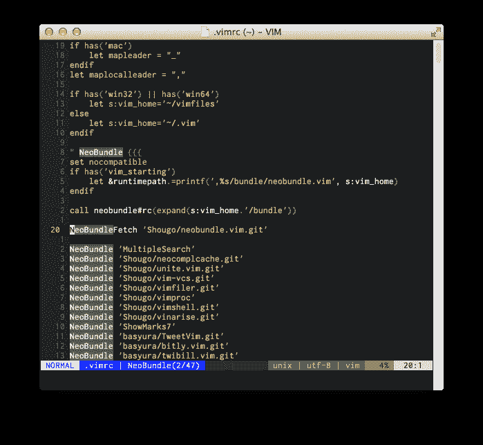

# 在 lightline.vim 和 vim-anzu 中显示搜索命中数

> 原文:# t0]https://dev . to/shiena/light line-vim-vim-anzu-2hpe

此内容为基于以下文章的 lightline.vim 版。

*   [vac2012とvim-anzuとvim-airline](http://lsifrontend.hatenablog.com/entry/2013/08/20/225913)

前几天，在以下帖子中导入 lightline.vim 后，知道了上面的文章，想做同样的事情，所以试着做了定制。

*   [试着导入了 vim 的 statusline 装饰插件的 light line.vim](http://qiita.com/shiena/items/a75d252e3814ad6ff7de)

## 定制后的外观

图为搜索 NeoBundle 后 47 件中，第二件移动到文件名右侧的结果。

[T2】](https://res.cloudinary.com/practicaldev/image/fetch/s--hyaWb1kl--/c_limit%2Cf_auto%2Cfl_progressive%2Cq_auto%2Cw_880/https://dev-to-uploads.s3.amazonaws.com/i/yqr8lycrpq1lpz9if75x.png)

# 定制内容

```
" lightline.vim 関連 {{{
let g:lightline = {
    \ 'colorscheme': 'landscape',
    \ 'active': {
    \   'left': [
    \       ['mode', 'paste'],
    \       ['readonly', 'filename', 'modified', 'anzu']
    \   ]
    \ },
    \ 'component_function': {
    \   'anzu': 'anzu#search_status'
    \ }
    \ }
"}}}

" vim-anzu 関連 {{{
nmap n <Plug>(anzu-n)
nmap N <Plug>(anzu-N)
nmap * <Plug>(anzu-star)
nmap # <Plug>(anzu-sharp)
augroup vim-anzu
" 一定時間キー入力がないとき、ウインドウを移動したとき、タブを移動したときに
" 検索ヒット数の表示を消去する
    autocmd!
    autocmd CursorHold,CursorHoldI,WinLeave,TabLeave * call anzu#clear_search_status()
augroup END
"}}} 
```

## lightline.vimの設定

1.  `anzu#search_status()`输出检索命中数，所以在`component_function`中用键`anzu`登录。
2.  显示位置想设在拍摄图像蓝色部分的文件名的右侧，将刚才注册的`anzu`添加到` g:lightline.active.left 的第 2 个列表的末尾。

另外，如果改变`anzu`的位置，显示位置也会改变。
例如，想在左端的白色位置显示的话，在第一个列表中追加。

## vim-anzuの設定

`n`、`N`、`*`、`#`的按键映射与[vim-anzu 的 Example](https://github.com/osyo-manga/vim-anzu#example) 相同，但删除在以下时机自动执行。

*   一定时间没有键输入时( CursorHold，CursorHoldI )
*   移动窗口时( WinLeave )
*   移动选项卡时( TabLeave )