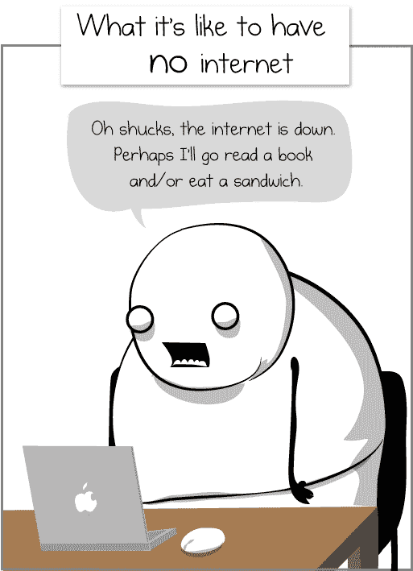

# 回到网络上

> 原文:[https://dev.to/adamkdean/back-on-the-web-4eom](https://dev.to/adamkdean/back-on-the-web-4eom)

经过 30 天的沉寂，这个网站又回到了网络上。

我现在已经成功地完成了从英格兰西北部到英格兰中部的 120 英里迁移，随着互联网的恢复和工作，网站也恢复了。没有网络的几个星期很难熬，我不得不去做一些事情，比如散步，看小说，慢慢地吃东西，看着空白的厨房墙壁思考问题。

[T2】](https://res.cloudinary.com/practicaldev/image/fetch/s--bdyNdUC4--/c_limit%2Cf_auto%2Cfl_progressive%2Cq_auto%2Cw_880/http://i.imgur.com/XcwdXxi.png)

我也将在周一开始一份令人兴奋的新工作，但我会继续写作，尽管博客帖子可能不会那么频繁。不过，我现在可能会有一些更好的话题来写了！

祝我好运！