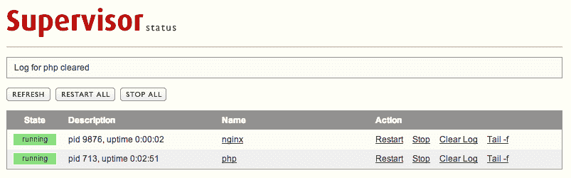

# 主管+ PHP + Nginx

> 原文:[https://dev.to/scottrobertson/supervisor-php-nginx-5ci1](https://dev.to/scottrobertson/supervisor-php-nginx-5ci1)

今天重新安装我的 Mac 时，我意识到让 PHP 和 Nginx 与 Supervisor 一起工作是多么容易。然而，如果你在我第一次安装 Mac 时问我这个问题，我可能会因为你没有帮我而对你大喊大叫。

Supervisor 允许您通过简单的网络用户界面轻松管理任何流程。您可以管理从 PHP 本身到长期运行的脚本的任何东西。我们在 romhut.com 的[用它来管理用 PHP 编写的上传工人，一旦你知道，它的使用非常强大。](http://romhut.com)

我想我应该写一篇博客来解释它是多么简单，并作为我将来复制和粘贴的参考。

我假设您安装了以下内容:

*   [自制](http://brew.sh/)
*   PHP(带有"- with-fpm "选项)
*   Nginx

首先，我们需要安装 Supervisord，为此我们需要安装“pip”。您可以通过运行以下命令来做到这一点:

```
easy_install pip 
```

<svg width="20px" height="20px" viewBox="0 0 24 24" class="highlight-action crayons-icon highlight-action--fullscreen-on"><title>Enter fullscreen mode</title></svg> <svg width="20px" height="20px" viewBox="0 0 24 24" class="highlight-action crayons-icon highlight-action--fullscreen-off"><title>Exit fullscreen mode</title></svg>

这将允许您运行:

```
sudo pip install supervisor 
```

<svg width="20px" height="20px" viewBox="0 0 24 24" class="highlight-action crayons-icon highlight-action--fullscreen-on"><title>Enter fullscreen mode</title></svg> <svg width="20px" height="20px" viewBox="0 0 24 24" class="highlight-action crayons-icon highlight-action--fullscreen-off"><title>Exit fullscreen mode</title></svg>

我们现在可以创建 supervisord.conf 文件，它将告诉 Supervisor 如何运行以及运行什么。我在**/usr/local/etc/supervisord . conf**中创建了我的。请注意，您可以在几个不同的位置创建它，Supervisord 会自动提取它，并查看他们的文档。

以下是我的**super visor . conf**文件，其中包括运行 web 界面的配置:

```
[inet_http_server]
port = 127.0.0.1:9001

; Deamon
[supervisord]
logfile = /var/log/supervisord.log
logfile_maxbytes = 50MB
logfile_backups = 5
loglevel = info
pidfile = /tmp/supervisord.pid
nodaemon = false
minfds = 1024
minprocs = 200
user = root
directory = /tmp
strip_ansi = true

; RPC Interface
[rpcinterface:supervisor]
supervisor.rpcinterface_factory = supervisor.rpcinterface:make_main_rpcinterface

; CTL
[supervisorctl]
serverurl = http://127.0.0.1:9001

[include]
files = /usr/local/etc/supervisor.d/*.conf 
```

<svg width="20px" height="20px" viewBox="0 0 24 24" class="highlight-action crayons-icon highlight-action--fullscreen-on"><title>Enter fullscreen mode</title></svg> <svg width="20px" height="20px" viewBox="0 0 24 24" class="highlight-action crayons-icon highlight-action--fullscreen-off"><title>Exit fullscreen mode</title></svg>

如果你注意到最后一行，我们包含了来自**/usr/local/etc/supervisor . d**的文件。这意味着我们可以把 PHP，Nginx 等的配置文件放在这个文件夹里，这样会更干净，但是，如果你愿意，你也可以把所有的配置文件放在上面的文件里。

首先，我们将在**/usr/local/etc/supervisor . d/PHP . conf**:
中创建 php-fpm 的配置文件

```
[program:php]
command = /usr/local/sbin/php-fpm
user = root
autostart = true 
```

<svg width="20px" height="20px" viewBox="0 0 24 24" class="highlight-action crayons-icon highlight-action--fullscreen-on"><title>Enter fullscreen mode</title></svg> <svg width="20px" height="20px" viewBox="0 0 24 24" class="highlight-action crayons-icon highlight-action--fullscreen-off"><title>Exit fullscreen mode</title></svg>

以上代码将在启动时以 root 用户身份运行 PHP。

接下来，我们将把 Nginx 配置文件添加到它各自的文件中:

```
[program:nginx]
command = /usr/local/bin/nginx
user = root
autostart = true 
```

<svg width="20px" height="20px" viewBox="0 0 24 24" class="highlight-action crayons-icon highlight-action--fullscreen-on"><title>Enter fullscreen mode</title></svg> <svg width="20px" height="20px" viewBox="0 0 24 24" class="highlight-action crayons-icon highlight-action--fullscreen-off"><title>Exit fullscreen mode</title></svg>

这也将在启动时以 root 用户身份运行 nginx。您还需要将以下内容添加到您的主 nginx 配置文件中:

```
daemon off; 
```

<svg width="20px" height="20px" viewBox="0 0 24 24" class="highlight-action crayons-icon highlight-action--fullscreen-on"><title>Enter fullscreen mode</title></svg> <svg width="20px" height="20px" viewBox="0 0 24 24" class="highlight-action crayons-icon highlight-action--fullscreen-off"><title>Exit fullscreen mode</title></svg>

这将阻止 nginx 对自己进行妖魔化，并且是 nginx 顺利运行所必需的。

运行以下命令，告诉 Supervisor 查看配置文件的更改。请注意，每次对配置文件进行更改时，您都需要运行它。

```
supervisorctl update 
```

<svg width="20px" height="20px" viewBox="0 0 24 24" class="highlight-action crayons-icon highlight-action--fullscreen-on"><title>Enter fullscreen mode</title></svg> <svg width="20px" height="20px" viewBox="0 0 24 24" class="highlight-action crayons-icon highlight-action--fullscreen-off"><title>Exit fullscreen mode</title></svg>

这应该就是让这些流程运行的所有准备工作。只需输入下面的代码来测试一下:

```
supervisorctl start php;
supervisorctl start nginx; 
```

<svg width="20px" height="20px" viewBox="0 0 24 24" class="highlight-action crayons-icon highlight-action--fullscreen-on"><title>Enter fullscreen mode</title></svg> <svg width="20px" height="20px" viewBox="0 0 24 24" class="highlight-action crayons-icon highlight-action--fullscreen-off"><title>Exit fullscreen mode</title></svg>

PHP 和 Nginx 现在应该正在运行，只需运行。您应该看到“运行”:

```
supervisorctl status php 
```

<svg width="20px" height="20px" viewBox="0 0 24 24" class="highlight-action crayons-icon highlight-action--fullscreen-on"><title>Enter fullscreen mode</title></svg> <svg width="20px" height="20px" viewBox="0 0 24 24" class="highlight-action crayons-icon highlight-action--fullscreen-off"><title>Exit fullscreen mode</title></svg>

要在 Mac 启动时启动 Supervisord，您需要使用 launchctl。只需将以下内容放入**/Library/launch daemons/com . agenda less . super visor . plist**:

```
<?xml version="1.0" encoding="UTF-8"?>
<!DOCTYPE plist PUBLIC "-//Apple//DTD PLIST 1.0//EN" "http://www.apple.com/DTDs/PropertyList-1.0.dtd">
<plist version="1.0">
<dict>
    <key>KeepAlive</key>
    <dict>
        <key>SuccessfulExit</key>
        <false/>
    </dict>
    <key>Label</key>
    <string>com.agendaless.supervisord</string>
    <key>ProgramArguments</key>
    <array>
        <string>/usr/local/bin/supervisord</string>
        <string>-n</string>
        <string>-c</string>
        <string>/usr/local/etc/supervisord.conf</string>
    </array>
    <key>RunAtLoad</key>
    <true/>
</dict>
</plist> 
```

<svg width="20px" height="20px" viewBox="0 0 24 24" class="highlight-action crayons-icon highlight-action--fullscreen-on"><title>Enter fullscreen mode</title></svg> <svg width="20px" height="20px" viewBox="0 0 24 24" class="highlight-action crayons-icon highlight-action--fullscreen-off"><title>Exit fullscreen mode</title></svg>

并运行:

```
launchctl load /Library/LaunchDaemons/com.agendaless.supervisord.plist 
```

<svg width="20px" height="20px" viewBox="0 0 24 24" class="highlight-action crayons-icon highlight-action--fullscreen-on"><title>Enter fullscreen mode</title></svg> <svg width="20px" height="20px" viewBox="0 0 24 24" class="highlight-action crayons-icon highlight-action--fullscreen-off"><title>Exit fullscreen mode</title></svg>

在这个阶段，Supervisord 应该正在运行并准备好使用，但是，我通常必须重启我的 Mac 才能正常工作。这可能是因为在此之前没有使用 launchctl。

要检查它是否正在运行，只需在浏览器中进入 [http://127.0.0.1:9001](http://127.0.0.1:9001) ，或者使用以下命令:

```
supervisorctl status 
```

<svg width="20px" height="20px" viewBox="0 0 24 24" class="highlight-action crayons-icon highlight-action--fullscreen-on"><title>Enter fullscreen mode</title></svg> <svg width="20px" height="20px" viewBox="0 0 24 24" class="highlight-action crayons-icon highlight-action--fullscreen-off"><title>Exit fullscreen mode</title></svg>

如果一切正常，您应该会在浏览器中看到以下内容:

[T2】](https://res.cloudinary.com/practicaldev/image/fetch/s--i0UvZzn8--/c_limit%2Cf_auto%2Cfl_progressive%2Cq_auto%2Cw_880/https://scottrobertson.me/img/posts/supervisor.png)

如果你有任何问题或建议，请在下面的评论中告诉我，或者发[微博给我](https://twitter.com/scottymeuk)