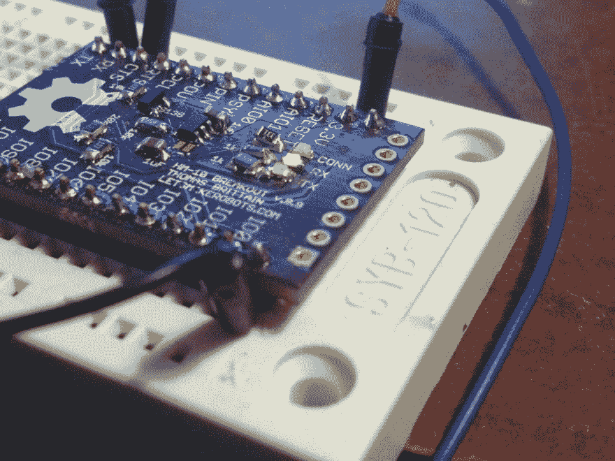
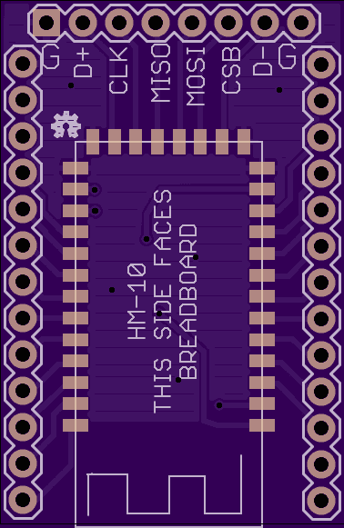
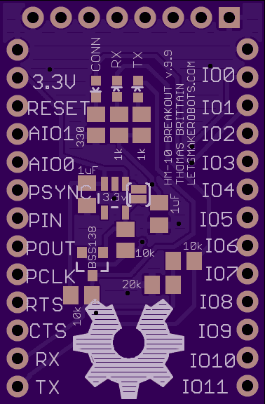
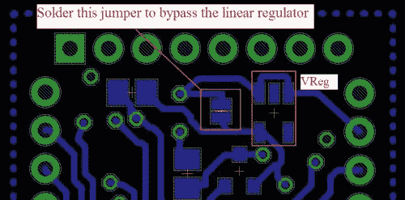
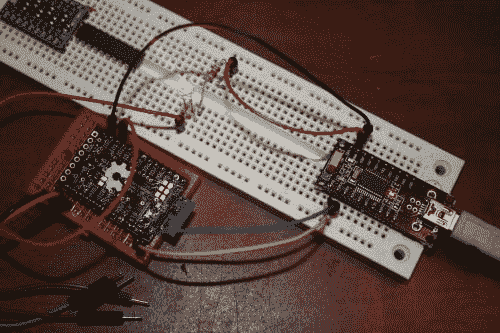
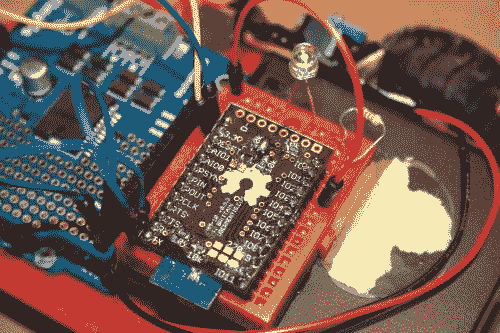
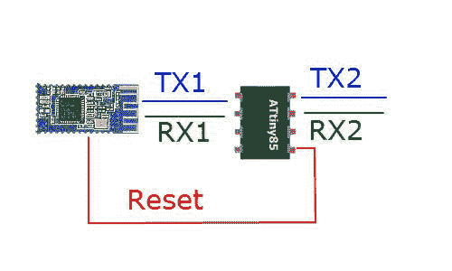

# HM-10

> 原文:[https://dev.to/ladvien/hm-10-3e3m](https://dev.to/ladvien/hm-10-3e3m)

*   更新:2014 年 7 月 6 日-丝网印刷更正。
*   更新:2014 年 6 月 1 日物料清单更正。
*   更新:2014 年 4 月 2 日-更正信息并链接新的分线板，v.9.9

[T2】](https://res.cloudinary.com/practicaldev/image/fetch/s--ET95XJyU--/c_limit%2Cf_auto%2Cfl_progressive%2Cq_auto%2Cw_880/https://ladvien.cimg/IMG_0356.jpg)

另外，这个家伙正在为 HM-10 开发[开源固件。](http://blog.p-dev.net/)

更新(2/514):我拆分了这篇文章，因为它变得有点迟钝。我已经更新了分线板版本 9.9，有更新固件的说明，并添加了一些关于伪星形网络的研究笔记。

*   先进的 HM-10

更新(11/23/13): **我添加了关于 HM-10s 和 ATtiny 85 串行过滤器联网的研究笔记(在底部)。**

旧:

我知道很少有蓝牙 4.0 和 Arduino 解决方案问世。Redbear Labs 的 [BLE 盾](http://www.seeedstudio.com/depot/bluetooth-40-low-energy-ble-shield-p-1255.html)、 [BLEDuinoe](http://www.kickstarter.com/projectss/kytelabs/bleduino-bluetooth-40-ble-made-easy-arduino-compat) Kickstarter 项目，以及 [Bluegiga 盾](http://www.seeedstudio.com/depot/bleshield-based-on-bluegigas-ble112-module-p-1367.html)。但是我不太喜欢这些，主要是因为价格:

*   Redbear 的 Mini:39.95 美元(注:这是 uC 和 BLE 的组合)。
*   红熊的 Uno 盾:29.95 美元
*   BLEDuino:19.95 美元(如果是 Kickstarter 的一部分)
*   蓝色巨盾:69.95 美元

这些超出了我对单个模块的价格范围。所以，最后，我为一个便宜的模块创造了突破，并以大约 10.03 美元一个模块的价格将其与 Arduino 接口。虽然，如果不批量购买组件，这个价格会更高。

**这里有一段视频摘要**:

[https://www.youtube.com/embed/-vp8rDSz8OU](https://www.youtube.com/embed/-vp8rDSz8OU)

现在， **我还没有将这些与 iOS 或 Droid 设备接口，它们只是一个无线串行连接** **的蓝牙 4.0 解决方案。我将这些设备与 iOS 进行了有限的对接。我用 iPad Mini 上的 LightBlue 应用打开了一个粗糙的串行接口。**不过，我可能以后会用 Jellybean 4.3 的蓝牙 4.0 API 来做这件事。更新:我发现 jnhuamoa 为 HM-10 提供了[示例 iOS 7.0 接口代码。](http://www.jnhuamao.cn/HMSoft_ios7.zip)

**概念验证视频**

[https://www.youtube.com/embed/1a9xLfBH-hc](https://www.youtube.com/embed/1a9xLfBH-hc)

现在，如果我有 99 美元来购买应用商店发行许可证，我会给我们所有人做一个漂亮的小机器人界面:)

我使用的模块是这些 [HM-10 的](http://www.fasttech.com/products/0/10004051/1292002-ti-cc2540-bluetooth-40-ble-2540-transparent-serial)。我不会去做分线板，因为我已经做了。不过，我要声明，我制作的分线板的最后一次迭代有一些错误，我可以在家里使用时纠正它们，我已经在我将发布的 Eagle 文件中纠正了它们，所以**我发布的板文件未经测试**，不过，它们正在路上，当我确认它们工作时，我将发布一个确认。此外，我所使用的板的图像是不同的，因为我纠正了板文件。**更新:**我注意到，由于电平转换器将线路拉高，RX/TX 线路上的交通指示灯总是亮着。**如果 led 未安装，电路板仍能正常工作。**

好的。让我们突围吧...

**1。这是我突围的 v .9.9。我不敢保证它没有 bug，但是它看起来很稳定。工作交通指示灯和它使用的线性稳压器** **:**

OSHPark 链接:[试验板足迹](https://oshpark.com/shared_projectss/aWRbRvyh) (三个约 6.35 美元)

Github: [HM-10 突围鹰档案](https://github.com/Ladvien/HM-10)

[T2】](https://res.cloudinary.com/practicaldev/image/fetch/s--iAbSHTxy--/c_limit%2Cf_auto%2Cfl_progressive%2Cq_auto%2Cw_880/https://ladvien.cimg/i.png)

[T2】](https://res.cloudinary.com/practicaldev/image/fetch/s--4y5F4Huw--/c_limit%2Cf_auto%2Cfl_progressive%2Cq_auto%2Cw_880/https://ladvien.cimg/i_2.png)

**2。从[奥什帕克](http://www.oshpark.com)订购电路板。**

[T2】](https://res.cloudinary.com/practicaldev/image/fetch/s--OrR29SLy--/c_limit%2Cf_auto%2Cfl_progressive%2Cq_auto%2Cw_880/https://ladvien.cimg/500x364xOSHParksplash.jpg)

**3。订购您需要的贴片元件。**

物料清单(BOM):

1.  HM-10 x 1
2.  [BS1138 x 1](http://www.ebay.com/itm/261117507960?ssPageName=STRK:MEWNX:IT&_trksid=p3984.m1439.l2649)
3.  [0603 发光二极管 x 3 (2 必须具有至少 3v 的电压降；通常，绿色或蓝色)](http://www.ebay.com/itm/15pcs-Red-0603-Super-Bright-SMD-LED-/121111954334?pt=LH_DefaultDomain_0&hash=item1c32d5c39e)
4.  [0805 电阻器 10k x 3](http://www.digikey.com)
5.  [0805 电阻 20k x 1](http://www.digikey.com/product-detail/en/RMCF0805JT20K0/RMCF0805JT20K0CT-ND/1942580)
6.  [0805 电阻 470 x 3](http://www.digikey.com)
7.  [0805 1uF 电容器 x 2](http://www.digikey.com/product-detail/en/CGA4J3X7R1E105K125AB/445-5687-1-ND/2443727)
8.  (可选) [SOT-23 LDO 电压调节器](http://www.digikey.com/scripts/DKSearch/dksus.dll?Detail&itemSeq=134171489&uq=635111280363769983)(使用这个没有意义，但我把选项放在板上以防万一。我来解释)。

再说一次，我买了大量的作品，因为我知道我会在其他项目中使用它们；我每个模块的价格是 10.03 美元。当然，你可以在 DigiKey 上买到所有这些组件，但价格会高一些。

好的。我来解释一下 3.3 线性稳压器。我在板上添加了这个选项，以防没有预调节的 3.3v 电源，但它本质上与使用蓝牙 4.0 模块的目的相矛盾:**极低的功耗。**我试图读取 HM-10 的毫安数，但我的万用表只能读取十分之一(ma ),该模块根本不会显示，即使在积极使用期间也是如此。而且一样多(全部？)大概已经知道，线性调节器的*极其*低效。因此，最好焊接绕过调节器的跳线，让它不被填充。更新:我找到了[耗电](http://item.taobao.com/item.htm?spm=a1z10.1.w1004-2840095810.3.7QjFDu&id=21367443311)的信息:

*   睡眠模式 400~800uA
*   主机搜索模式:19.6 毫安
*   传输(从机或主机):8.5 毫安。

**4。填充分线板。**

焊接 SMD 片的几点注意事项:

*   不要害怕。这*真的*没那么难。
*   SMD 有**三个必须**，至少从我的角度来说是这样的:**一个[小铁尖](http://www.amazon.com/ZITRADE-5pcs-Soldering-tips-ZITRADES/dp/B009YSPGAS/ref=sr_1_2?s=hi&ie=UTF8&qid=1375550915&sr=1-2&keywords=soldering+tip+.5)，尖头[镊子](http://www.fasttech.com/products/0/10002626/1195600-precision-tweezers-3-piece-set)，线状焊料**(至少是 [.022”焊锡丝](http://www.mouser.com/ProductDetail/MG-Chemicals/4890-18G/?qs=SUQPjvP5usX%252b2A7zEBV6SQ%3D%3D&gclid=CJOzp-_m4bgCFcbm7AodxDMALg))。
*   其他重要的焊接工具:湿海绵和[铜球](http://www.fasttech.com/product/1212100-soldering-remover-ball)将保持您的优良烙铁头 _ 良好。_ 用海绵擦拭焊料尖端，然后在每个组件后使其穿过黄铜球，以防止积聚。
*   说句亵渎的话:助焊剂还好，但是我发现镊子经常代替助焊剂。
*   在焊接过程中练习使用双手。一手拿着镊子，一手拿着烙铁。

[T2】](https://res.cloudinary.com/practicaldev/image/fetch/s--ULLqtJrb--/c_limit%2Cf_auto%2Cfl_progressive%2Cq_auto%2Cw_880/https://ladvien.cimg/HM-10SolderJumperExplain.jpg)

**5。把它连到串口上。**

[T2】](https://res.cloudinary.com/practicaldev/image/fetch/s--fuuXq1Cm--/c_limit%2Cf_auto%2Cfl_progressive%2Cq_auto%2Cw_880/https://ladvien.cimg/IMG_9049.jpg)

这就是我搞砸的那块板。基本上，像一个傻瓜一样，我试图用分压器调节 3.3v。当然，[我现在更清楚了](https://www.youtube.com/watch?v=XxLKfAZrhbM)。尽管如此，鉴于 HM-10 拉不到 10ma，我可能会回去运行数学，看看作为分压器，事实上，是一个可行的解决方案。

总之，连接非常简单。

*   BT-3.3v 3.3v
*   BT-RX FTDI-TX
*   BT-TX FTDI-RX
*   BT-IO1LED220 RES .GND
*   BT-GND FTDI GND
*   (对于 3.3v 电压，我使用了一个调节器，并连接了我的接地)。

*   需要注意的是，RX 和 TX 线路通过分压器和 BS1138 从 3.3v 转换为 5v。**其他所有线路都会死在> 3.3v** 。

现在，正如我所说的，我将两个模块连接在一起，所以您必须将一个模块设置为从模块。

我使用了 [RealTerm](http://realterm.sourceforge.net/) 通过 AT 命令访问 HM-10s 固件(手册中的[完整列表)。](http://www.ubermentis.com/files/HM-10_English.pdf)

##### HM-10 设置说明

1.  在“端口”选项卡下
2.  波特:9600
3.  奇偶校验:无
4.  数据位:8
5.  停止位:1
6.  硬件流控制:RTS/CTS
7.  软件流控制:接收-是，发送-是
8.  在“回显端口”选项卡下
9.  回声:是的
10.  班长:是的

然后，在“发送”选项卡下键入 AT 命令，并点击“发送 ASCII”:

*   发送:在
*   回应:好的

现在，将一个单元设置为从单元(它们默认为主单元)。

*   发送:在+角色 1
*   回应:OK+角色:奴隶

这应该是我们建立连接所需要做的全部工作。现在，只要一开机，它们就会自动尝试交配。如果 LED 从闪烁变为稳定，您将知道它们是否连接。

**7。将模块连接到目标设备。**

[T2】](https://res.cloudinary.com/practicaldev/image/fetch/s--pFILRlKl--/c_limit%2Cf_auto%2Cfl_progressive%2Cq_auto%2Cw_880/https://ladvien.cimg/IMG_9039.jpg)

*   BT-3.3v Arduino 3.3
*   BT-RX Arduino TX
*   BT-TX Arduino RX
*   BT-IO1LED220 RES .GND(或者如果你焊接在 0603s 上，你可以跳过这个连接)。

注意到我的电路板布线的错误了吗？:(

不过，这还是可以挽回的。

10。打开设备并确保指示灯稳定亮起。

**(10a。如果不行就冲我吼。)**

**11。如果指示灯稳定亮起，则表明设备之间存在串行连接。玩得开心:)**

我发现了一些事情:

1.  他们的射程比我想象的要远。我在室内大约 30 英尺。我没有在外面试过。对于那些读过我的文章的人来说:**是的，天线下面的铜层是导致范围问题的原因。他们现在有了超级射程:)**更新:我找到了关于[射程](http://item.taobao.com/item.htm?spm=a1z10.1.w1004-2840095810.3.7QjFDu&id=21367443311)的信息:室内 60 英尺，视线 300 英尺。
2.  它们的连接速度比老式蓝牙设备快得多。
3.  主动发送或接收小于 10mAs 的 draws:)
4.  我喜欢 Xbees 上的这些小家伙:)

**使用 HM-10s 研究枢纽和节点网络:**

**2013 年 11 月 18 日**

**理论:**

因此，我一直致力于将 attiny 85 放在 HM-10 串行线的末端，以允许 AT 命令的远程控制。事情是这样的:

[T2】](https://res.cloudinary.com/practicaldev/image/fetch/s--sV7y1bbX--/c_limit%2Cf_auto%2Cfl_progressive%2Cq_auto%2Cw_880/https://ladvien.cimg/ATtiny_and_BLE_0.jpg)

使用软件串行设置两条串行线。基本上，ATtiny 85 充当串行线上的滤波器。如果是常规消息，它从 TX1 传递到 TX2。但是 Tiny 中的代码将寻找以“AT+”开头的串行数据，如果它发现了什么，它会将该命令写入 RX1。

现在，跟着我一分钟。

主机有一个称为远程的模式，通过命令 AT+MODE2 进行设置。在远程模式下，HM-10 将传输串行数据，但也接受 AT 命令。可悲的是，这似乎只对主人有效。因此，我们必须为奴隶设置不同的设置。

对于从机，我们使用复位线。每个从机都有 ATtiny 滤波器，但当它在串行数据中收到“AT+”命令时，它会将 reset 线拉低。这将重置 HM-10。我们这样做是因为 HM-10 在+IMME1 处有一个命令，这将使 HM-10 从机进入一种不会自动寻求配对的模式。相反，它将接受 AT 命令，直到给出“AT+WORK”命令，该命令将它发送到配对/传输模式。

好的。回到我们的奴隶设置。所以，当我们把 HM-10/ATtiny 组合设置为奴隶时，我们把它们都设置为不寻求配对的模式，直到得到+WORK 的命令。当然，我们对 ATtiny 进行了编程，以便在它打开时将 HM-10 发送到配对模式。然后，一旦它与我们的主机配对，我们就可以通过主机向从机发送一条串行消息，字符串为“AT+RESET&AT+PIO11&AT+WORK”。当 ATtiny 获得此代码时，它会将 RESET 线拉低，使从机回到 AT 模式。然后，连接到从机的 ATtiny 将在+PIO11 发送命令，将 HM-10 的引脚 1 置于高电平。之后，ATtiny 命令从机重新进入传输模式。*瞧吧*。

好的，到目前为止，我已经完成了所有的编码和硬件工作——几乎所有以上我可以确认的工作。

但是，我一直怀疑 HM-10 是否能足够快地连接到主设备，在从设备之间实现看似无缝的传输。每当我重置之前配对的 HM-10 中的一个时，我都会看到闪烁的连接 LED，这让我产生了怀疑。然后我突然想到。他们没有*立即*重新连接，因为从机仍然认为它是连接的，因此，HM-10 固件没有重新初始化配对协议。我测试过了。果然，如果一个主设备和一个从设备配对，其中一个失去电源，那么另一个将挂起 3 秒钟，然后再尝试配对。但是，如果一个断电，而另一个同时复位，当它们都重新通电(<100 毫秒)时，它们几乎会*立即*配对。

哇哦！

因此，我们所要做的就是设置一个代码，让主机连接到一个节点，告诉它需要什么，然后告诉它重置自己。之后，主节点更改自己的配对 pin，然后重置自己，每当主节点恢复时，它应该几乎立即连接到新节点。

我们开始吧。可行的蓝牙 4.0 星形网络。我希望在假期前进行全面测试。

**2013 年 11 月 23 日**

**(警告:对数据表作者的大量激烈表达)**

好的。这就是我所学到的。

好吧，我以这样的话开始这篇文章:我喜欢 HM-10。优秀的设备。然而！我想把他们的数据表作者打得落花流水。首先，我在几个月的时间里从 www.fasttech.com 订购了几架 HM-10。我从来没有意识到他们升级固件的速度比我买的还快。这不会太糟糕，但就像 HM-10 怪物拉了一泡屎，数据表是这样的结果:列出的固件版本的实际命令与数据表不匹配，中文数据表中的信息与英文数据表中的信息不同，一些 AT 命令被合并而没有声明。只是 fubar。

所以，我在尝试联网小设备时遇到的一些问题，我认为是来自固件版本不太好。

例如，HM-10 V303 有一个命令 AT+IMME1 (0 表示关闭)，仅用于主设备，使其保持 AT 模式，直到给出命令 **AT+WORK。**我发现那个蠢驴 [jnhuamao](http://www.jnhuamao.cn/index_en.asp?ID=49) 在某个时候(在 4xx 范围内)更改了固件，这个命令与 AT+START 合并，在我的 V303 数据表中，这是一个用于其他东西的命令。翻译得不好。

现在，我有 2 块固件为 V303 的板和 1 块固件为 V502 的板。我还有 2 个后来买的模块，它们很可能比 V502 更好。我祈祷他们是 V508 或更高版本；在 V508 中，他们增加了通过串行线给[升级固件](http://www.jnhuamao.cn/download_rom_en.asp?id=49)的功能。该死的时间到了。

我找不到 V502 的数据表(任何一种语言),但在 V508 中，我可以看到 AT+TYPE 命令现在有三个选项。V303 只列出了 AT+类型的两个选项。然而，不知何故，我的 V303 板实际上采用了第三种选择(AT+TYPE2)。奇怪。

从固件和数据表的混乱中继续:使用 ATtiny 85 确实可行，但是要让 HM-10 接受它所要求的命令:

*   TinySerial。**写**(“AT+xxxxx”)；

因此，理论上，要让 HM-10 主设置只在收到命令时进入传输模式，它应该是这样的:

1.  tiny serial . write(" AT+RENEW ")；//重置为出厂设置。
2.  tiny serial . write(" AT+role 0 ")；//做主人。
3.  tiny serial . write(" AT+im me 1 ")；//除非被告知，否则不要进入传输模式。
4.  tiny serial . write(" AT+RESET ")；// IMME 复位后生效。
5.  tiny serial . write(" AT+" START ")；//好的，试着连接到什么东西。

这会将它重置为出厂设置，告诉它在收到命令之前不要连接，然后发出命令开始尝试连接。

下面是我在 ATtiny 85 上使用的示例代码:

```
 /*
  This code has been modified for use on an ATtiny.
  Created by Matthew on June 11, 2013
  http://projectssfromtech.blogspot.com/

   This example code is in the public domain.

   */

  #include
  SoftwareSerial TinySerial(3, 4); // RX, TX
  SoftwareSerial TinySerial2(1, 2); // RX, TX

  String blah;
  int incomingByte = 0;

  void setup()  
  {
    // Open serial communications and let us know we are connected
    TinySerial.begin(9600); //Serial line for the ATtiny85 to read/write from/to the HM-10.
    TinySerial.println("Tiny Serial Connected via SoftwareSerial Library");
    TinySerial2.begin(9600); //Serial line for the ATtiny85 to print to a serial port.
    TinySerial2.println("Tiny Serial Connected via SoftwareSerial Library");  

    TinySerial.write("AT+RENEW"); // Reset all settings.
    delay(300);  
    TinySerial.write("AT+ROLE0"); // Slave mode ("AT+ROLE1" is slave and "AT+ROLE0" is master)
    delay(300);
    //TinySerial.write("AT+PASS001111"); // "AT+PASS001111" sets the password.
    //delay(300);
    //The work mode only works for the Master HM-10.
    TinySerial.write("AT+MODE2"); //"AT+MODE0" = Transmission Mode, "AT+MODE1" = Remote Control Mode, "AT+MODE2" = Modes 0 + 1.
    delay(300);
    TinySerial.write("AT+IMME1"); // Don't enter transmission mode until told. ("AT+IMME0" is wait until "AT+START" to work. "AT+WORK1" is connect right away.).
    delay(300);
    TinySerial.write("AT+START"); // Ok, go ahead and enter. BULLSHIT! Apparently "AT+WORK" is not what we use, it's "AT+START"
    delay(300);

  }

  void loop()
  {

  } 
```

<svg width="20px" height="20px" viewBox="0 0 24 24" class="highlight-action crayons-icon highlight-action--fullscreen-on"><title>Enter fullscreen mode</title></svg> <svg width="20px" height="20px" viewBox="0 0 24 24" class="highlight-action crayons-icon highlight-action--fullscreen-off"><title>Exit fullscreen mode</title></svg>

好的。我还学到了更多关于 PIN 命令的知识。首先，“AT+PASS000001”将设置 PIN， ***而不是***“AT+PIN 000001”。当然，它必须是一个 6 位数，所以，用零填充其他数字。现在，根据固件版本，引脚配对有 3 种不同的设置，都由 AT+TYPEx 设置

1.  AT+TYPE0 -这应该是“无密码连接模式”
2.  at+type 1——“简单配对”_ 不做解释)。
3.  AT+TYPE2 -“需要 PIN 进行配对”

好吧。所以，这是我在模块间切换的关键。我想我会为每个从机设置一个唯一的引脚，连接到主机的 ATtiny 85 会根据我要连接的节点来切换主机上的引脚。**嗯，这个功能坏了。**我用它玩了几个小时，无论我如何设置 pin 码或类型设置，模块**即使没有正确的 PIN 码**也能配对。我找不到这种行为的答案。 ***直到*，我通读了*中文*版本的数据表，偶然发现了这块宝石。**

*   **“重要提示:V515 以前的版本，该指令没有实际作用，设置后会导致无法连接，请不要使用。”**

当然，这是谷歌翻译。但是我很确定我读到过，“【V515 版本下的这个特性不起作用。

这就是我此刻的处境。我想确保我写下了一些东西，以防其他人遇到问题。我的下一个项目将是写信给 [jnhuamao](http://www.jnhuamao.cn/index_en.asp?ID=49) 并得到一些问题的回答(例如，“任何在低于 V508 的版本上升级固件的方法，这样我就不会剩下 5 个不安全的 HM-10；也许通过 SPI 接口？).