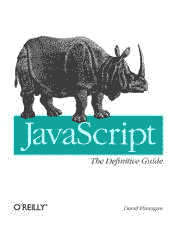

# 用 JavaScript 防止父元素滚动

> 原文:[https://dev . to/for foreach/prevent-scrolling-of-parent-element-with-JavaScript-41hi](https://dev.to/forforeach/prevent-scrolling-of-parent-element-with-javascript-41hi)

在我当前的项目中，当到达内部元素的末尾时，我被要求避免父元素的滚动。

这听起来像是一个非常简单的任务。当你想跨浏览器实现它的时候就不会了。所以，我搜索了一下，找到了《JavaScript:权威指南》中的下一个例子。顺便说一下，当你想学习 JavaScript 基础知识时，这是一本非常好的入门书。

因此，基于这个例子[，这是我对一个问题的解决方案。](http://jsfiddle.net/dima_k/5mPkB/1/)

享受

[T2】](https://res.cloudinary.com/practicaldev/image/fetch/s--qHGByDRU--/c_limit%2Cf_auto%2Cfl_progressive%2Cq_auto%2Cw_880/https://cdn-images-1.medium.com/max/176/0%2AXZJQkYt4TbPLmWCO.jpg)

* * *