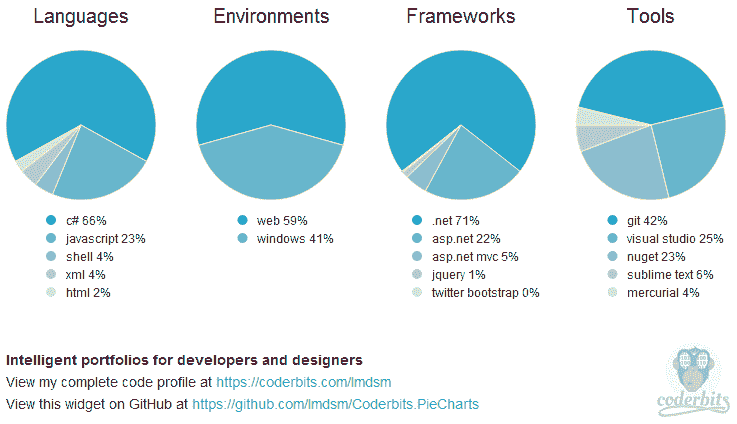

# 共轨饼图

> 原文:[https://dev.to/adamkdean/coderbits-pie-charts-2da8](https://dev.to/adamkdean/coderbits-pie-charts-2da8)

如果你看过[我的简介](http://www.adamkdean.co.uk/profile/index)，你可能会注意到我已经把 GitHub/StackOverflow 小部件换成了一个 Coderbits 小部件。这不仅是因为我的 GitHub/ServerStack。NET API 代码崩溃，但也是因为我认为它更好地概述了我的编码概况。

我使用了 Coderbits 使用的 [Scott 的 Raphael 饼状图](http://jsfiddle.net/scottksmith95/wvVRY/)，并将它们与来自 [Coderbits js 小部件](https://github.com/scottksmith95/coderbits.widget)的请求代码混合在一起。在我看来，添加一点点 [SpiffyGif](http://spiffygif.com/) 加载 Gif，你就有了一个非常好看的轻量级 API 支持的图形。

你可以在这里找到这个饼状图部件的代码:[https://github.com/Imdsm/Coderbits.PieCharts](https://github.com/Imdsm/Coderbits.PieCharts)
T3】你可以在这里试用演示:[http://imdsm.github.io/Coderbits.PieCharts/](http://imdsm.github.io/Coderbits.PieCharts/)

[T2】](https://res.cloudinary.com/practicaldev/image/fetch/s--5caKvQPU--/c_limit%2Cf_auto%2Cfl_progressive%2Cq_auto%2Cw_880/http://i.imgur.com/7MUIJEy.png)